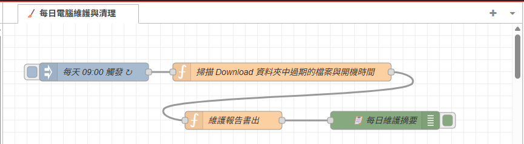
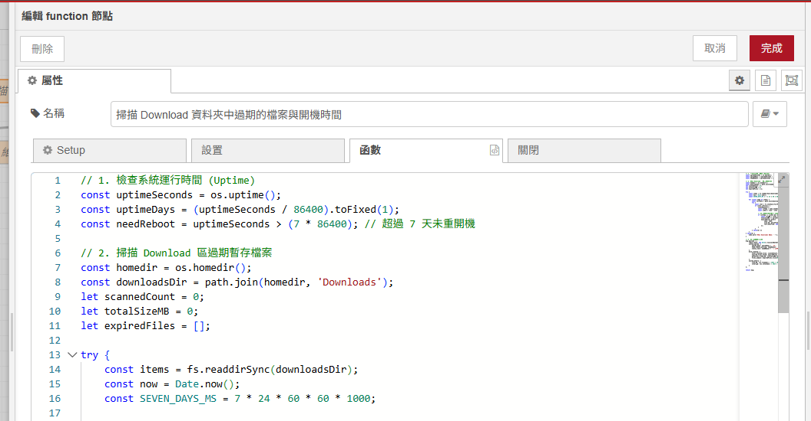
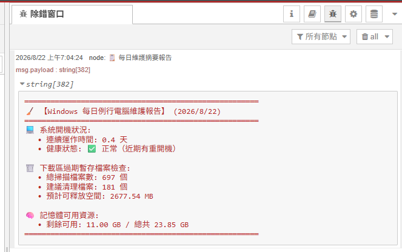
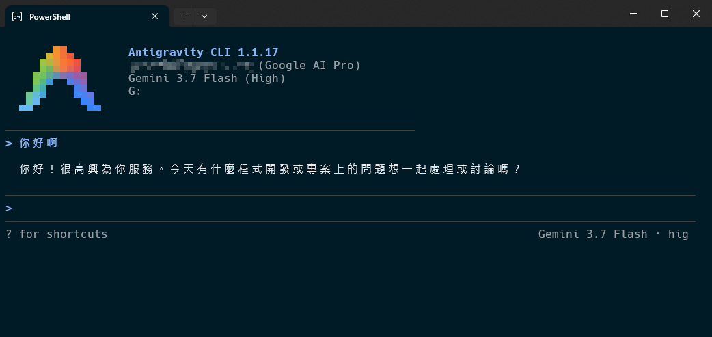
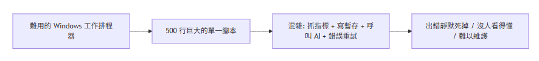
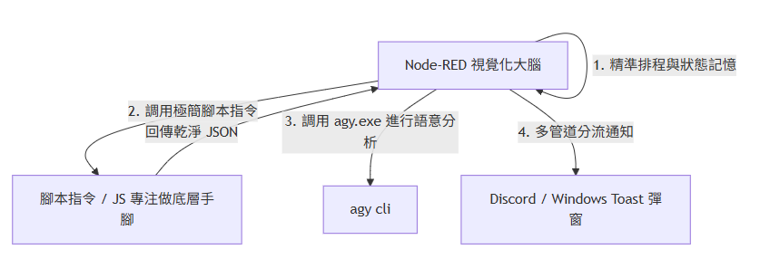
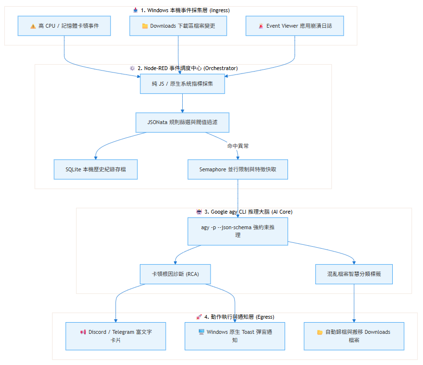

# Day 01：Windows 個人 AI 自動化中心 — Node-RED × Google agy CLI

> 身為一個 Windows 使用者或開發者，一定有寫過 `.bat` 或是 `.ps1` 腳本，或是用「Windows 工作排程器」定期的去執行某個程式。
> 本系列想透過 **Node-RED** 這套工具搭配 Google 的 **`agy cli`**，來改善 Windows 自動化工作流程。
> 今天將深入剖析這兩大工具，為你的 Windows 電腦加入 AI 管家幫你自動完成工作！

---

## 什麼是 Node-RED？

**Node-RED** 是一套以 JavaScript 為基礎的視覺化流程編排工具。讓你用簡單的「拖拉節點與連線」方式，在瀏覽器中把 Windows 本機硬體、檔案系統、PowerShell 腳本與 AI 模型串接成強大的自動化流程。

Node-RED 是一套 Low Code 的平台，主要透過 JavaScript 進行程式碼撰寫，相比於 `.bat` 與 `.ps1` 腳本，個人覺得 JS 還是比較友善的；另外，我覺得相比於 No-Code，反而這種 Low-Code 比較對我的胃口，畢竟實際的運作邏輯我還是能夠比較清楚的知道。

下圖是一個 Node-RED 流程的簡單示意

點開節點可開始撰寫程式碼

旁邊的 Debug 視窗可以看到執行過程的輸出

### 1. 核心概念：流程導向程式設計

一般的程式邏輯分散在數百行程式碼中，比較無法一眼看出資料是如何從 A 流向 B ；而 Node-RED 將每個函式封裝成 **「節點（Node）」**，節點之間以 **「連線（Wire）」** 串接：

- **節點（Nodes）**：包含「事件觸發（Inject, File Watcher）」、「資料處理（Function, Change, Switch）」與「動作執行（Exec, HTTP, SQLite, Debug）」。
- **訊息流通（Message Pipeline）**：所有資料統一裝在名為 **`msg`** 的 JavaScript 物件中，其中 **`msg.payload`** 是最核心的資料載體。
- **熱重載部署（Hot Deploy）**：修改流程後點擊右上角的「Deploy」，**1 秒內即可完成熱更新**，無需重啟伺服器，更不會中斷其他正在背景跑的流程！

### 2. Node-RED 在 Windows 上的真實資源開銷

不用擔心 NodeRED 會像 Electron 桌面軟體（如 VS Code、Slack、Teams）一樣動輒吃掉 1~2 GB 記憶體。

* **本機實測數據**：
  * **常駐記憶體**：僅約 **35 MB ~ 60 MB RAM**！
  * **CPU 閒置佔用**：**0.0% ~ 0.1%**（採用 Node.js 非阻塞事件迴圈，沒有事件進線時執行緒直接休眠）。
  * **啟動速度**：在 Windows 10/11 上冷啟動僅需 **0.8 ~ 1.5 秒**。
* **結論**：相較於隨便開一個 Chrome 分頁（150MB~300MB），Node-RED 常駐在 Windows 背景基本上是「完全無感」的存在。

---

## 什麼是 agy CLI？

**`agy`（Antigravity CLI）** 是 Google 官方為開發者打造的終端機 AI 工具。它直接綁定你的 **Google AI Pro 訂閱帳號**，讓你可以在終端機中隨心所欲使用最新的 **Gemini 多模態模型**！

### `agy.exe` 在自動化流程中的四大特性：

1. **無 API Key 費用焦慮**：
   - 如果是使用 OpenAI 或 Claude API 時，每呼叫一次就跳計費，很怕哪天流程出個無窮迴圈刷爆信用卡。
   - `agy.exe` 透過 Google AI Pro 訂閱授權，是個人本機自動化的高性價比方案！
2. **非互動式印出模式（`-p / --print`）**：
   - 單次執行 Prompt 後立即退出並將答案輸出至標準輸出（stdout），Node-RED 可以像調用常規命令一樣輕鬆取得結果。
3. **原生支援 MCP 工具調用（`agy mcp`）**：
   - 支援 Model Context Protocol（MCP），可以為 AI 掛載本機檔案系統、PowerShell 診斷工具或資料庫，讓 AI 從「只會回答的聊天機器人」進化為「具備自主行動力的 Agent」！

---

## Node-RED 適合「取代」PowerShell / .bat 腳本嗎？

答案是：**Node-RED 的目的不是「消滅」PowerShell/.bat 腳本，而是「升級為 PowerShell/.bat 腳本的指揮官與視覺化調度中心（Orchestrator）」！**

### 過去：純 PowerShell / .bat 腳本的痛苦日常

### 現在：Node-RED + 本機 AI 的協同架構 (1+1 > 2)

#### 分工原則：

* **PowerShell 專注當「手腳」**：只寫 1~3 行最精準的 Windows 底層操作（如 `Get-Process | ConvertTo-Json`、`Move-Item`、WMI 查詢）。
* **Node-RED 專注當「大腦與骨架」**：負責排程、非同步事件、狀態記憶（Context/SQLite）、流程分流、防抖限流、調度 `agy.exe` AI 核心與系統通知。

---

## 30 天要打造的「Windows 智慧個人管家」系統藍圖

## 30 天實戰規劃與路線圖

1. **第 0 階段（Day 01–03）｜Windows 自動化基石**：
   - 打通 Windows 本機 Node-RED 視覺化環境、Context 狀態記憶模型與 Google `agy.exe` 免 API Key 終端機大腦。
2. **第 1 階段（Day 04–08）｜本機 AI 效率場景大爆發**：
   - **從第 4 天直接進入 AI 實戰！**：Downloads 混亂檔案 AI 智慧分類、終端機報錯一鍵救援、剪貼簿非結構文字轉 Markdown 表格、Git 工作日報自動產出、電腦卡頓秒級 RCA 根因診斷。
3. **第 2 階段（Day 09–16）｜讓本機 AI 變聰明、變穩定**：
   - `--json-schema` 契約保證、Prompt 前置資料壓縮、本機 SQLite 長期記憶 RAG、雙層防誤刪安全網、防重複安全防呆鎖、封裝 `agy-ai-core` 專屬 Subflow、本機 Webhook 網關與第一階段守護流水線綜合驗收。
4. **第 3 階段（Day 17–22）｜AI Agent 自主行動力與進階排查**：
   - Event Viewer 崩潰日誌深度分流、`agy mcp` 掛載 Windows 本機工具、Human-in-the-loop 審批門、智慧剪貼簿管家、Semaphore 號誌燈並行保護與 MD5 特徵快取。
5. **第 4 階段（Day 23–28）｜【Windows 智慧總管家】端到端整合實戰**：
   - 四層架構端到端拼裝、雙軌採集、AI 雙軌決策大腦、多管道推播歸檔、全系統並行防護與全流程自我修復。
6. **第 5 階段（Day 29–30）｜生產上線與維運藍圖**：
   - 專注使用 PM2 實現開機無感自啟與守護、30 天復盤與個人 AI Agent 未來藍圖。

明天我們將從 Windows 本機 Node-RED 環境搭建與 Context 記憶機制說明開始！
