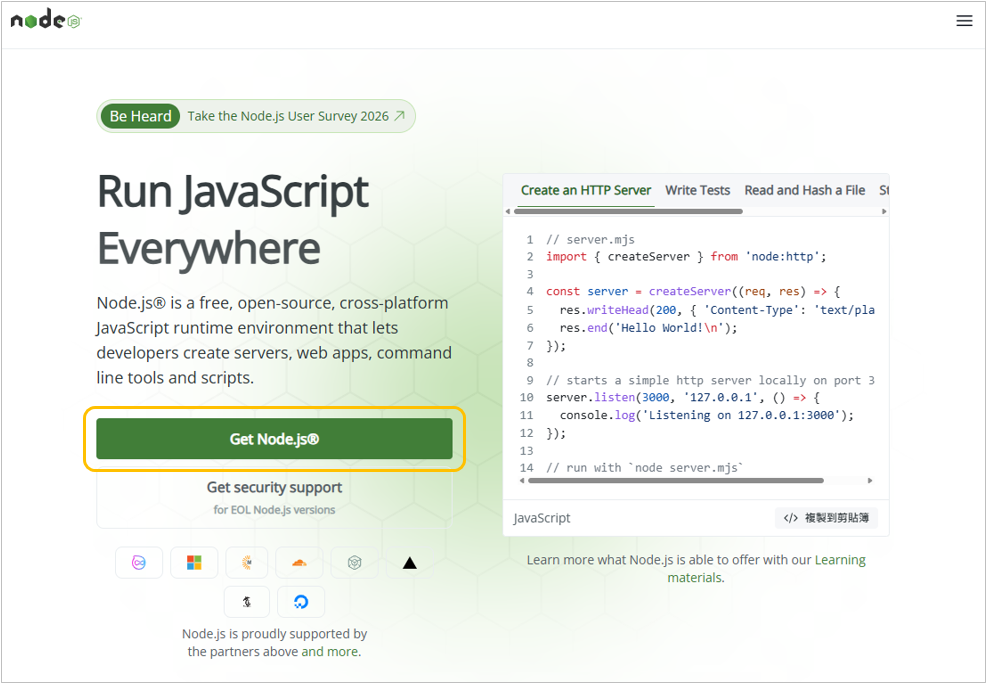
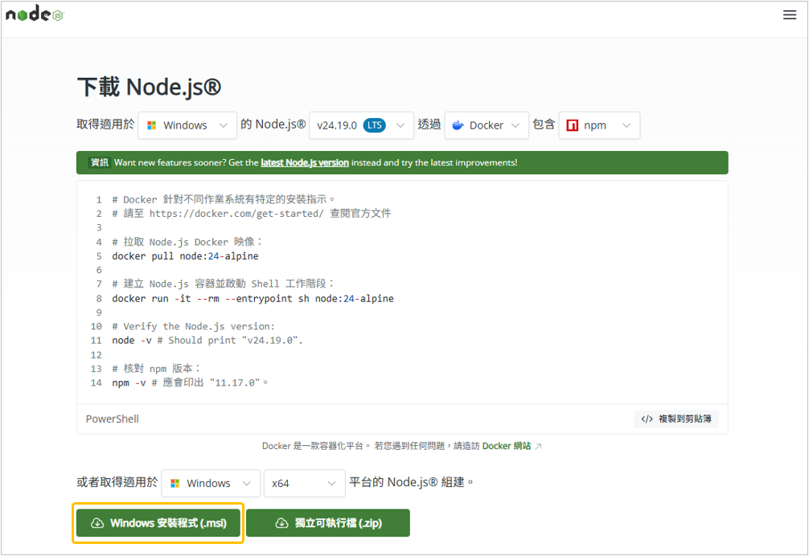
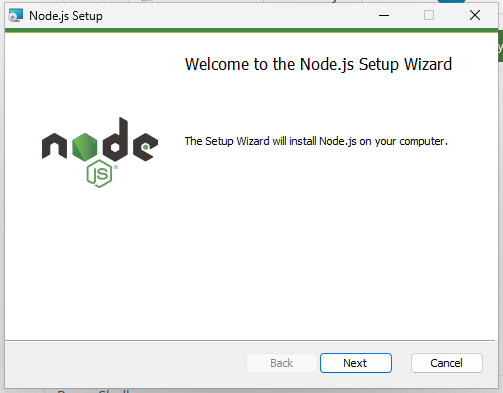
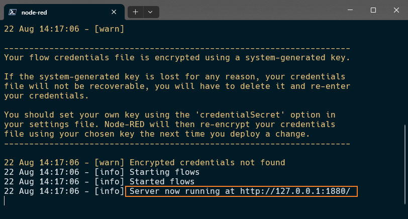
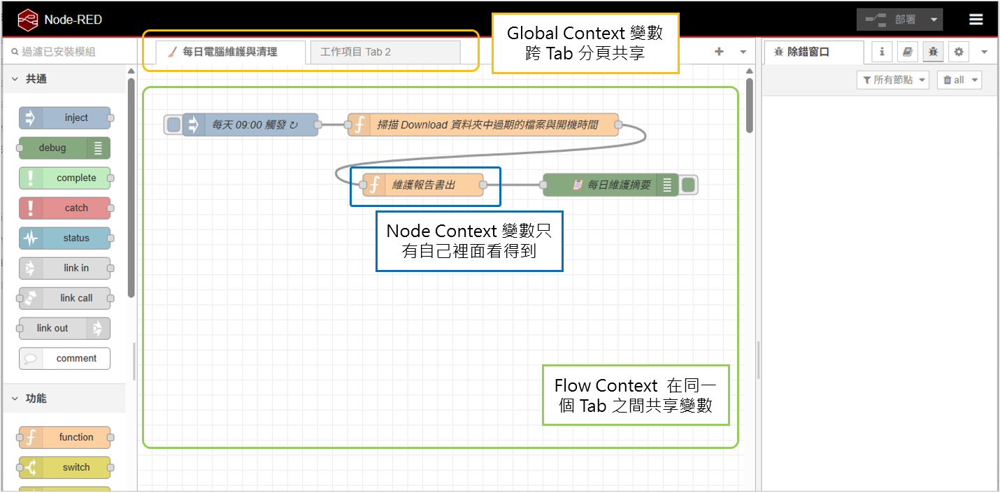
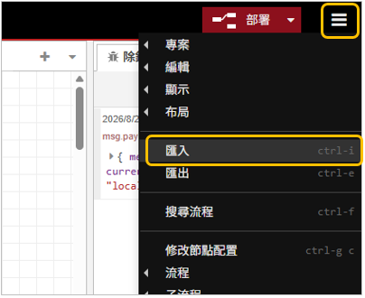
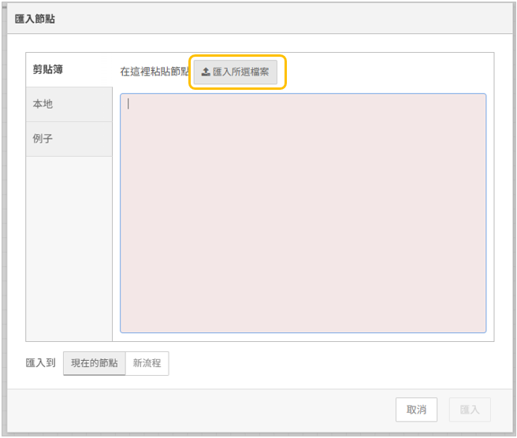
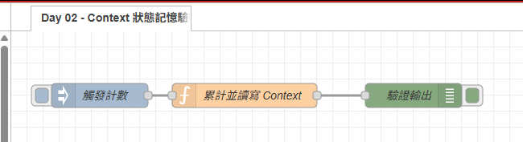

# Day 02：環境建置：Windows 本機 Node-RED 安裝與 Context 狀態記憶模型

> 聊完了為什麼在 Windows 電腦上用 Node-RED 搭配 `agy CLI` 是個不錯的選擇，今天就來動手把 NodeRED 環境跑起來吧。
> 安裝環境的時候，最怕遇到那種「官方教學寫得好像很簡單，自己照著做卻噴一堆紅字」。這篇我把 Windows 上最簡單的安裝方式、避坑指南，以及 Node-RED 最關鍵的「Context 狀態記憶」一次說清楚。

---

本文同步發布於 GitHub： [2026-18th-it-ironman](https://github.com/BingFengHung/2026-18th-it-ironman/blob/main/Day02_%E7%92%B0%E5%A2%83%E5%BB%BA%E7%BD%AE%E8%88%87Context%E7%8B%80%E6%85%8B%E8%A8%98%E6%86%B6.md)

## 在 Windows 上安裝與啟動 Node-RED

在 Windows 上安裝 Node-RED 非常簡單，跟著這 4 個步驟走就行：

### 步驟 1：安裝 Node.js LTS 環境

Node-RED 是跑在 Node.js 之上的。如果你的電腦還沒裝過：

1. **前往 Node.js 繁體中文官方網站**：👉 [https://nodejs.org/zh-tw](https://nodejs.org/zh-tw)
   
2. 點擊下載 **「LTS（長期支援版）」** 的 Windows 安裝檔（`.msi` 檔，建議 Node.js 20.x 或 22.x+）。
   
3. 下載完成後開啟安裝程式，依照畫面指示**一路點擊「下一步（Next）」**直到完成安裝即可！
   

安裝完成後，打開 PowerShell 確認版本：

```powershell
node -v   # 會顯示如 v20.x.x 或 v22.x.x
npm -v    # 會顯示如 10.x.x
```

### 步驟 2：全域安裝 Node-RED

在 PowerShell 中執行以下 npm 指令進行全域安裝：

```powershell
npm install -g node-red
```

### 步驟 3：啟動 Node-RED 服務

在 PowerShell 中直接輸入：

```powershell
node-red
```

終端機將輸出啟動日誌，看到 `Server now running at http://127.0.0.1:1880/` 就代表啟動成功了！



### 步驟 4：開啟視覺化編輯器

開啟瀏覽器，訪問 `http://127.0.0.1:1880`，就能看到 NodeRED 的編輯畫面了。

---

## 為什麼你的自動化管家需要「記憶」？（Context 概念）

如果沒有「記憶」，自動化管家每次執行任務時都像失憶一樣，只知道當下這一瞬間的數據：

* 例如：你設定每 5 分鐘檢查一次電腦的排程，發現 Chrome 吃了 1.5GB 記憶體，它每 5 分鐘就彈一次通知視窗提醒你，不到半小時你就會被吵到想把排程關掉。

但如果管家具備「記憶能力」，它就能變得很聰明：

* **記住時間**：「我 10 分鐘前才剛提醒過使用者，1 小時內不要再跳出相同警告打擾他。」
* **記住累計數據**：「今天一共幫我自動分類了 15 個檔案。」
* **共享設定**：「記錄我最常用的下載路徑是 `G:/Downloads`，其他分頁也能直接拿來用。」

在 Node-RED 裡面，這套記憶機制叫做 **Context（上下文 / 共享變數）**。

---

## 搞懂 Context 的三種層級

在 Node-RED 中，變數並不是隨便亂丟的，而是根據「可見範圍（Scope）」嚴格劃分為三種層級：**Global Context**、**Flow Context** 與 **Node Context**。

我們先來認識這三者的正式定義與技術作用範圍：

1. **Global Context（全域上下文）**：
   * **作用範圍**：**跨所有分頁（Tabs）**。你在「分頁 A」寫入的資料，「分頁 B」與「分頁 C」都能直接讀取。
   * **適用場景**：整個系統通用的全域設定（例如：電腦的常用 Downloads 路徑、全域通知總開關、跨流程共享狀態）。
2. **Flow Context（分頁上下文）**：
   * **作用範圍**：**僅限「同一個分頁畫布」**。同一個分頁裡的所有節點都能共享，但換到其他分頁就完全隔離、讀取不到。
   * **適用場景**：該特定工作流的內部狀態（例如：效能監控流程中「上次跳出警告的時間戳記」、檔案整理流程中「今天已自動分類的檔案累計數量」）。
3. **Node Context（節點私有上下文）**：
   * **作用範圍**：**僅限「當前這顆節點自身」**。其他任何節點（哪怕在同一分頁）都看不到。
   * **適用場景**：單一節點內部專屬的小紀錄（例如：按鈕點擊累計次數、防止手殘連點的防重複紀錄）。



---

### 為了更好理解，我們用辦公室記事工具做比喻：

如果覺得上面的技術定義太過抽象，可以把他們想像成辦公室裡的三種記事工具：

* **Global Context 就像「大廳公佈欄」**：全公司的人一進大門都看得到，適合張貼全公司通用的公告與設定。
* **Flow Context 就像「各會議室的專屬白板」**：在 1 號會議室開會的人看 1 號白板，不同房間互不干擾。
* **Node Context 就像「個人螢幕邊的便利貼」**：只有你自己桌上看得到，私密且獨立。

### 常用 JavaScript 讀程式碼速查：

```javascript
// 1. Global Context (大廳公佈欄)
const homedir = os.homedir();
global.set("downloadPath", path.join(homedir, "Downloads"));
const myPath = global.get("downloadPath");

// 2. Flow Context (會議室白板)
flow.set("lastAlertTime", Date.now());
const lastTime = flow.get("lastAlertTime");

// 3. Node Context (個人便利貼)
node.context().set("clickCount", 1);
const count = node.context().get("clickCount");
```

---

## Windows 必配：啟用檔案持久化存儲（重開機記憶不消失）

預設 Node-RED 的 Context 是放在記憶體（RAM）裡的。也就是說，電腦一旦重開機，所有計數器和狀態都會歸零。

要讓它具備永久記憶，只要開啟 Node-RED 內建的 `localfilesystem` 持久化功能：

### 修改 Windows 上的 `settings.js`

`Node-RED 的設定檔位於 %USERPROFILE%\.node-red\settings.js。`

打開 `settings.js`，找到 `contextStorage` 區塊並修改為：

```javascript
module.exports = {
    // ... 其他原有設定
    contextStorage: {
        default: {
            module: "memory"
        },
        file: {
            module: "localfilesystem",
            config: {
                // 不需要手動指定 dir，Node-RED 預設就會自動存在 .node-red/context 目錄中！
                cache: true,      // 啟用記憶體快取加速讀取
                flushInterval: 30 // 每 30 秒批次寫入硬碟
            }
        }
    }
}
```

> **重要提醒（必須重啟 Node-RED）**：
> `settings.js` 是 Node-RED 伺服器的核心設定檔，只有在啟動時會讀取一次。
> 修改儲存後，請回到原先運行 Node-RED 的 PowerShell 視窗，按下 **`Ctrl + C`** 停止服務，然後再次輸入 **`node-red`** 重啟！
> 重啟時若看到終端機日誌印出 `Context store  : 'default' [module=localfilesystem]`，就代表檔案持久化已經大功告成！

## 實戰：在 Function 節點中優雅讀寫狀態

在 NodeRED 中透過 flow context 存取持久化狀態非常簡單，程式碼如下：

```javascript
// 從檔案儲存庫讀取 test_counter 的值（若無紀錄則預設為 0）
let count = flow.get('test_counter', 'file') || 0;

count += 1;

// 將累加後的 count 寫回 Flow Context 鍵值 'test_counter'，並持久化至本地檔案
flow.set('test_counter', count, 'file');

msg.payload = {
    message: 'Context 狀態記憶正常！',
    current_count: count,
    storage_engine: 'localfilesystem (file)'
};
return msg;
```

## 完整 Flow

### 本範例 flow 位置：👉 [下載](https://github.com/BingFengHung/2026-18th-it-ironman/blob/main/flows/flow_day02_nodered_context.json)

本系列文章部分有提供 NodeRED 程式碼，可透過以下方式匯入 flow 查看
點選右上角的選單，找到匯入的按鈕


進入匯入節點視窗後，點選上方匯入所選檔案，選擇所需的 flow.json 檔案即可。



匯入之後 flow 會像是下圖所示：



---

## 今日總結與明日預告

今天我們順利把 Node-RED 架設在 Windows 本機上，並且搞懂了讓管家具備記憶能力的 Context 模型。

* **明天（Day 03）**：我們將介紹 **Google `agy CLI`**！
