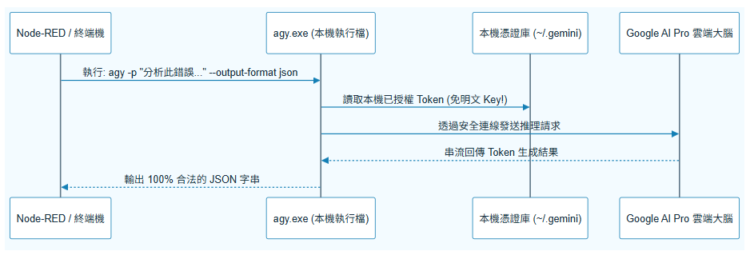
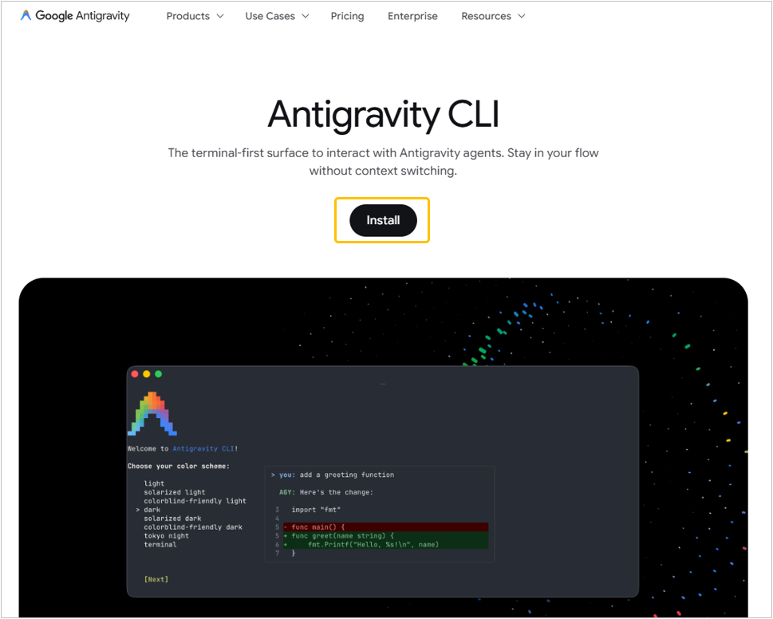
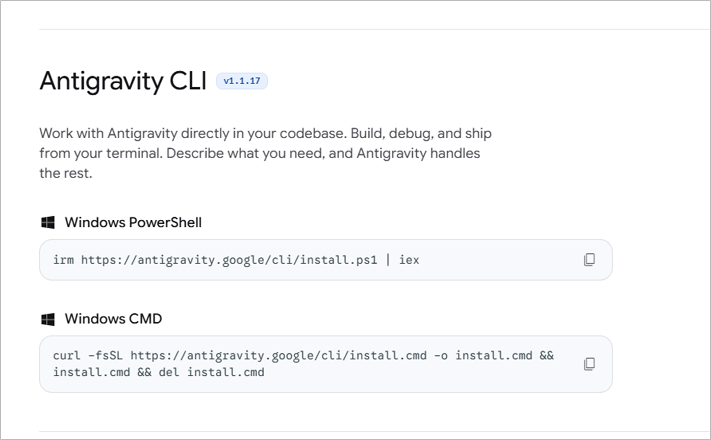
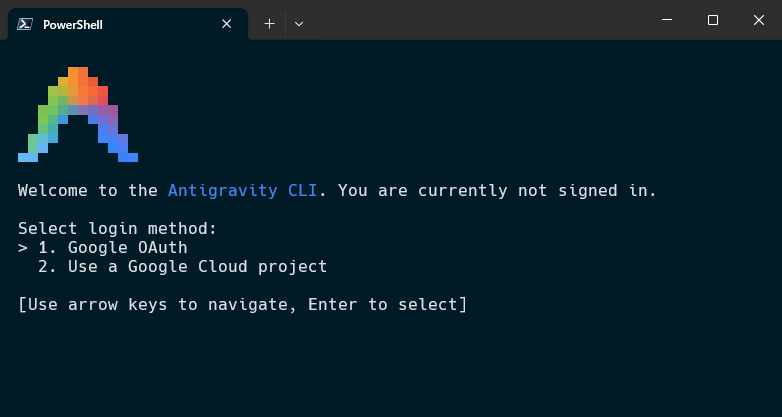

# Day 03：在 Windows 中暢玩 agy cli

> 過去要在電腦上做 AI 自動化，最怕要到國外網站綁信用卡、申請 API Key，隨時擔心程式寫出 bug 陷入無窮迴圈刷爆帳單。
> 不過在使用了 Google AI Pro 搭配本機 **`agy cli` (Antigravity CLI)**，整套開發體驗徹底變成了「隨便你怎麼叫都不用害怕費用爆掉」的安心體驗！

---

本文同步發布於 GitHub： [2026-18th-it-ironman](<https://github.com/BingFengHung/2026-18th-it-ironman/blob/main/Day03_%E5%9C%A8Windows%E4%B8%AD%E6%9A%A2%E7%8E%A9agy%20cli.md>)

## 什麼是 `agy cli`？

`agy CLI` 是 Google Antigravity 生態系專屬的命令列工具（CLI）。只要你的 Google 帳號訂閱了 Google AI Pro，在 Windows 終端機完成一次性 OAuth 授權登入後，`agy.exe` 就會利用 Windows 本機受保護的憑證儲存庫進行認證，直接對接最新的 Gemini 3.7  模型。



---

## 4 步驟安裝與配置 `agy CLI`

在 Windows 10/11 上安裝與配置 `agy cli` 非常簡單：

### 步驟 1：下載與安裝 `agy` CLI

* 進入 Antigravity 官方頁面（[antigravity.google/product/antigravity-cli](https://antigravity.google/product/antigravity-cli)）。
  
* 有兩種安裝方式使用 cmd 或是 powershell
  

  * Windows PowerShell

  ```powershell
  irm https://antigravity.google/cli/install.ps1 | iex
  ```

  * Windows CMD

  ```bat
  curl -fsSL https://antigravity.google/cli/install.cmd -o install.cmd && install.cmd && del install.cmd
  ```

### 步驟 2：一次性 Google 帳號授權登入

打開 PowerShell，直接輸入 `agy` 啟動初次認證：

```powershell
agy
```



* CLI 會自動喚醒預設瀏覽器（Chrome / Edge）打開 Google OAuth 授權頁面。
* 請使用你**已訂閱 Google AI Pro** 的 Google 帳號登入並點擊「允許授權」。
* 認證成功後，Token 會安全加密儲存於本機憑證庫（位於 `~/.gemini` 目錄），從此在終端機中享受無感免登入調用！

### 步驟 3：在 Windows PowerShell 中驗證 `agy`

認證完成後，在 PowerShell 執行以下基礎命令測試：

```powershell
# 1. 查看 agy 命令列選項
agy --help

# 2. 測試單次非互動式執行 (-p / --print)
agy -p "請回覆一句話證明你在 Windows 上正常運行"

# 3. 測試強制 JSON 輸出格式
agy -p "列出 3 個 Windows 最常佔用 CPU 的系統進程名稱" --output-format json
```

---

## `agy.exe` 在自動化流程中的核心參數

| 參數                               | 用途                                   | 自動化價值                                                   |
| :--------------------------------- | :------------------------------------- | :----------------------------------------------------------- |
| `-p / --print`                   | 非互動式執行（Print Mode）             | 執行單次 Prompt 後立即退出並打印結果，專為自動化腳本調度設計 |
| `--output-format json`           | 強制以 JSON 格式輸出                   | 方便 Node-RED 直接用`json` 節點解析為 JavaScript 物件      |
| `--json-schema`                  | 傳入 JSON Schema 強約束                | 強制模型每一個 Token 嚴格遵守型別契約，杜絕廢話與格式錯誤    |
| `--dangerously-skip-permissions` | 自動放行工具調用權限                   | 在無人值守後台運行時，自動放行工具執行，避免阻塞掛起         |
| `--effort`                       | 控制思考推理深度 (`low\|medium\|high`) | 簡單分類用`low`（極速），深層崩潰排查用 `high`（精確）   |

## 為什麼這個架構對個人開發者最友善？

1. **零信用卡盜刷風險**：不需要在設定檔中明文存放 `API_KEY=AIzaSy...`，就算把 Flow 匯出分享給其他人，也不用怕金鑰外洩。
2. **真正的零邊際成本**：每月固定訂閱費用，不用看著 Token 計費碼表心驚膽顫。
3. **原生支援 `--json-schema`**：這點是目前自動化最需要的——保證回傳的一定是乾淨 JSON，下游解析 100% 穩定！

---

## 今日總結與明日預告

今天我們打通了本機 `agy CLI` 的免 API Key 呼叫管道。

* **明天（Day 04）**：我們將正式進入第一個本機 AI 實戰——**Downloads 混亂檔案 AI 智慧分類與自動歸檔**！
