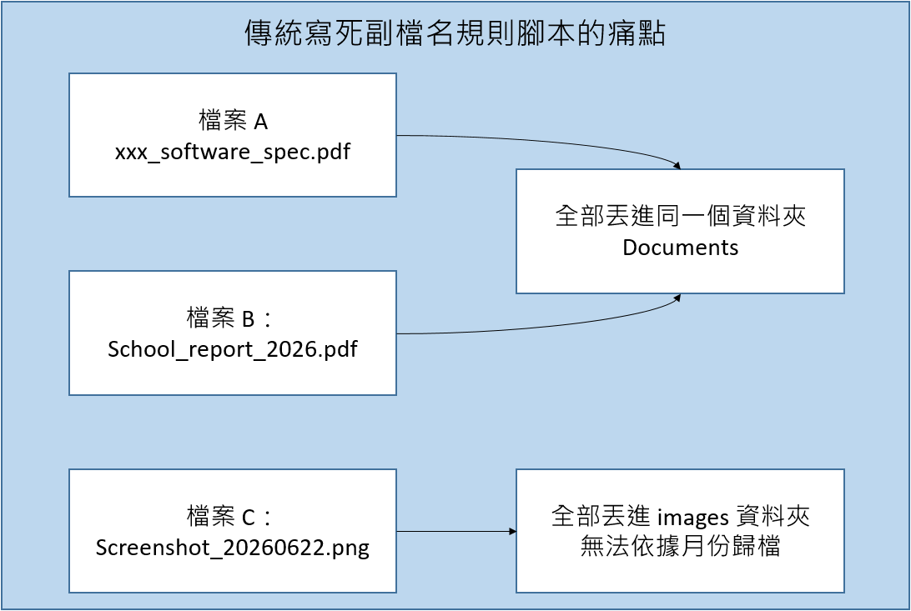
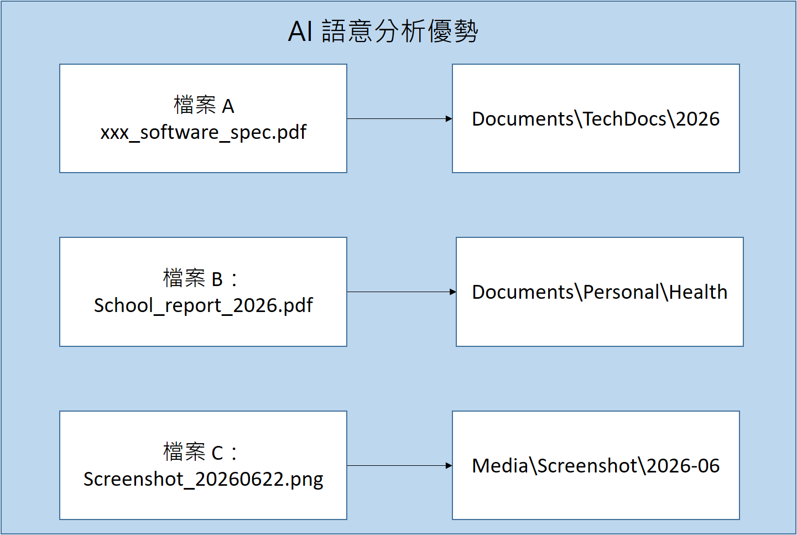
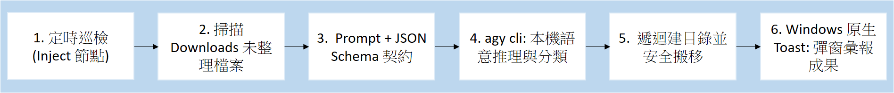
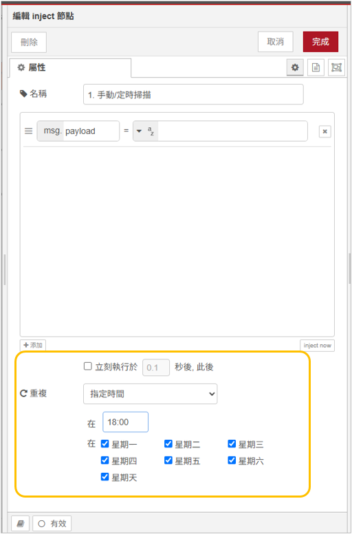
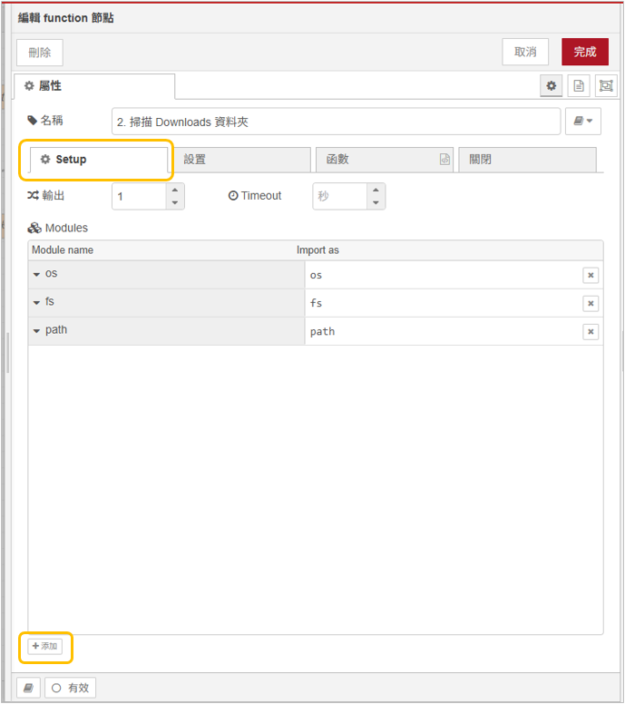
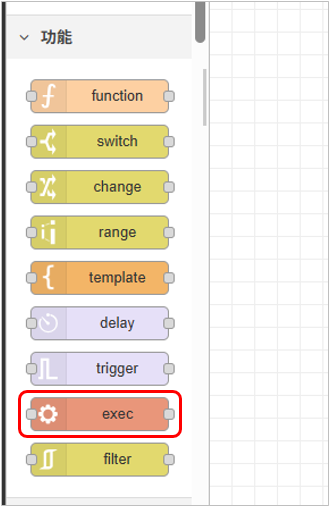
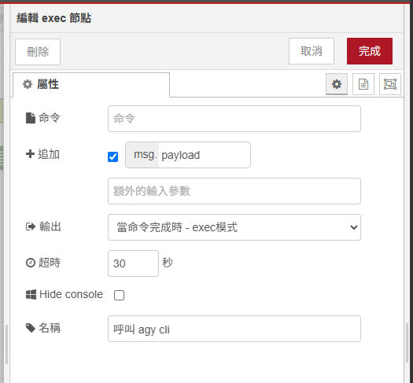
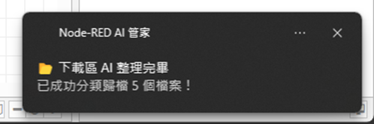
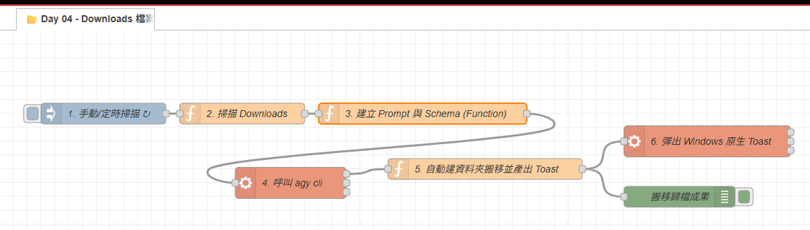

# Day 04：AI 實戰 1：Downloads 下載區混亂檔案 AI 智慧分類與自動歸檔

> 不得不說，我的 Windows 桌面與 Downloads 資料夾，是我電腦最髒亂的地方：
> 在 Downloads 資料夾裡面多的是甚麼 Screenshot_2026.png、install.exe、任何的 .pdf 檔案、壓縮檔，久久才會進行手動清理一次。
> 因此，這一次就透過 Node-RED 搭配 agy cli，來打造一個每天定時掃描、檔案類型辨識與自動建立子目錄並安全移動檔案的實用管家。

---

本文同步發布於 GitHub： [2026-18th-it-ironman](https://github.com/BingFengHung/2026-18th-it-ironman/blob/main/Day04_Downloads%E6%B7%B7%E4%BA%82%E6%AA%94%E6%A1%88AI%E6%99%BA%E6%85%A7%E5%88%86%E9%A1%9E%E8%88%87%E8%87%AA%E5%8B%95%E6%AD%B8%E6%AA%94.md)

## 為什麼檔案分類需要 AI？ 傳統規則哪裡不夠用？

一般我們在進行分類的時候，通常透過寫死副檔名的規則 (如，.png、jpg 丟圖片區、.exe 丟到軟體區。)
但現實生活中的檔案更複雜：

* `Screenshot_2026-06-22.png` 應該丟到 `Media/Screenshots/2026-06/`。
* `xxx_software_spec_v2.pdf` 應該丟到 `Documents/TechDocs/2026/`。
* `docker-desktop-installer.exe` 應該丟到 `Installers/`。

但在真實工作與生活中，這種寫死規則的腳本很快就會遇到三大死穴：



### 傳統規則的三大死穴：

1. **無法識別「檔案語意」**：同樣是 `.pdf` 檔案，「軟體規格書」應該歸檔到 `Documents/TechDocs`，而「健康檢查報告」應該歸檔到 `Documents/Personal/Health`。副檔名完全看不出兩者的本質差異。
2. **無法智慧正規化新檔名**：截圖工具產生的檔名通常是 `IMG_20260622_142011.png`。
3. **維護成本極高**：每次遇到新的檔案命名格式，就得回頭修改程式碼幾十行正則表達式，久了根本沒人想維護。

**AI 的威力在於：它能直接「看懂檔名背後的意圖」，並在 1 秒內給出最佳的子資料夾路徑與標準化命名！**

這一次就透過 AI 幫助我們根據檔案的意圖，自動進行分類。



---

## 系統全景工作流架構

整套下載區自動整理管線由 **6 個節點模組與階段** 組成：



---

## 實戰動手做：組裝 6 大流水線節點

### 階段 1：定時排程巡檢（Inject 節點）

拉出一個 **`inject`** 節點：

* **Interval（重複間隔）**：設定為每 1 小時（或每天下班前 18:00）自動觸發一次，亦可隨時點擊手動執行按鈕立即觸發。
* 

---

### 階段 2：掃描下載區待整理檔案（Function 節點）

我比較偏好不使用第三方套件，能夠用內建的模組就直接使用；因此，直接使用 Node.js 內建的 `os`、`fs`、`path` 模組。

> **💡 Setup 設定提醒**：
> 請點開 Function 節點，切換到 **「設定（Setup）」➔「模組（Modules）」** 頁籤，新增 `os`、`fs`、`path` 三個模組（變數名稱分別對應 `os`、`fs`、`path`）。
> 

這邊有一個重點是我們每一次只處理 20 檔案進行分類，避免我們的 Prompt 過長

```javascript
// Function 節點：純 JS 快速掃描 Downloads 目錄 (Setup 注入 os, fs, path)
const homedir = os.homedir();
const downloadsDir = path.join(homedir, 'Downloads');
const candidateFiles = [];

try {
    const items = fs.readdirSync(downloadsDir);
    for (const name of items) {
        // 過濾暫存檔、隱藏檔與正在下載中的檔案
        if (name.startsWith('.') || name.endsWith('.tmp') || name.endsWith('.crdownload')) continue;
  
        const fullPath = path.join(downloadsDir, name);
        try {
            const stat = fs.statSync(fullPath);
            // 防禦 2：只處理實體檔案，自動略過子資料夾 (避免 EISDIR 錯誤)
            if (stat.isFile()) {
                candidateFiles.push({
                    original_name: name,
                    size_kb: Math.round(stat.size / 1024),
                    ext: path.extname(name).toLowerCase()
                });
            }
        } catch(e) {}
  
        // 批次處理限額 (每次最多處理 20 個檔案，避免 Prompt 過長)
        if (candidateFiles.length >= 20) break;
    }
} catch(err) {
    node.warn('掃描 Downloads 失敗: ' + err.toString());
}

// 如果下載區乾乾淨淨，安靜結束流程
if (candidateFiles.length === 0) {
    node.warn('Downloads 目前無新檔案需整理');
    return null;
}

msg.candidateFiles = candidateFiles;
return msg;
```

---

### 階段 3：建立 AI Prompt 與 `--json-schema` 契約（Function 節點）

將掃描到的檔案清單包裝成 Prompt，並傳入嚴格的 JSON Schema，要求 AI 僅需輸出 `original_name`、`category`（子目錄名稱）與 `new_name`（標準化檔名）：

```javascript
const files = msg.candidateFiles;

const prompt = `你是一個專業的檔案分類專家。請為以下檔案分析用途與語意，給出建議的「子資料夾名稱」(如 TechDocs, Screenshots, Installers, Archives, Manuals) 與「標準化新檔名」: ${JSON.stringify(files)}`;

const schema = {
      type: 'object',
      properties: {
        results: {
          type: 'array',
          items: {
            type: 'object',
            properties: {
              original_name: { type: 'string', description: '原始檔名' },
              category: {
                type: 'string',
                // 強制限制 AI 只能從以下固定 6 個資料夾中選擇！
                enum: ['Documents', 'Media', 'Installers', 'Archives', 'Code', 'Others'],
                description: '分類目標資料夾'
              },
              new_name: { type: 'string', description: '整理後的新檔名 (保留原副檔名)' }
            },
            required: ['original_name', 'category', 'new_name']
          }
        }
      },
      required: ['results']
    };

msg.payload = `agy -p ${JSON.stringify(prompt)} --dangerously-skip-permissions --json-schema ${JSON.stringify(JSON.stringify(schema))} --output-format json`;
return msg;
```

---

### 階段 4：呼叫本機 `agy cli` 執行推理（Exec 節點）

拉出一個 **`exec`** 節點：

* **命令 Command**：留空（由上游 `msg.payload` 動態傳入）。
* **追加 Append**：打勾。
* **Use spawn**：否。
* **超時 Timeout**：設定為 30 秒。
* 

---

### 階段 5：遞迴建立子資料夾並安全搬移（Function 節點）

當 `agy cli` 回傳標準 JSON 後，進行實體檔案搬移：

```javascript
// Function 節點：自動建目錄並安全搬移 (Setup 注入 os, fs, path)
const homedir = os.homedir();
const downloadsDir = path.join(homedir, 'Downloads');

let parsed;
try {
    parsed = typeof msg.payload === 'string' ? JSON.parse(msg.payload) : msg.payload;
} catch (e) {
    node.error('JSON 解析失敗: ' + msg.payload);
    return null;
}

// 雙軌解包 (支援 structured_output 與 response 字串)
let data = parsed.structured_output;
if (!data && parsed.response) {
    try {
        data = typeof parsed.response === 'string' ? JSON.parse(parsed.response) : parsed.response;
    } catch (e) {
        const match = parsed.response.match(/\{[\s\S]*\}/);
        if (match) data = JSON.parse(match[0]);
    }
}

const results = (data && data.results) || parsed.results || [];
const movedList = [];

for (const item of results) {
    const srcPath = path.join(downloadsDir, item.original_name);
  
    // 程式碼強制規範：根目錄寫死在 Downloads，AI 僅輸出子目錄名稱 (category)
    const folderName = (item.category || item.target_folder || 'Others').replace(/^[\\\/]+/, '').trim();
    const destDir = path.join(downloadsDir, folderName);
    const destPath = path.join(destDir, item.new_name || item.original_name);

    // 防禦 1：確認來源檔案依然存在 (防止已被使用者手動刪除)
    if (fs.existsSync(srcPath) && fs.statSync(srcPath).isFile()) {
        // 防禦 2：遞迴建立目標子資料夾 (如 Downloads/TechDocs)
        fs.mkdirSync(destDir, { recursive: true });
  
        // 防禦 3：安全更名與搬移
        fs.renameSync(srcPath, destPath);
        movedList.push({ from: item.original_name, to: item.new_name, dir: folderName });
    }
}

// 建立 Windows 原生 Toast 通知腳本
msg.movedCount = movedList.length;
msg.payload = `powershell -NoProfile -Command "[Windows.UI.Notifications.ToastNotificationManager, Windows.UI.Notifications, ContentType = WindowsRuntime] > $null; $template = [Windows.UI.Notifications.ToastNotificationManager]::GetTemplateContent([Windows.UI.Notifications.ToastTemplateType]::ToastText02); $textNodes = $template.GetElementsByTagName('text'); $textNodes.Item(0).AppendChild($template.CreateTextNode('📂 下載區 AI 整理完畢')) > $null; $textNodes.Item(1).AppendChild($template.CreateTextNode('已成功分類歸檔 ${movedList.length} 個檔案至 Downloads 子資料夾！')) > $null; [Windows.UI.Notifications.ToastNotificationManager]::CreateToastNotifier('Node-RED AI 管家').Show([Windows.UI.Notifications.ToastNotification]::new($template));"`;

msg.movedFiles = movedList;
return msg;
```

---

### 階段 6：Windows 原生 Toast 彈窗彙報成果（Exec 節點）

最後接上一顆 **`exec`** 節點執行上一步產生的 PowerShell Toast 腳本，檔案整理完成時 Windows 桌面右下角就會彈出漂亮的通知卡片！



## 完整 Flow 程式

### 本範例 flow 位置：👉 [下載](https://github.com/BingFengHung/2026-18th-it-ironman/blob/main/flows/flow_day04_file_classifier.json)

本案例 flow 



## 今日總結與明日預告

今天我們完成了第一個真正具備「AI 語意理解力」的 Windows 實用自動化！

* **明天（Day 05）**：我們將打造開發者專屬的救星——**終端機報錯一鍵救援：PowerShell 報錯 ➔ 本機 AI 秒給修復命令**！
