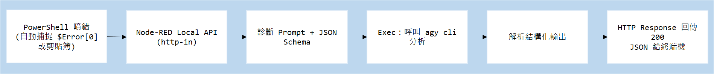
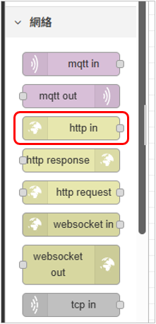
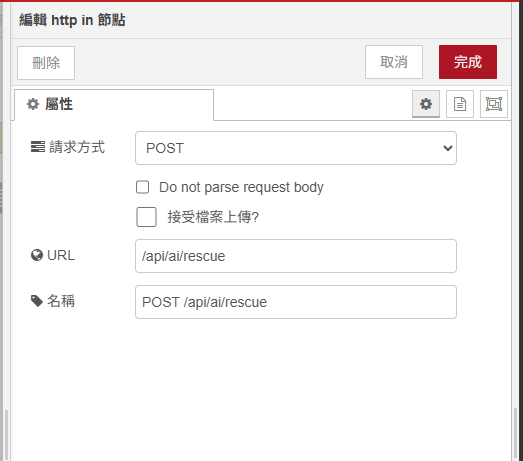
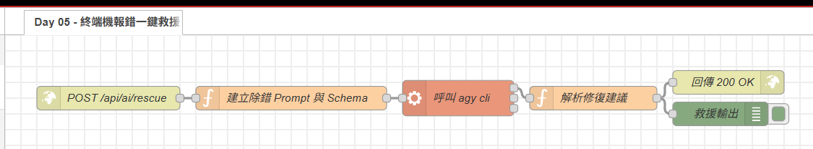

# Day 05：AI 實戰 2：終端機噴錯一鍵救援（PowerShell 報錯 ➔ Agent 秒給修復命令）

> 在 Windows 終端機下指令、安裝套件或編譯專案時，最讓人頭痛的就是突然噴出一長串紅字報錯：
> `npm ERR! code ENOENT`、`git error: failed to push some refs`、`ExecutionPolicy restricted`……
> 每次都要手動複製那一大坨文字去 Google 或問網頁版 ChatGPT。今天我們在 Node-RED 上架設一個 **「本地專屬報錯救援 API」**，只要在終端機遇到報錯，輸入 `rescue`，本機 AI 在 3 秒內用人話告訴你原因，並且給出可複製執行的修復指令！

---

本文同步發布於 GitHub： [2026-18th-it-ironman](https://github.com/BingFengHung/2026-18th-it-ironman/blob/main/Day05_%E7%B5%82%E7%AB%AF%E6%A9%9F%E5%A0%B1%E9%8C%AF%E4%B8%80%E9%8D%B5%E6%95%91%E6%8F%B4_PowerShell%E5%A0%B1%E9%8C%AFAI%E7%A7%92%E7%B5%A6%E4%BF%AE%E5%BE%A9%E5%91%BD%E4%BB%A4.md)

## 系統工作流設計



---

## 實戰動手做：打造終端噴錯救援中樞

### 步驟 1：建立 Local API 接收節點（`http in` 節點）

1. 在 Node-RED 畫面上拉出一個 **`http in`** 節點：

   * **Method**：`POST`
   * **URL**：`/api/ai/rescue`
   *  
2. 後方接上建立 Prompt 的 Function 節點。

---

### 步驟 2：配置 AI 故障排查 Prompt 與 Schema（Function 節點）

在 Function 節點中，定義嚴謹的修復契約，強制模型輸出包含 `plain_reason`（原因）與 `fix_commands`（可執行的修復指令陣列）：

```javascript
// Function 節點：建立報錯排查 Prompt
const errorLog = (typeof msg.payload === 'object' ? msg.payload.error : msg.payload) || "未知終端錯誤";

const prompt = `你是一個資深的 Windows 與全端除錯專家。使用者在終端機遇到以下報錯，請用一句白話文解釋原因，並給出 1~3 行最精準、可直接複製執行的修復指令：
${errorLog}`;

const schema = {
  type: "object",
  properties: {
    plain_reason: { type: "string", description: "用一句大白話說明報錯原因" },
    fix_commands: { 
      type: "array", 
      items: { type: "string" },
      description: "可直接複製執行的修復指令清單"
    },
    risk_level: { type: "string", enum: ["LOW", "MEDIUM", "HIGH"] }
  },
  required: ["plain_reason", "fix_commands", "risk_level"]
};

// 建立無人值守命令行
msg.payload = `agy -p ${JSON.stringify(prompt)} --dangerously-skip-permissions --json-schema ${JSON.stringify(JSON.stringify(schema))} --output-format json`;
return msg;
```

---

### 步驟 3：呼叫本機 `agy cli`（Exec 節點）

拉出一個 **`exec`** 節點：

* **Command**：留空（由上游 `msg.payload` 傳入）。
* **附加 msg.payload**：**打勾（true）**。
* **超時 timeout**: 設定為 30 秒
* 

---

### 步驟 4：雙軌安全解包與回傳（Function 節點 ➔ `http response` 節點）

在 Function 節點中進行雙軌解包，確保資料正確提取後回傳給終端機：

```javascript
// Function 節點：解析修復建議 (雙軌解包)
let parsed;
try {
    parsed = typeof msg.payload === 'string' ? JSON.parse(msg.payload) : msg.payload;
} catch(e) {
    node.error('JSON 解析失敗: ' + msg.payload);
    msg.payload = { plain_reason: 'AI 回傳格式解析失敗', fix_commands: [], risk_level: 'LOW' };
    return msg;
}

// 雙軌解包：取出 structured_output 或 response 內部的修復資料
let data = parsed.structured_output;
if (!data && parsed.response) {
    try {
        data = typeof parsed.response === 'string' ? JSON.parse(parsed.response) : parsed.response;
    } catch (e) {
        const match = parsed.response.match(/\{[\s\S]*\}/);
        if (match) data = JSON.parse(match[0]);
    }
}

msg.payload = data || parsed;
return msg;
```

後方接上一個 **`http response`** 節點，設定狀態碼為 `200`，並在標頭設定 `Content-Type: application/json; charset=utf-8`。

---

### 步驟 5：在 PowerShell `$PROFILE` 配置 `rescue` 一鍵救援函數

#### 💡 什麼是 `$PROFILE`？它在哪裡？

`$PROFILE` 是 PowerShell 每次啟動時會**自動載入的個人設定檔**（相當於 Linux 的 `~/.bashrc` 或 `~/.zshrc`）。

#### 1. 如何找到並打開你的 `$PROFILE`？

在 PowerShell 中執行以下命令，即可直接用「記事本」打開設定檔：

```powershell
# 1. 如果設定檔還沒建立過，先自動建立檔案
if (!(Test-Path -Path $PROFILE)) {
    New-Item -ItemType File -Path $PROFILE -Force
}

# 2. 用記事本開啟 (或輸入 code $PROFILE 用 VS Code 開啟)
notepad $PROFILE
```

> **檔案實際存放路徑**：
> 通常位於 `%USERPROFILE%\Documents\PowerShell\Microsoft.PowerShell_profile.ps1`。

---

#### 2. 將 `rescue` 函數貼入 `$PROFILE` 最下方：

```powershell
# 在 PowerShell 中一鍵呼叫本機 AI 救援 (自動讀取上一條報錯)
function rescue {
    # 智慧抓取，優先自動抓取上一條報錯 ($Error[0])，若無則抓剪貼簿
    $err = ""
    if ($Error.Count -gt 0 -and $Error[0]) {
        $err = $Error[0] | Out-String
    }
    if ([string]::IsNullOrWhiteSpace($err)) {
        $err = Get-Clipboard
    }

    if ([string]::IsNullOrWhiteSpace($err)) {
        Write-Host "⚠️ 目前沒有捕獲到終端報錯或剪貼簿文字！" -ForegroundColor Yellow
        return
    }

    $body = @{ error = $err.Trim() } | ConvertTo-Json
    try {
        $res = Invoke-RestMethod -Uri "http://127.0.0.1:1880/api/ai/rescue" -Method Post -Body $body -ContentType "application/json; charset=utf-8"
  
        # 雙重相容：若回傳為外層 Envelope 物件，自動解包取 structured_output
        if ($res.structured_output) {
            $res = $res.structured_output
        }

        Write-Host "`n🔍 故障原因: " -ForegroundColor Yellow -NoNewline
        Write-Host $res.plain_reason
        Write-Host "💡 建議修復指令:" -ForegroundColor Green
        $res.fix_commands | ForEach-Object { Write-Host "  > $_" -ForegroundColor Cyan }
        Write-Host ""
    } catch {
        Write-Host "❌ 無法連線至 Node-RED 救援端點: $($_.Exception.Message)" -ForegroundColor Red
    }
}
```

存檔並關閉記事本後，在終端機輸入以下指令**立即載入生效**：

```powershell
. $PROFILE
```

---

## 實際成果驗收

在 PowerShell 中隨便輸入一個錯誤指令（例如 `adsdf`），接著直接輸入 `rescue` 並按 Enter：

```text
PS G:> adsdf
adsdf: The term 'adsdf' is not recognized as a name of a cmdlet, function, script file, or executable program.
Check the spelling of the name, or if a path was included, verify that the path is correct and try again.

PS G:> rescue

🔍 故障原因: 系統中找不到名為 'adsdf' 的指令或執行檔，可能是拼字錯誤或未安裝該指令套件。
💡 建議修復指令:
  > Get-Command adsdf
  > winget search adsdf
```

---

## 完整 Flow 程式

### 本範例 flow 位置：👉 [下載](https://github.com/BingFengHung/2026-18th-it-ironman/blob/main/flows/flow_day05_error_rescue.json)
### 本範例 ps1 位置：👉 [下載](https://github.com/BingFengHung/2026-18th-it-ironman/blob/main/flows/flow_day05_rescue.ps1)

本案例 flow



---

## 今日總結與明日預告

今天我們把本機 AI 與終端機工作流深度結合，打造了開發者日常必備的救命神技！

* **明天（Day 06）**：我們將探索另一個超實用場景——**剪貼簿非結構化文字 ➔ AI 自動轉 Markdown 表格**！
