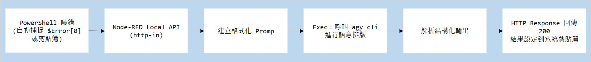
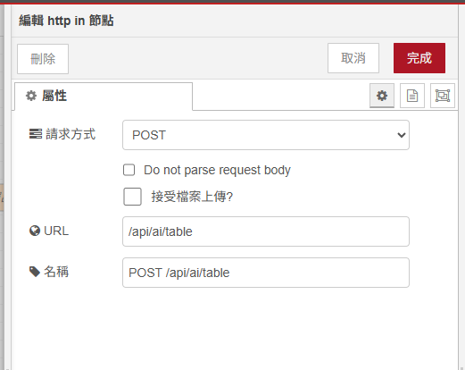
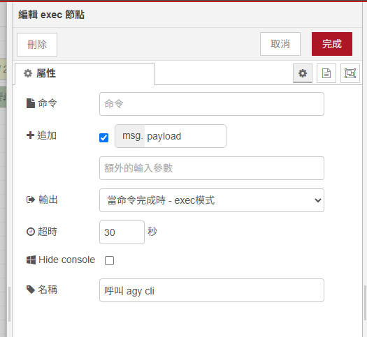
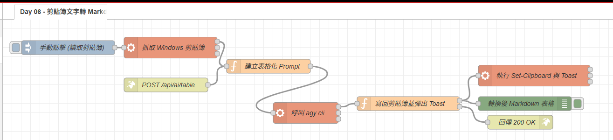

# Day 06：AI 實戰 3：剪貼簿非結構文字 ➔ AI 自動轉 Markdown 表格

> 在日常開發或整理筆記時，經常遇到這種讓人煩躁的場景：
> 從伺服器日誌、工作管理員、或是同事傳來的 Teams 訊息中複製了一大段雜亂的數據（例如：多個進程的記憶體佔用、伺服器規格列表、API 回應欄位），想貼進 Obsidian 筆記或 GitHub Issue 時，得手動一行行補上 `|` 符號排版成 Markdown 表格。
> 只要資料有 10 行以上，光是對齊欄位和補空格就能耗掉好幾分鐘。今天我們就來打造一個 **「隨按隨轉、秒級排版、自動寫回剪貼簿」** 的效率神器！

---

本文同步發布於 GitHub： [2026-18th-it-ironman](https://github.com/BingFengHung/2026-18th-it-ironman/blob/main/Day06_剪貼簿非結構化文字_AI自動轉Markdown表格.md)

## 痛點：手動排版表格到底有多痛苦？

假設你剛從 Windows 系統工具複製了這段文字：

```text
ProcessName           Id Memory_MB
-----------           -- ---------
Memory Compression  3700   1443.00
Code                5012    605.00
explorer           22180    446.00
agy                 9404    393.00
Code               18920    370.00
```

如果要手動產生 Markdown 表格，你必須：

1. 一個個欄位手動拆解（ProcessName、Id、Memory_MB）。
2. 在每行前後手動補上 `|` 符號。
3. 加上第二行的對齊線 `| :--- | :---: | :---: |`。

這完全是耗費時間且沒有價值的事情。而這正是本機 AI 最擅長的領域——**非結構化語意解析與標準排版**！

---

## 系統工作流設計（端到端閉環）



---

## 實戰動手做：打造 MD 表格格式化中心

### 步驟 1：`建立 Local API 接收節點（http in 節點）`

1. 拉出一個 **`http in`** 節點：
   * **Method**：`POST`
   * **URL**：`/api/ai/table`
   * 

---

### 步驟 2：建立 AI 表格化 Prompt（Function 節點）

在 Function 節點中，我們明確設定 AI 的角色擔任排版專家，且**直接輸出 Markdown 表格本體**：

```javascript
// Function 節點：建立 Markdown 表格化 Prompt
const rawText = (typeof msg.payload === 'object' ? msg.payload.text : msg.payload) || 'chrome 1420MB PID 15416, Code 838MB PID 1852';

const prompt = `你是一個專業的技術文檔排版助手。請將以下雜亂的非結構化文字或數據，整理為排版工整、欄位標題清晰的標準 Markdown 表格 (必須包含表頭與對齊線)。
【嚴格要求】：直接輸出 Markdown 表格本體，絕對不要輸出任何問候語、前言、結語或 Markdown 圍欄程式碼區塊！

原始資料內容:
${rawText}`;

msg.rawInput = rawText;
msg.payload = `agy -p ${JSON.stringify(prompt)} --dangerously-skip-permissions --output-format json`;
return msg;
```

---

### 步驟 3：調用本機 `agy CLI`（Exec 節點）

拉出一個 **`exec`** 節點：

* **Command**：留空（由上游 `msg.payload` 傳入）。
* **附加 msg.payload**：**打勾（true）**。
* **超時 timeout**: 設定為 30 秒
* 

---

### 步驟 4：輸出端——自動寫回剪貼簿並彈出 Toast（Function ➔ Exec 節點）

當 AI 回傳排版後的 Markdown 表格後，我們透過 PowerShell 的 **`Set-Clipboard`** 自動覆蓋寫回剪貼簿，並彈出 Windows Toast 通知：

```javascript
// Function 節點：寫回剪貼簿並建立 Toast 指令
let parsed;
try {
    parsed = typeof msg.payload === 'string' ? JSON.parse(msg.payload) : msg.payload;
} catch (e) {
    parsed = { response: msg.payload };
}

// 提取 AI 表格文字並清理可能殘留的圍欄標記
let mdTable = (parsed.response || parsed.structured_output || msg.payload || '').trim();
mdTable = mdTable.replace(/^```markdown\s*/i, '').replace(/^```\s*/i, '').replace(/\s*```$/, '').trim();

msg.markdown_table = mdTable;

// 透過 Base64 編碼避免 PowerShell 特殊符號跳脫問題
const b64 = Buffer.from(mdTable, 'utf-8').toString('base64');

// 建立寫回剪貼簿與彈出 Toast 的 PowerShell 指令
msg.payload = `powershell -NoProfile -Command "$md = [System.Text.Encoding]::UTF8.GetString([System.Convert]::FromBase64String('${b64}')); Set-Clipboard -Value $md; [Windows.UI.Notifications.ToastNotificationManager, Windows.UI.Notifications, ContentType = WindowsRuntime] > $null; $template = [Windows.UI.Notifications.ToastNotificationManager]::GetTemplateContent([Windows.UI.Notifications.ToastTemplateType]::ToastText01); $template.GetElementsByTagName('text').Item(0).AppendChild($template.CreateTextNode('📋 Markdown 表格已複製至剪貼簿！')) > $null; [Windows.UI.Notifications.ToastNotificationManager]::CreateToastNotifier('Node-RED AI 管家').Show([Windows.UI.Notifications.ToastNotification]::new($template));"`;

return [msg, { payload: { markdown_table: mdTable }, req: msg.req, res: msg.res }];
```

後方接上一個 **`exec`** 節點執行上述 PowerShell 寫入命令，即可實現完全免手動操作的閉環體驗！

---

### 步驟 5：在 PowerShell `$PROFILE` 配置 `mdtable` 快捷指令

在 `$PROFILE` 加上這個快捷函數：

```powershell
# 在 PowerShell 中一鍵將剪貼簿文字轉為 Markdown 表格
function mdtable {
    $clip = Get-Clipboard
    if ([string]::IsNullOrWhiteSpace($clip)) {
        Write-Host "⚠️ 剪貼簿目前沒有文字！" -ForegroundColor Yellow
        return
    }
    $body = @{ text = $clip } | ConvertTo-Json
    $res = Invoke-RestMethod -Uri "http://127.0.0.1:1880/api/ai/table" -Method Post -Body $body -ContentType "application/json; charset=utf-8"
    Write-Host "✅ 已成功將剪貼簿文字轉為 Markdown 表格並寫回剪貼簿！" -ForegroundColor Green
}
```

---

## 成果驗收：實測前後對比

### 1. 複製的原始雜亂文字：

```text
ProcessName           Id Memory_MB
-----------           -- ---------
Memory Compression  3700   1443.00
Code                5012    605.00
explorer           22180    446.00
agy                 9404    393.00
Code               18920    370.00
```

### 2. 觸發自動化後，剪貼簿中瞬間產生的內容（直接 `Ctrl + V` 貼上）：

| ProcessName        |    Id | Memory_MB |
| :----------------- | ----: | --------: |
| Memory Compression |  3700 |   1443.00 |
| Code               |  5012 |    605.00 |
| explorer           | 22180 |    446.00 |
| agy                |  9404 |    393.00 |
| Code               | 18920 |    370.00 |

Windows 桌面右下角同步彈出 Toast：「📋 Markdown 表格已複製至剪貼簿！」，整個過程耗時不到 3 秒！


---

## 完整 Flow 程式

### 本範例 flow 位置：👉 [下載](https://github.com/BingFengHung/2026-18th-it-ironman/blob/main/flows/flow_day06_clipboard_table.json)

### 本範例 ps1 位置：👉 [下載](https://github.com/BingFengHung/2026-18th-it-ironman/blob/main/flows/flow_day06_mdtable.ps1)

本案例 flow



---

## 今日總結與明日預告

今天我們打通了剪貼簿與本機 AI 的橋樑，將繁瑣的資料排版工作徹底交給 AI 代勞。

* **明天（Day 07）**：我們將探索另一個超實用場景——**Git 提交與工作流水帳 ➔ AI 每日下班自動產出工作日報**！
