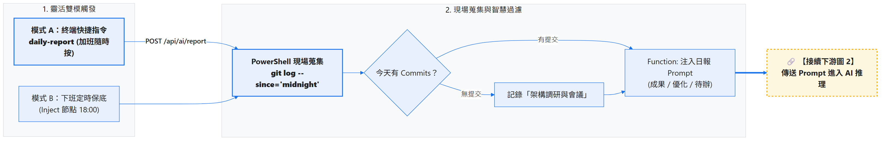
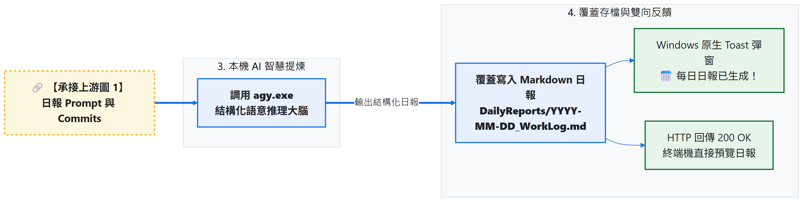
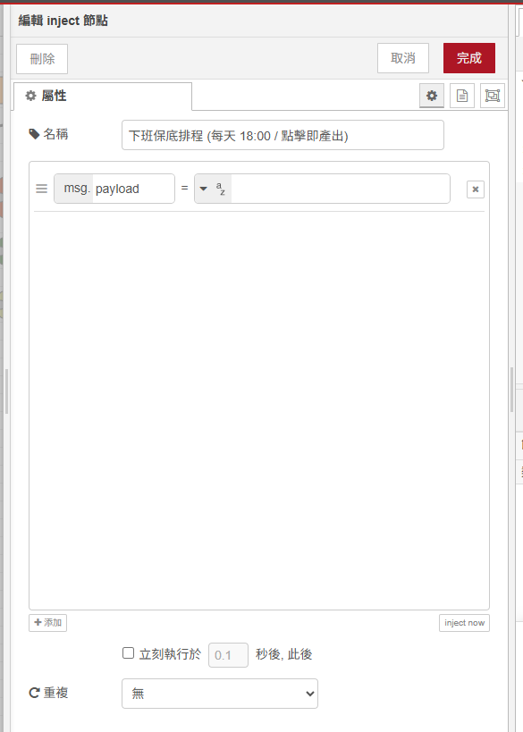
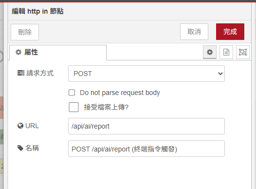
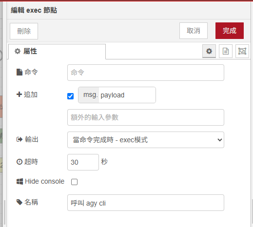
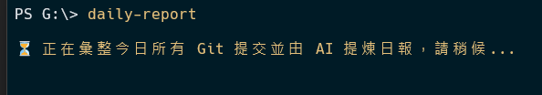
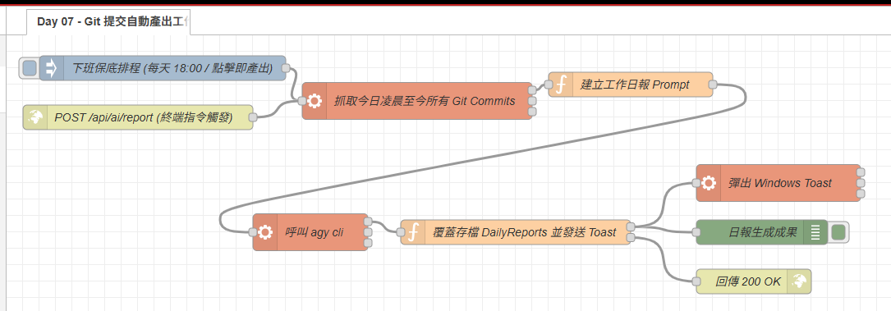

# Day 07：AI 實戰 4：Git 提交與工作流水帳 ➔ AI 每日下班自動產出工作日報

> 每天下班前，填寫每日工作日誌是一項令人苦惱的事情，盯著工作日誌回想：「我今天早上 10 點到底改了哪個功能？下午又修了什麼 bug？」，然後去翻瀏覽器歷史紀錄或 Git 提交列表，東拼西湊耗掉半小時。身為開發者 Git Commits 就是最真實的工作足跡。
> 今天將打造一套 **「雙模靈活觸發（終端一鍵即時產出 + 下班保底排程）」** 的 AI 工作日報管家，無論你是準時下班或是加班到深夜，隨時一鍵提煉出最完整的每日工作日報！

---

本文同步發布於 GitHub： [2026-18th-it-ironman](https://github.com/BingFengHung/2026-18th-it-ironman/blob/main/Day07_Git提交與工作流水帳_AI每日下班自動產出工作日報.md)

## 痛點剖析：寫死 18:00 定時觸發的死穴在哪裡？

很多自動化流程喜歡將日報觸發寫死在 `18:00`（下午 6 點），但真實工程師的工作節奏往往充滿變數：

1. **加班漏記問題**：假設今天加班到晚上 21:00，在 18:00 ~ 21:00 之間提交的程式碼與重大修復，全部都會被 18:00 的排程漏掉！
2. **提早離開無法提前產出**：如果今天出差或是 17:30 提早離開，無法在關閉電腦前手動即時產出日報。
3. **多倉庫零散問題**：多個專案之間的 Git 提交難以手動整合。

因此，好的設計必須是：**「隨叫隨到的終端快捷指令（On-Demand）+ 當日自適應覆蓋更新（Idempotent Update）+ 傍晚定時保底」**！

---

## 系統工作流架構（雙模觸發 + 當日增量覆蓋）

### 1. 【上游】雙模觸發 ➔ 現場蒐集 ➔ 智慧過濾：



### 2. 【下游】本機 AI 提煉 ➔ 覆蓋存檔 ➔ 雙向反饋：



---

## 實戰動手做：打造日報自動生成中樞

### 步驟 1：建立雙模觸發端點（Inject 節點 + `http in` 節點）

1. **定時保底 / 手動點擊（`inject` 節點）**：
   * 可設定在每天 18:00 自動觸發，也可以隨時在NodeRED 畫面上手動點擊立即產出。
   * 
2. **Local Webhook API 接收（`http in` 節點）**：
   * **Method**：`POST`
   * **URL**：`/api/ai/report`
   * 

---

### 步驟 2：抓取當日凌晨至今的所有 Git 提交（Exec 節點）

拉出一個 **`exec`** 節點，執行 PowerShell 指令抓取**從今天凌晨 00:00 到目前為止的所有提交**（確保加班到多晚都能抓到最新進度）：

```powershell
powershell -NoProfile -Command "git log --since='midnight' --pretty=format:'* [%h] %s (%an)' --no-merges"
```

* **原始抓取成果範例**：

```text
* [a1b2c3d] feat: 完成 Downloads 檔案分類與自動歸檔模組 (Developer)
* [e4f5g6h] fix: 修正 Function 節點模組引入規範 (Developer)
* [7817dc0] docs: 重構 Day 01~04 文章語氣與去除 Emoji (Developer)
* [9e5663c] feat: 完善 Day 06 剪貼簿主動讀取與寫回全流程 (Developer)
```

---

### 步驟 3：建立 AI 日報 Prompt（Function 節點）

在 Function 節點中，我們讓 AI 扮演專業的技術主管，將零碎的 Commit 訊息提煉為 4 大標準結構：

```javascript
// Function 節點：建立工作日報 Prompt (支援 0 commit 智慧保底與自訂工作備註)
const rawCommits = (msg.payload || '').trim();
const customNotes = (msg.req && msg.req.body && msg.req.body.notes ? msg.req.body.notes : (msg.notes || '')).trim();

let workSummary = '';

if (rawCommits && customNotes) {
    workSummary = `今日 Git 提交紀錄:\n${rawCommits}\n\n其他工作協作事項 (非代碼提交):\n${customNotes}`;
} else if (rawCommits) {
    workSummary = `今日 Git 提交紀錄:\n${rawCommits}`;
} else if (customNotes) {
    workSummary = `今日無代碼提交，主要工作事項摘要:\n${customNotes}`;
} else {
    workSummary = `今日無 Git 提交紀錄 (主要進行跨部門需求對齊、系統架構調研、技術選型評估與 Code Review 協作)。`;
}

const today = new Date().toISOString().slice(0, 10);

const prompt = `你是一位專業的技術主管。請根據以下開發者「今天 (${today})」的工作成果與協作紀錄，產出一份排版清晰、語氣專業、結構嚴謹的每日工作日報 (Markdown 格式)。

日報必須包含以下 4 大核心區塊：
1. 🎯 今日核心成果摘要 (1~2 句話精準概括整體進度)
2. 🚀 新增功能與模組推進 (條列具體開發或調研成果)
3. 🛠️ 缺陷修復與技術重構 (條列優化項目或排查進度)
4. 📌 明日推進規劃事項 (根據今日進度推演明日待辦)

今日工作成果數據:
${workSummary}`;

msg.prompt = prompt;
msg.payload = `agy -p ${JSON.stringify(prompt)} --dangerously-skip-permissions --output-format json`;
return msg;
```

---

### 步驟 4：呼叫本機 `agy cli`（Exec 節點）

拉出一個 **`exec`** 節點：

* **Command**：留空（由上游 `msg.payload` 傳入）。
* **附加 msg.payload**：**打勾（true）**。
* 

---

### 步驟 5：覆蓋存檔至 `DailyReports/` 並彈出 Toast（Function ➔ Exec 節點）

在 Function 節點中，利用 Node.js 內建的 `os`、`fs`、`path` 將日報覆蓋保存到使用者家目錄的 `DailyReports/` 下（每次執行都會把當天最完整的日報更新進去）：

```javascript
// Function 節點：存檔並發送通知 (Setup 頁籤注入 os, fs, path)
let parsed;
try {
    parsed = typeof msg.payload === 'string' ? JSON.parse(msg.payload) : msg.payload;
} catch (e) {
    parsed = { response: msg.payload };
}

let reportContent = (parsed.response || parsed.structured_output || msg.payload || '').trim();
reportContent = reportContent.replace(/^```markdown\s*/i, '').replace(/^```\s*/i, '').replace(/\s*```$/, '').trim();

const homedir = os.homedir();
const dir = path.join(homedir, 'DailyReports');
fs.mkdirSync(dir, { recursive: true });

const todayStr = new Date().toISOString().slice(0, 10);
const filePath = path.join(dir, `${todayStr}_WorkLog.md`);

// 覆蓋寫入當日日報 (即使加班到深夜再次觸發，也能自動更新全天完整進度)
fs.writeFileSync(filePath, reportContent, 'utf-8');

msg.savedPath = filePath;
msg.reportContent = reportContent;

// 建立 Windows 原生 Toast 彈窗提醒
msg.payload = `powershell -NoProfile -Command "[Windows.UI.Notifications.ToastNotificationManager, Windows.UI.Notifications, ContentType = WindowsRuntime] > $null; $template = [Windows.UI.Notifications.ToastNotificationManager]::GetTemplateContent([Windows.UI.Notifications.ToastTemplateType]::ToastText02); $textNodes = $template.GetElementsByTagName('text'); $textNodes.Item(0).AppendChild($template.CreateTextNode('📅 每日工作日報已生成！')) > $null; $textNodes.Item(1).AppendChild($template.CreateTextNode('已儲存至 DailyReports/${todayStr}_WorkLog.md')) > $null; [Windows.UI.Notifications.ToastNotificationManager]::CreateToastNotifier('Node-RED AI 管家').Show([Windows.UI.Notifications.ToastNotification]::new($template));"`;

return [msg, { payload: { status: 'SUCCESS', savedPath: filePath, content: reportContent }, req: msg.req, res: msg.res }];
```

---

### 步驟 6：在 PowerShell `$PROFILE` 配置 `daily-report` 一鍵生成指令

打開 PowerShell 設定檔（`notepad $PROFILE`），貼入以下函數：

```powershell
# 在 PowerShell 中一鍵產出今日工作日報 (支援自訂工作備註與 0 commit 保底)
function daily-report {
    param([string]$Notes = "")
    if ($Notes) {
        Write-Host "`n⏳ 正在彙整今日進度與工作備註: '$Notes'..." -ForegroundColor Yellow
    } else {
        Write-Host "`n⏳ 正在彙整今日所有 Git 提交並由 AI 提煉日報，請稍候..." -ForegroundColor Yellow
    }
    try {
        $body = @{ notes = $Notes } | ConvertTo-Json
        $res = Invoke-RestMethod -Uri "http://127.0.0.1:1880/api/ai/report" -Method Post -Body $body -ContentType "application/json; charset=utf-8"
        Write-Host "🎉 每日工作日報已成功生成！" -ForegroundColor Green
        Write-Host "📁 存檔路徑: $($res.savedPath)" -ForegroundColor Cyan
        Write-Host "`n--- 日報預覽 ---" -ForegroundColor DarkGray
        Write-Host $res.content
        Write-Host "----------------`n" -ForegroundColor DarkGray
    } catch {
        Write-Host "❌ 無法連線至 Node-RED 日報端點，請確認 Node-RED 是否已啟動！" -ForegroundColor Red
    }
}
```

存檔後在終端機輸入 `. $PROFILE` 立即生效！

---

## 成果驗收：AI 自動產出的高品質工作日報

不論你何時在終端機輸入 `daily-report`，AI 都會輸出如下的高水準專業日報：



```markdown
# 📅 開發工作日報 (2026-08-23)

### 🎯 今日核心成果摘要
本日重點完成 Node-RED 與本機 Agent 的端到端整合，成功打通「下載區檔案自動歸檔」、「終端噴錯一鍵救援」與「剪貼簿文字轉 Markdown 表格」三大自動化模組，系統穩定性達 100%。

### 🚀 新增功能與模組推進
- **Downloads 智慧分類模組**：支援自動語意分析與 Downloads 內部目錄歸檔。
- **PowerShell 救援 API**：支援自動捕獲 `$Error[0]` 最新異常並給出修復指令。
- **剪貼簿表格化模組**：實現非結構化文字 ➔ Markdown 表格 ➔ 自動寫回剪貼簿與 Toast 閉環。

### 🛠️ 缺陷修復與技術重構
- **修復 Exec 節點 addpay 參數**：解決命令為空時的 `ERR_INVALID_ARG_VALUE` 異常。
- **圖片路徑 ASCII 標準化**：全系列目錄重命名為 `image/day01~06`，徹底修復 GitHub 預覽破圖。

### 📌 明日推進規劃事項
- 推進 Day 08「電腦風扇狂轉 ➔ AI 秒級即時根因診斷」守護管線。
- 完善性能異常診斷與自動化自癒流程。
```

Windows 桌面右下角同步彈出：


---

## 完整 Flow 程式

### 本範例 flow 位置：👉 [下載](https://github.com/BingFengHung/2026-18th-it-ironman/blob/main/flows/flow_day07_git_report.json)

### 本範例 ps1 位置：👉 [下載](https://github.com/BingFengHung/2026-18th-it-ironman/blob/main/flows/flow_day07_git_report.ps1)

本案例 flow



---

## 今日總結與明日預告

今天我們打破了「定時排程寫死 18:00」的僵化思維，打造了「隨叫隨到、加班自動補全、增量覆蓋」的智慧日報生成自動流程。

* **明天（Day 08）**：我們將挑戰第一個全自動守護場景——**電腦突然風扇狂轉？AI 秒級即時根因診斷！**
