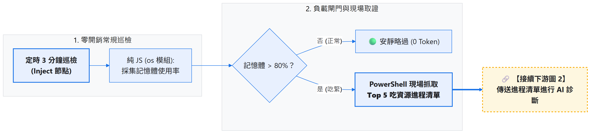
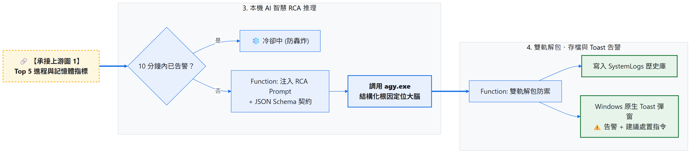
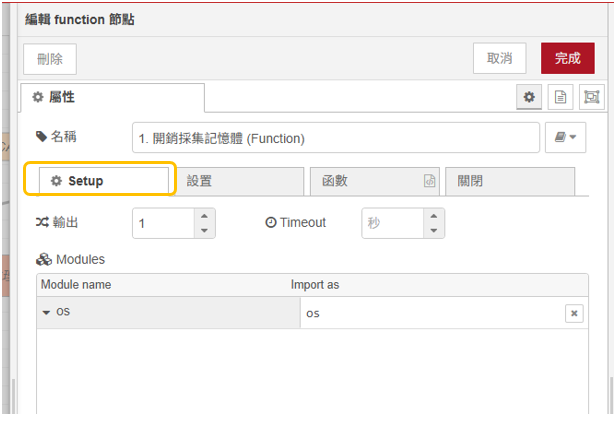
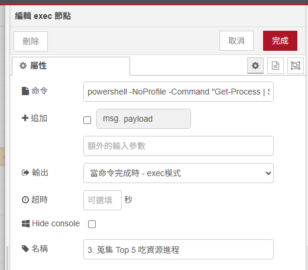
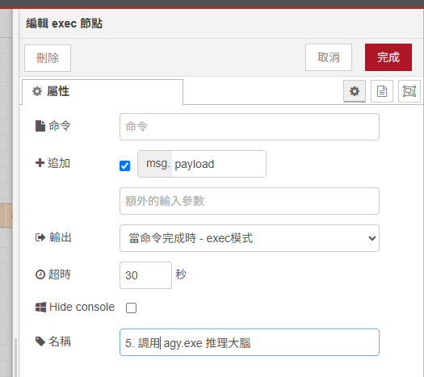
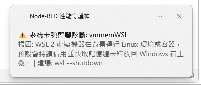
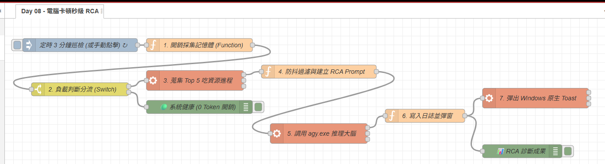

# Day 08：AI 實戰 5：電腦突然風扇狂轉？AI 秒級即時根因診斷（RCA 分析）

> 正在寫程式、開會或打遊戲時，筆電風扇突然開始瘋狂狂轉、滑鼠游標瞬間卡頓，大家的第一反應通常是按下 `Ctrl + Shift + Esc` 打開 Windows「工作管理員」。但點開之後，在一長串上百個叫不出名字的進程清單裡慢慢翻，好不容易找到吃最多記憶體的進程，卻往往一臉茫然：
>
> * 「這個 `vmmemWSL` 為什麼突然吃了 4GB？它到底在幹嘛？」
> * 「這個 `SearchIndexer.exe` 到底能不能強制關閉？會不會導致系統崩潰？」
>
> 今天將打造一個 **「零開銷常規巡檢 + 異常突發現場取證 + 本機 AI 秒級 RCA 根因診斷」** 的智慧守護神：平時 0% CPU 佔用，一旦資源飆高，本機 AI 在 3 秒內用白話文告訴你原因，並直接給出可複製執行的安全處置指令！

---

本文同步發布於 GitHub： [2026-18th-it-ironman](https://github.com/BingFengHung/2026-18th-it-ironman/blob/main/Day08_電腦突然風扇狂轉_AI秒級即時根因診斷.md)

## 傳統排查 vs AI-First 智慧守護神對比

| 比較項目             | 傳統手動開工作管理員                  | 🤖 AI-First 秒級 RCA 守護神                                           |
| :------------------- | :------------------------------------ | :-------------------------------------------------------------------- |
| **反應速度**   | 卡頓時手忙腳亂按快速鍵，耗時 1~2 分鐘 | **背景自動感知**，資源飆高 3 秒內秒級告警                       |
| **資訊可讀性** | 滿滿英文進程名與十六進位代碼，看不懂  | **白話文解釋成因**（如說明是 Docker 快取未釋放）                |
| **操作指引**   | 不敢隨便關閉進程，怕系統藍屏          | **指名道姓可疑進程**，給出安全處置指令（如 `wsl --shutdown`） |
| **資源開銷**   | 輪詢腳本容易吃佔用                    | **平時毫秒級計算，0% CPU / 0 Token 消耗**                       |
| **防重複打擾** | 傳統告警一直彈窗逼瘋使用者            | **內建 10 分鐘防抖抑制機制**（Context 狀態鎖）                  |

---

## 系統全景工作流架構（雙圖清晰銜接）

### 1. 【上游】零開銷巡檢 ➔ 負載閘門 ➔ 現場 Top 5 取證：



### 2. 【下游】本機 AI 提煉 ➔ 雙軌解包 ➔ 日誌存檔與 Toast 彈窗：



---

## 實戰動手做：打造卡頓 RCA 診斷流水線

### 步驟 1：零開銷採集記憶體現況（Function 節點）

在 Function 節點中，利用 Node.js 內建的 `os` 模組，耗時不到 1 毫秒即可算出記憶體使用率：

> **💡 Setup 設定提醒**：請點開 Function 節點，切換至 **「設定（Setup）」➔「模組（Modules）」** 頁籤，新增模組 `os`（變數名：`os`）。
> 

```javascript
// 採集 (Setup 頁籤注入 os)
const total = os.totalmem();
const free = os.freemem();
const used = total - free;
const memPercent = Math.round((used / total) * 100);
const usedMB = Math.round(used / 1024 / 1024);
const totalMB = Math.round(total / 1024 / 1024);

// 閥值過濾：記憶體佔用 > 80% 判定為高負載
const isHighLoad = memPercent > 80;

msg.metrics = {
    mem_used_mb: usedMB,
    mem_total_mb: totalMB,
    mem_percent: memPercent,
    is_high_load: isHighLoad,
    timestamp: new Date().toISOString()
};

msg.payload = msg.metrics;
return msg;
```

---

### 步驟 2：負載判斷分流閘門（Switch 節點）

拉出一個 **Switch 節點** 判斷 `msg.payload.is_high_load`：

* **第 1 路 (`== true`)** ➔ 記憶體吃緊，導向現場抓取進程。
* **第 2 路 (`== false`)** ➔ 系統健康，導向 Debug 節點安靜結束（**平時完全不消耗任何 Token 與 AI 算力！**）。

---

### 步驟 3：PowerShell 蒐集 Top 5 吃資源進程（Exec 節點）

拉出一個 **`exec`** 節點，執行優化過的 PowerShell 指令，採集吃記憶體最多的前 5 個進程並轉為 JSON：

* **Command**：
  ```powershell
  powershell -NoProfile -Command "Get-Process | Sort-Object WorkingSet64 -Descending | Select-Object -First 5 ProcessName, Id, @{N='Memory_MB';E={[math]::Round($_.WorkingSet64/1MB)}} | ConvertTo-Json"
  ```
* **附加 msg.payload**：不打勾。
* 

---

### 步驟 4：防抖抑制與建立 RCA Prompt（Function 節點）

在此節點中加入 **10 分鐘防重複告警防線**，並向 `agy.exe` 發起具備 `--json-schema` 約束的診斷 Prompt：

```javascript
// Function 節點：防抖過濾與建立 RCA Prompt
const now = Date.now();
const lastAlert = flow.get('last_alert_time') || 0;
if (now - lastAlert < 10 * 60 * 1000) {
    node.warn('⚠️ 10 分鐘內已觸發過 RCA 診斷，本次自動跳過以節省算力');
    return null;
}
flow.set('last_alert_time', now);

let topProcesses = [];
try {
    topProcesses = JSON.parse(msg.payload);
} catch (e) {
    topProcesses = msg.payload;
}

const metrics = msg.metrics || {};
const prompt = `你是一個專業的 Windows 系統效能診斷專家。目前系統記憶體佔用高達 ${metrics.mem_percent}% (${metrics.mem_used_mb}MB / ${metrics.mem_total_mb}MB)。
以下是吃記憶體最多的 Top 5 進程清單:
${JSON.stringify(topProcesses)}

請進行 RCA 根因診斷：
1. 找出最可疑或最吃資源的目標進程名稱 (target_process)。
2. 用一句話解釋為什麼該進程會佔用這麼高資源 (plain_cause)。
3. 給出 1 條建議的具體處置或修復指令 (recommended_action，如釋放記憶體或終止指令)。
4. 判定強制結束該進程是否安全 (can_kill_safely: true/false)。`;

const schema = {
  type: 'object',
  properties: {
    target_process: { type: 'string', description: '最可疑的進程名稱' },
    plain_cause: { type: 'string', description: '白話根因分析' },
    recommended_action: { type: 'string', description: '建議處置指令' },
    can_kill_safely: { type: 'boolean', description: '強制終止是否安全' }
  },
  required: ['target_process', 'plain_cause', 'recommended_action', 'can_kill_safely']
};

msg.topProcesses = topProcesses;
msg.payload = `agy -p ${JSON.stringify(prompt)} --dangerously-skip-permissions --json-schema ${JSON.stringify(JSON.stringify(schema))} --output-format json`;
return msg;
```

---

### 步驟 5：呼叫本機 `agy CLI`（Exec 節點）

* **Command**：留空（由上游 `msg.payload` 傳入）。
* **附加 msg.payload**：**打勾（true）**。
* 
---

### 步驟 6：雙軌解包、日誌存檔與 Windows Toast 彈窗（Function ➔ Exec 節點）

將 AI 回傳的結果解包後，自動寫入本地歷史記錄日誌，並彈出原生 Toast 提醒：

> **💡 Setup 設定提醒**：請在 Function 節點「設定」頁籤中引入 `os`、`fs`、`path`。

```javascript
// Function 節點：雙軌解包與存檔 (Setup 頁籤注入 os, fs, path)
let parsed;
try {
    parsed = typeof msg.payload === 'string' ? JSON.parse(msg.payload) : msg.payload;
} catch (e) {
    node.error('JSON 解析失敗: ' + msg.payload);
    return null;
}

// 雙軌解包
let data = parsed.structured_output;
if (!data && parsed.response) {
    try {
        data = typeof parsed.response === 'string' ? JSON.parse(parsed.response) : parsed.response;
    } catch (e) {
        const match = parsed.response.match(/\{[\s\S]*\}/);
        if (match) data = JSON.parse(match[0]);
    }
}

const rca = data || parsed;
const homedir = os.homedir();
const logDir = path.join(homedir, 'SystemLogs');
fs.mkdirSync(logDir, { recursive: true });

const today = new Date().toISOString().slice(0, 10);
const logFile = path.join(logDir, `${today}_PerfRCA.log`);
const line = `[${new Date().toLocaleTimeString()}] 程式: ${rca.target_process} | 根因: ${rca.plain_cause} | 處置: ${rca.recommended_action} | 安全: ${rca.can_kill_safely}\n`;
fs.appendFileSync(logFile, line, 'utf-8');

const title = `⚠️ 系統卡頓智慧診斷: ${rca.target_process}`;
const message = `根因: ${rca.plain_cause} | 建議: ${rca.recommended_action}`;

msg.rcaResult = rca;
msg.payload = `powershell -NoProfile -Command "[Windows.UI.Notifications.ToastNotificationManager, Windows.UI.Notifications, ContentType = WindowsRuntime] > $null; $template = [Windows.UI.Notifications.ToastNotificationManager]::GetTemplateContent([Windows.UI.Notifications.ToastTemplateType]::ToastText02); $textNodes = $template.GetElementsByTagName('text'); $textNodes.Item(0).AppendChild($template.CreateTextNode('${title}')) > $null; $textNodes.Item(1).AppendChild($template.CreateTextNode('${message}')) > $null; [Windows.UI.Notifications.ToastNotificationManager]::CreateToastNotifier('Node-RED 性能守護神').Show([Windows.UI.Notifications.ToastNotification]::new($template));"`;

return msg;
```

---

## 成果驗收：真實卡頓診斷效果

當系統記憶體飆高時，本機 AI 的結構化輸出如下：

```json
{
  "target_process": "vmmemWSL",
  "plain_cause": "WSL2 虛擬機器在背景常駐並快取了大量 Linux 容器記憶體，未在 Windows 端設定最大記憶體配額限制。",
  "recommended_action": "在 PowerShell 執行 wsl --shutdown 立即釋放記憶體，或在 %USERPROFILE%/.wslconfig 設定 memory=4GB",
  "can_kill_safely": true
}
```

Windows 桌面右下角同步彈出醒目的 Toast 卡片：



> **⚠️ 系統卡頓智慧診斷：vmmemWSL**
> **根因**：WSL2 虛擬機器在背景常駐並快取了大量 Linux 容器記憶體。
> **建議**：在 PowerShell 執行 `wsl --shutdown` 立即釋放記憶體。

---

## 完整 Flow 程式

### 本範例 flow 位置：👉 [下載](https://github.com/BingFengHung/2026-18th-it-ironman/blob/main/flows/flow_day08_perf_rca.json)


本案例 flow



---

## 今日總結與明日預告

今天我們打造了一個兼顧效能（平時 0% 佔用）與智慧（異常秒級 RCA）的 Windows 守護中樞！

* **明天（Day 09）**：我們將深入剖析核心技術——**`--json-schema` 契約保證：為什麼 AI 自動化絕不能只輸出純文字？**
