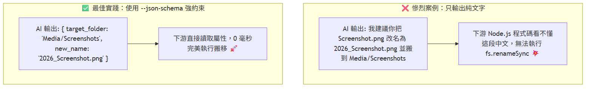
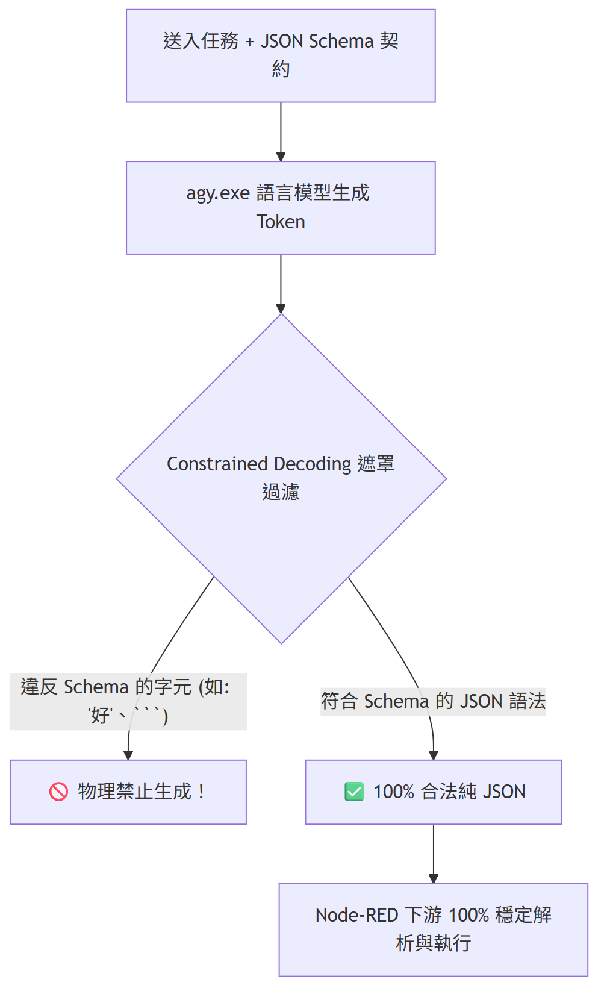

# Day 09：AI 核心：`--json-schema` 契約保證（為什麼自動化不能只輸出純文字？）

> 在前面幾天的實戰中，你一定注意到了我們呼叫 `agy CLI` 時，都會帶上一個特殊的參數：`--json-schema`。
> 初學者常問一個直覺的問題：「直接叫 AI 輸出純文字或 Markdown 不就好了嗎？為什麼一定要大費周章定義 JSON Schema？」
> 今天我們就來深入探討這個決定自動化管線「能不能 7x24 小時無人值守穩定運行」的關鍵功臣！

---

本文同步發布於 GitHub： [2026-18th-it-ironman](https://github.com/BingFengHung/2026-18th-it-ironman/blob/main/Day09_jsonSchema契約保證_為什麼AI自動化不能只吐純文字.md)

## 純文字 vs 結構化 JSON：給誰看的差別？

核心原則只有一句話：

* **給人類閱讀看的** ➔ 輸出 **純文字（Text / Markdown）** 確實最直覺。
* **要給後面的程式碼繼續「自動搬檔案、做條件判斷、存資料庫」的** ➔ 必須輸出 **結構化資料（JSON + Schema）**！



---


## 沒有 `--json-schema` 時，自動化會遇到的三個問題

### 問題 1：Markdown 圍欄污染 ➔ `JSON.parse` 直接爆炸

* **Prompt 期望**：你明明在 Prompt 寫著：「請只回傳 JSON，絕對不要任何廢話！」
* **AI 偶爾吐出**：
  ```text
  好的！這是為您整理的分析結果：

  { "severity": "WARNING", "process": "chrome.exe" }

  希望對您有幫助！
  ```
* **後果**：下游 Node-RED 接到這串字串時，`JSON.parse()` 直接噴錯 `SyntaxError: Unexpected token '好'`，整條自動化流程當場中斷死掉！

---

### 問題 2：欄位名稱隨機漂移（Key Drift） ➔ 下游讀到 `undefined`

* **第 1 次執行**：AI 吐出的 key 叫 `{"severity": "CRITICAL"}` ➔ 下游 Switch 節點正常分流。
* **第 10 次執行**：AI 心情好突然自己改名叫 `{"level": "CRITICAL"}` 或 `{"risk_level": "HIGH"}`。
* **後果**：下游寫 `if (msg.payload.severity === 'CRITICAL')` 時永遠比對失敗，重大警報被靜默丟棄！

---

### 問題 3：型別不一致（Type Mutation）

* 下游需要陣列 `files: ["a.png", "b.png"]` 來跑迴圈 `forEach`。
* 結果 AI 遇到只有 1 個檔案時，自作聰明吐出字串 `files: "a.png"`。
* **後果**：下游執行 `files.forEach` 直接噴出 `TypeError: files.forEach is not a function` 崩潰！

---

## `--json-schema` 是如何從物理底層解決問題的？

Google `agy` 的 `--json-schema` 採用了 **「語法樹約束解碼（Constrained Decoding）」** 技術：

> **Constrained Decoding（約束解碼）** 是大型語言模型（LLM）在生成文字時的一種技術，透過在 **每個 Token 生成步驟中強制加入規則限制** ，確保輸出結果 100% 符合預設的格式或語法（例如 JSON Schema、正規表達式 Regex、SQL 或 Python 語法）。



1. **物理級限制**：模型在生成每一個 Token 時，只要是不符合 JSON Schema 規格的字元，直接在機率矩陣被強制過濾。模型「想講廢話也講不出來」！
2. **保證欄位與型別**：只要定義了 `required: ["target_folder", "new_name"]`，輸出必定 100% 包含這些欄位，型別也絕對正確。

---

## 最佳實戰：標準 JSON Schema 定義範本

在 Node-RED Function 節點中，建立標準 JSON Schema 的規範寫法如下：

```javascript
// Function 節點：建立標準 JSON Schema 契約
const schema = {
  type: "object",
  properties: {
    target_folder: {
      type: "string",
      description: "目標歸檔資料夾路徑，例如 Documents/TechDocs"
    },
    new_name: {
      type: "string",
      description: "標準化後的檔案名稱"
    },
    category: {
      type: "string",
      enum: ["DOCUMENT", "IMAGE", "ARCHIVE", "INSTALLER", "OTHER"]
    },
    confidence: {
      type: "number",
      description: "置信度 (0.0 ~ 1.0)"
    }
  },
  required: ["target_folder", "new_name", "category", "confidence"],
  additionalProperties: false
};

const prompt = "請將以下檔案名稱進行分類與標準化命名...";

// 透過 JSON.stringify 進行雙重轉義傳入 CLI 參數
msg.payload = `agy -p ${JSON.stringify(prompt)} --dangerously-skip-permissions --json-schema ${JSON.stringify(JSON.stringify(schema))} --output-format json`;
return msg;
```

---

## 防禦性程式設計：Node-RED「雙軌解包」守護神

即便有了 `--json-schema`，在自動化中建議在 Function 節點中加入 **「雙軌解包防禦」**：

```javascript
// 雙軌解包防禦
let parsed;
try {
    parsed = typeof msg.payload === 'string' ? JSON.parse(msg.payload) : msg.payload;
} catch (e) {
    node.error("JSON 解析失敗: " + msg.payload);
    return null;
}

// 優先取得 structured_output，若無則從 response 解包
let result = parsed.structured_output;
if (!result && parsed.response) {
    try {
        result = typeof parsed.response === 'string' ? JSON.parse(parsed.response) : parsed.response;
    } catch (e) {
        const match = parsed.response.match(/\{[\s\S]*\}/);
        if (match) result = JSON.parse(match[0]);
    }
}

msg.payload = result || parsed;
return msg;
```

---

## 今日總結與明日預告

`--json-schema` 是將隨機生成的生成式模型，轉化為高可用架構與穩定 API 的關鍵機制。

* **明天（Day 10）**：我們將學習如何幫 Prompt 瘦身——**用 JSONata 與純 JS 前置壓縮長日誌，省下 80% Token 與推理時間**！
