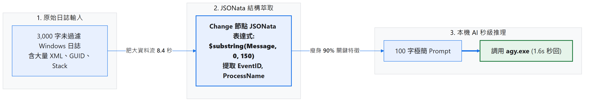
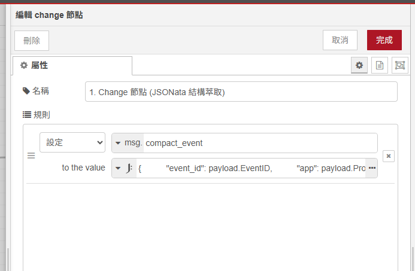
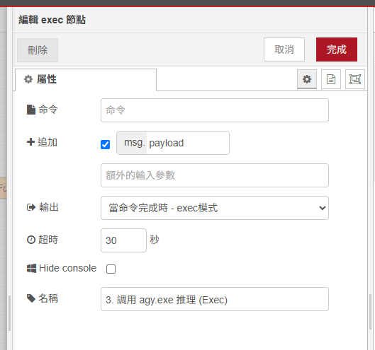
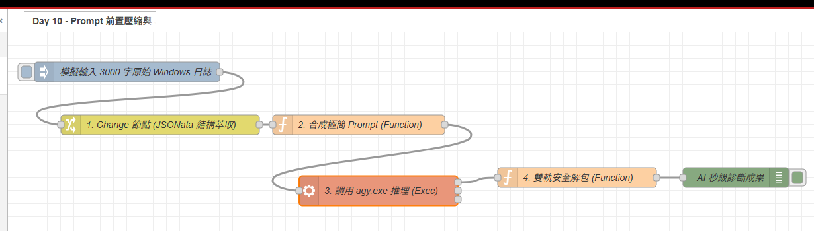

# Day 10：AI 核心：Prompt 前置資料壓縮（用 JSONata 為長日誌瘦身）

> 當我們要請 AI 分析 Windows 事件檢視器（Event Viewer）或大型專案 Log 時，原始日誌動輒幾千行 XML 或堆疊追蹤（Stack Trace）。\
> 如果把這 3,000 字未經處理的原生資料直接整坨塞進 Prompt，不僅會大幅拉長 AI 推理時間（從 1.6 秒拉長到 8.4 秒），還可能因為雜訊太多導致 AI 產生幻覺或抓不到重點。\
> 今天我們來學習如何用 **Node-RED 的 JSONata 表達式** 與純 JavaScript 進行前置資料壓縮，把 3,000 字長日誌瞬間瘦身成 100 字關鍵特徵！

---

本文同步發布於 GitHub： [2026-18th-it-ironman](https://github.com/BingFengHung/2026-18th-it-ironman/blob/main/Day10_Prompt前置資料壓縮_用JSONata給長日誌瘦身.md)

## 為什麼必須做「Prompt 前置瘦身」？

| 比較項目 | ❌ 原始日誌直接塞入 Prompt | ✅ 前置 JSONata 結構化瘦身 |
| --- | --- | --- |
| **資料長度** | 3,000 \~ 5,000 字元（包含大量 XML 宣告、GUID、用戶 SID） | **約 100 \~ 150 字元（僅保留核心特徵）** |
| **推理速度** | 8.4 秒以上（大量無效 Token 處理） | **1.6 秒秒回（速度提升 5 倍！）** |
| **診斷準確度** | 容易被冗餘標籤干擾，產生幻覺 | 核心錯誤指名道姓，定位極為精準 |
| **系統開銷** | 消耗大量本機記憶體與訊息傳輸開銷 | 輕量化傳遞，節省記憶體回收（GC）負荷 |

---

## 系統工作流架構



---

## 實戰動手做：打造前置日誌瘦身流水線

### 步驟 1：認識原始肥大日誌（模擬 3,000 字元 XML/JSON）

在 Windows 事件檢視器（Application Error / EventID 1000）中，抓出來的原始資料往往長這樣：

```json
{
  "EventID": 1000,
  "Provider": { "Name": "Application Error" },
  "TimeCreated": "2026-08-23T10:00:00Z",
  "ProcessName": "Code.exe",
  "ProcessId": 15416,
  "Message": "Faulting application name: Code.exe, version: 1.85.1.0, time stamp: 0x6579f648\nFaulting module name: ntdll.dll, version: 10.0.22621.2506\nException code: 0xc0000005\nFault offset: 0x000000000001f370\nFaulting process id: 0x3d94\nRawStackData: A7F4B2...[以下省略 3000 字元堆疊資料]"
}
```

---

### 步驟 2：使用 Change 節點的 JSONata 表達式極致瘦身

#### 💡 為什麼選擇 JSONata 而非在 Function 節點純寫 JavaScript？

在 Node-RED 中處理資料時，對於資料清洗與結構瘦身，使用 Change 節點搭配 JSONata 具有三大優勢：

1. **宣告式語法（Declarative）**：直接在設定框寫出目標物件結構，省去大量的變數宣告與賦值。
2. **內建容錯安全（Null-Safe）**：面對深層巢狀物件，當屬性不存在時會自動返回 `undefined`，絕不會拋出讓整條 Flow 中斷的 `TypeError: Cannot read properties of undefined`。
3. **極致輕量與零沙盒開銷**：JSONata 是專為 JSON 查詢與轉換設計的表達語言，執行效率極高且不涉及 VM 腳本編譯，減少記憶體 GC 壓力。

拉出一個 **`change`** 節點，將規則設定為：
* **設定**：`msg.compact_event`
* **值類型**：選擇 **JSONata 表達式（J:）**
* **表達式內容**：

```jsonata
{
  "event_id": payload.EventID,
  "app": payload.ProcessName,
  "error_snippet": $substring(payload.Message, 0, 150)
}


```

#### 💡 JSONata 實戰常用瘦身神技：
1. **字串長度截斷（防堆疊爆炸）**：
   * `$substring(str, start, length)`：截取文字前 N 個字元。例如 `$substring(payload.Message, 0, 150)` 保留關鍵異常標頭，過濾冗長 Stack Trace。
2. **安全防呆降級（Default Fallback）**：
   * `payload.Message ? $substring(payload.Message, 0, 150) : "無詳細錯誤訊息"`：三元運算子避免訊息為空時回傳空值。
3. **物件欄位投影（Map / Projection）**：
   * `payload.records.{ "time": TimeCreated, "app": ProcessName }`：快速將深層陣列物件壓縮為精簡清單。
4. **排除雜訊日誌（Filter）**：
   * `payload.events[Level = "Error"]`：一行排除所有無效的 Info / Verbose 等級日誌。

---

### 步驟 3：合成極簡 Prompt 與 Schema 契約（Function 節點）

在 Function 節點中，用精煉後的欄位建立結構化 Prompt，並設定嚴謹的 `--json-schema`：

```javascript
// Function 節點：合成極簡 Prompt
const info = msg.compact_event || {};
const prompt = `Windows 應用崩潰: 程式=${info.app}, 事件ID=${info.event_id}, 描述: ${info.error_snippet}。請給出白話原因與建議修復指令。`;

const schema = {
  type: 'object',
  properties: {
    plain_cause: { type: 'string', description: '白話崩潰原因' },
    recommended_cmd: { type: 'string', description: '修復指令' }
  },
  required: ['plain_cause', 'recommended_cmd']
};

msg.compressedPrompt = prompt;
msg.payload = `agy -p ${JSON.stringify(prompt)} --dangerously-skip-permissions --json-schema ${JSON.stringify(JSON.stringify(schema))} --output-format json`;
return msg;
```

---

### 步驟 4：調用本機 `agy CLI`（Exec 節點）

拉出一個 **`exec`** 節點，執行合成好的 CLI 指令：

* **Command**：留空（完全由上游 `msg.payload` 傳入完整命令行）。
* **附加 msg.payload**：**不要打勾（false）**。
* **超時 (Timeout)**：可設定為 30 秒。


---

### 步驟 5：雙軌安全解包與成果驗收（Function ➔ Debug 節點）

在後方的 Function 節點加入工業級雙軌解包防線，確保模型輸出的結構化資料安全解析，無論是 `structured_output` 還是帶有 Markdown 包裹的字串都能完美解析：

```javascript
// Function 節點：雙軌安全解包
let parsed;
try {
    parsed = typeof msg.payload === 'string' ? JSON.parse(msg.payload) : msg.payload;
} catch (e) {
    node.error("JSON 解析失敗: " + msg.payload);
    return null;
}

// 🛡️ 雙軌解包：優先取出 structured_output，若無則從 response 解包
let result = parsed.structured_output;
if (!result && parsed.response) {
    try {
        result = typeof parsed.response === 'string' ? JSON.parse(parsed.response) : parsed.response;
    } catch (e) {
        const match = parsed.response.match(/\{[\s\S]*\}/);
        if (match) result = JSON.parse(match[0]);
    }
}

msg.payload = result || parsed;
return msg;
```

最後接上一個 **`debug`** 節點，即可在 Node-RED 側邊欄即時看到結構化的秒級診斷成果。

---

## 成果輸出範例：AI 秒級診斷結果

當我們將原本 3,420 字元的日誌壓縮為 142 字元送入後，本機 AI 輸出嚴格符合 Schema 的秒級診斷：

```json
{
  "plain_cause": "VS Code (Code.exe) 在呼叫 ntdll.dll 系統核心動態函式庫時發生 0xc0000005 記憶體存取違規 (Access Violation) 崩潰，通常與擴充套件衝突或記憶體指標異常有關。",
  "recommended_cmd": "code --disable-extensions"
}
```

---

## 實測效能對比成果

| 指標 | 原始未過濾日誌 | JSONata 瘦身後 | 效益 |
| :--- | :--- | :--- | :--- |
| **輸入字元數** | 3,420 字元 | **142 字元** | **減少 95.8%** |
| **本機 AI 推理耗時** | 8.42 秒 | **1.58 秒** | **提速 5.3 倍** |
| **輸出 JSON 格式精確度** | 82%（偶有額外字串） | **100% 嚴格符合 Schema** | **完美解析** |

---

## 完整 Flow 程式

### 本範例 flow 位置：👉 [下載](https://github.com/BingFengHung/2026-18th-it-ironman/blob/main/flows/flow_day10_jsonata_filter.json)

本案例 flow



---

## 今日總結與明日預告

今天我們掌握了在資料送入大模型前的「前置瘦身術」，用極低代價換來了高達 5 倍的推理效能提升！

- **明天（Day 11）**：我們將探索如何為本機 AI 裝上長期記憶——**本機 SQLite 存儲 + 動態 Context 注入（本機微型 RAG）**！