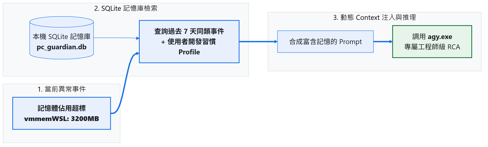
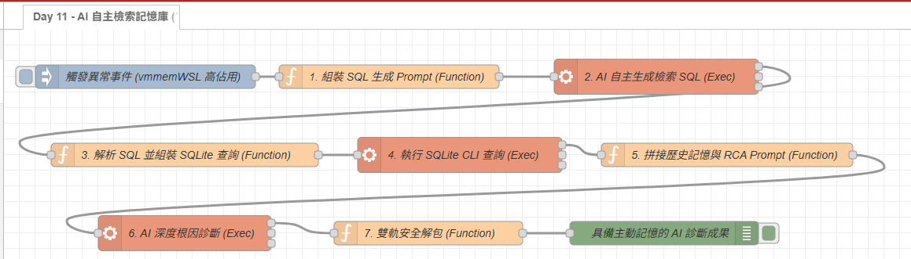

# Day 11：AI 核心：給 AI 裝上長期記憶（本機 SQLite + Agentic Text-to-SQL 動態檢索）

> 如果每次請 AI 做卡頓診斷時，都只給它「當下這一瞬間」的數據，AI 往往只能給出「請嘗試重開機」這種廢話。
> 但如果我們將「過去 7 天的歷史事故、前次修復方式、使用者開發習慣」動態注入 Prompt，AI 就能瞬間化身為最懂你電腦的專屬架構師！
> 今天我們在 Windows 本機打造專屬記憶庫，實作 **AI 主動長期記憶（Agentic Text-to-SQL + 動態 Context 注入）**！

---

本文同步發布於 GitHub： [2026-18th-it-ironman](https://github.com/BingFengHung/2026-18th-it-ironman/blob/main/Day11_給AI裝上長期記憶_本機SQLite與動態Context注入.md)

## 痛點對比：金魚腦 AI vs 具備主動記憶的專屬管家

| 比較項目           | ❌ 無狀態 AI（金魚腦）     | ⚠️ 固定條件查詢（受限版）                     | ✅ AI 主動檢索記憶（Agentic Text-to-SQL）                                                 |
| :----------------- | :------------------------- | :---------------------------------------------- | :---------------------------------------------------------------------------------------- |
| **輸入數據** | 只有當下「記憶體佔用 85%」 | 當下資料 +**寫死只查同一進程名稱**        | 當下資料 +**AI 自主動態聯想關聯進程與閾值**                                         |
| **關聯能力** | 完全無法關聯               | 遇到`docker.exe` 連鎖引發 `vmmemWSL` 就瞎掉 | **自動檢索 WSL、Docker 容器與過往超過 2GB 的重大事故**                              |
| **診斷結論** | 「建議關閉應用程式。」     | 「過去 3 天 vmmemWSL 發生 3 次超標。」          | **「比對過去 Docker 編譯與 WSL 紀錄，確認為容器快取連鎖洩漏，精準給出修復指令。」** |

---

## 本機 SQLite 主動記憶架構圖



---

* 由 AI 先根據當前異常情境**自主決定檢索策略並寫出最精準的 SQL**。
* 再由本機輕量 `sqlite3.exe` 執行查詢，把撈出來的精準結構化歷史數據動態注入給下一個階段進行深度診斷。
* **既保留了關聯式資料庫 100% 精確的時序與數值過濾，又賦予了 AI 跨進程自主聯想的強大智慧！**

---

## 前置準備：在 Windows 上安裝與驗證 SQLite CLI

SQLite 不需要啟動任何背景服務，它是純粹的單一執行檔（`sqlite3.exe`），極度輕量。

### 一鍵安裝（Windows 內建 winget）

打開 PowerShell 直接執行：

```powershell
winget install SQLite.SQLite
```

> **驗證安裝成果**：重新開啟一個 PowerShell 終端機，輸入 `sqlite3 --version`，能印出版本號就代表配置完成！

---

## 實戰動手做：雙階段 Agentic 流水線設計

整條自動化流程分為 **「SQL 查詢規劃」** 與 **「深度根因診斷」** 兩大 AI 階段，中間由本機 SQLite 負責高精準的歷史資料對齊：

```
[異常事件觸發] 
      ↓
【階段一：AI 自主規劃 SQL 查詢】 ➔ AI 根據異常與 Schema，自動推理出最適 SELECT 語句
      ↓
【中繼站：安全過濾與本機 SQLite 檢索】 ➔ 白名單正則攔截非 SELECT 指令，sqlite3.exe 毫秒級取回 JSON
      ↓
【階段二：動態 Context 注入與深度 RCA】 ➔ 將歷史數據注入 Prompt，AI 產出根因分析與專屬處置方針
```

---

### 階段一：AI 觀察異常，自主生成最適檢索語句（Text-to-SQL）

傳統作法是由人類寫死查詢條件，而我們將 SQLite 表結構直接交給 AI：

```sql
CREATE TABLE system_incidents (
    id INTEGER PRIMARY KEY,
    timestamp DATETIME,
    process_name TEXT,
    memory_mb REAL,
    last_action TEXT
);
```

#### 1. 核心 Prompt 設計（Function 節點）

當監控系統捕獲到 `vmmemWSL` 佔用高達 3200MB 時，我們組裝出以下 Prompt：

```text
你是一位資深的 Windows 系統架構師與自動化維運專家。
當前監控系統捕獲到即時異常事件：進程 vmmemWSL，記憶體佔用 3200 MB。

為了對此異常進行最深度的 RCA 根因診斷，請不要受限於單一進程名稱！
請自主分析可能與其連鎖關聯的進程生態（例如 Docker、WSL、編譯器等）、合理的嚴重度閾值，
並寫出一條最有參考價值的 SQLite SELECT 查詢語句（最多檢索 5 筆，按 timestamp 降序）。
```

#### 2. 調用本機 `agy CLI` 推理（Exec 節點）

* **節點設定**：Command 留空（由 payload 傳入），勾選「附加 msg.payload」，超時設定為 **60 秒**。
* **關鍵調優**：指令中加入 `--effort low`，將 AI 的思考時間大幅壓縮至 **6~10 秒內**完成，既快速又保持高精確度。

---

### 中繼站：安全防護與本機 SQLite 毫秒級檢索

讓 AI 動態寫 SQL，最關鍵的原則就是 **「安全防禦」** ——嚴格限制只允許執行查詢，杜絕任何意料之外的寫入或刪除操作。

#### 1. 正則白名單防線（Function 節點）

在把 AI 產出的 SQL 送進資料庫前，加入嚴格的白名單過濾：

```javascript
// 僅允許 SELECT 查詢，若包含非查詢指令則強制降級為安全預設條件
if (!/^select\b/i.test(generatedSql)) {
    generatedSql = `SELECT * FROM system_incidents WHERE process_name = '${msg.currentEvent.process_name}' LIMIT 5;`;
}
```

#### 2. 本機 SQLite 查詢（Exec 節點）

透過 Windows 本機的 `sqlite3` CLI 執行多語句查詢：

```powershell
sqlite3 -json "C:/Users/<User>/SystemLogs/pc_guardian.db" "<SQL>"
```

* 搭配 `-json` 參數，SQLite 會以**毫秒級速度**直接將查詢結果輸出為純 JSON 陣列，下游節點能無縫銜接解析。

---

### 階段二：動態 Context 注入與深度 RCA 根因診斷

拿到本機歷史紀錄後，我們將「當前異常」、「AI 的檢索思維」、「歷史關聯紀錄」以及「使用者開發習慣」一同封裝為上下文：

#### 1. 動態 Context 注入結構（Function 節點）

```text
你是一個個人專屬的 Windows 系統維運顧問。請根據以下情境進行深度 RCA 根因診斷：

【當前異常事件】: 進程 vmmemWSL (PID: 4120)，記憶體佔用 3200 MB
【AI 自主檢索策略】: $msg.retrievalThought
【本機 SQLite 歷史關聯紀錄】: 
  - [2026-08-28] 進程 vmmemWSL 佔用 2800 MB (前次處置: 手動重啟 Docker)
  - [2026-08-30] 進程 vmmemWSL 佔用 3100 MB (前次處置: 執行 wsl --shutdown)
【使用者個人開發環境背景】: 使用者主要進行 WSL2 Linux 容器開發、Docker 與 VS Code 專案編譯。

請結合關聯進程生態（WSL 與 Docker 交互影響）與歷史趨勢，給出深度技術根因與量身定做的處置方案。
```

#### 2. 調用 `agy CLI` 進行最終診斷（Exec ➔ Debug 節點）

* 透過 `--json-schema` 強制模型將診斷結論結構化為 `retrieval_analysis`（檢索分析）、`root_cause`（技術根因）、`action_plan`（處置方針）。
* 最後接上 Function 雙軌解包與 Debug 節點，即時在右側邊欄呈現診斷結果！

---

## 成果驗收：AI 自主檢索與專屬深度診斷

當系統異常觸發時，整條流水線在 **20 秒內**完成兩階段調用與 SQLite 檢索，展現出驚人的自主推理能力：

### 1. 階段一：AI 自主生成的動態 SQL 與檢索思考

```json
{
  "thought": "1. vmmemWSL 為 WSL2 虛擬機宿主進程，通常連帶 Docker Desktop、編譯任務 (cargo, node, python) 產生 Page Cache 佔用。\n2. 當前記憶體 3200MB，以 2048MB 作為重大警戒水位。\n3. 檢索策略：採用 LOWER + LIKE 模糊匹配關聯進程，依時間降序取前 5 筆近期事故。",
  "executed_sql": "SELECT id, timestamp, process_name, memory_mb, last_action FROM system_incidents WHERE memory_mb >= 2048.0 AND (LOWER(process_name) LIKE '%vmmem%' OR LOWER(process_name) LIKE '%docker%' OR LOWER(process_name) LIKE '%wsl%' OR LOWER(process_name) LIKE '%node%' OR LOWER(process_name) LIKE '%cargo%') ORDER BY timestamp DESC LIMIT 5;"
}
```

👉 **AI 不僅自動將 WSL、Docker 與編譯器關聯在一起，還主動設定了 `>= 2048MB` 的警戒門檻，徹底打破了傳統死板查詢的限制！**

### 2. 階段二：結合本機記憶後的專屬 RCA 診斷成果

```json
{
  "retrieval_analysis": "歷史庫顯示過去在短時間內連續記錄多次事故，記憶體恆定鎖定在 3200MB，呈現階梯式鎖定，並非單次短暫編譯尖峰，而是 Linux Page Cache 或 Docker 常駐容器未釋放。",
  "root_cause": "1. Linux 核心 Page Cache 惰性回收機制。\n2. Docker Desktop 與 WSL2 交互影響。\n3. 缺少 .wslconfig 資源上限約束。",
  "action_plan": "1. 立即於 WSL 終端機執行: sudo sync; echo 3 | sudo tee /proc/sys/vm/drop_caches 釋放 Page Cache。\n2. 於 C:\\Users\\User\\.wslconfig 加入 [wsl2] memory=4GB 與 autoMemoryReclaim=dropcache 自動回收。\n3. 執行 docker system prune -f 清理懸空建置快取。"
}
```

---

## 完整 Flow 程式

本篇所有節點代碼、Schema 定義與依賴庫（`os`, `fs`, `path`）皆已完整封裝在 Flow 檔案中，在 Node-RED 點擊「右上角漢堡選單」➔「匯入」即可一鍵部署運行：

### 本範例 flow 位置：👉 [下載](https://github.com/BingFengHung/2026-18th-it-ironman/blob/main/flows/flow_day11_sqlite_memory.json)

本案例 flow



---

## 今日總結與明日預告

今天我們打破了傳統寫死 SQL 與固定查詢的框架，讓本機 AI 變身為可以 **「自主思考檢索策略 ➔ 自動生成 SQL 檢索本機 SQLite ➔ 注入 Context 完成深度推理」** 的真正 Agentic 長期記憶架構！

* **明天（Day 12）**：當我們賦予 AI Agent 更多自主行動力時，安全最重要——**AI 雙層安全防禦：硬性白名單 + 隔離區防誤刪**！
