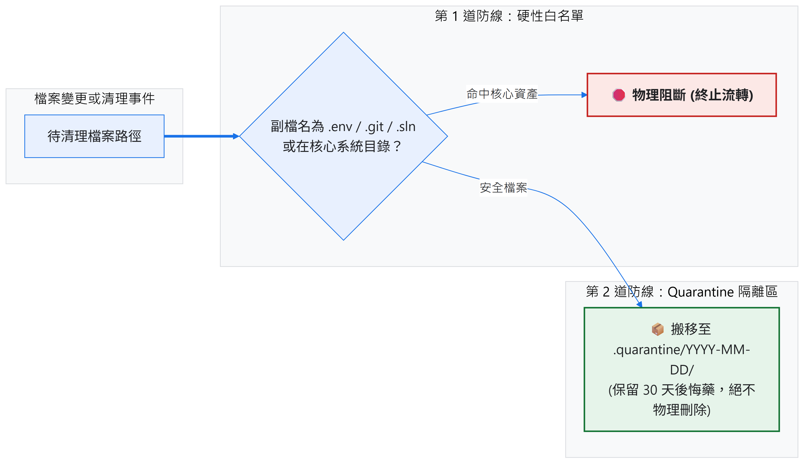
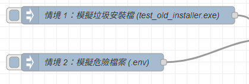
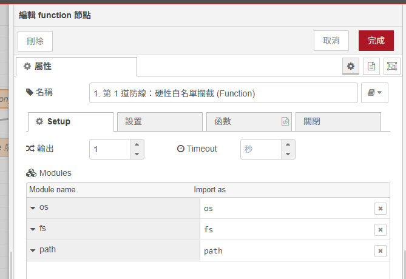
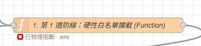
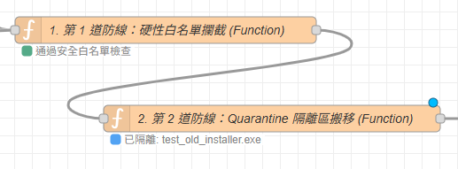
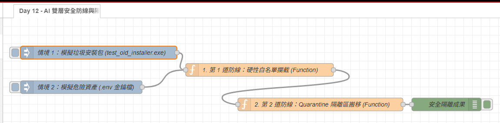

# Day 12｜AI 安全：雙層安全防禦（硬性白名單 + 隔離區防誤刪機制）

> 讓 AI 自動幫忙整理下載區、清理快取檔案聽起來很酷，但萬一 AI 哪天腦袋卡住，把你桌面上的專案原始碼、Git Repo 或 `.env` 私密金鑰當作垃圾檔案刪除，那就真的是世界末日了。
> 在自動化領域有一條絕對鐵律：**「永遠不要把刪除的權力完全交給 AI」**。今天來建立兩道堅不可摧的安全防線！

---

本文同步發布於 GitHub： [2026-18th-it-ironman](https://github.com/BingFengHung/2026-18th-it-ironman/blob/main/Day12_AI雙層安全防禦_硬性白名單與隔離區防誤刪.md)

## 為什麼需要「雙層防禦機制」？

| 比較項目               | ❌ 完全信任 AI 刪除指令                                  | ✅ 雙層防禦機制（白名單 + 隔離區）                                   |
| :--------------------- | :------------------------------------------------------- | :------------------------------------------------------------------- |
| **誤刪核心資產** | 發生率極高（`.env`, `.git`, 原始碼可能被誤判為垃圾） | **0% 誤刪率**（程式層級物理阻斷，AI 連碰都碰不到）             |
| **災難復原力**   | 物理刪除（永久消失，無法挽回）                           | **保留 30 天反悔期**（搬移到 `.quarantine/` 隔離區隨時還原） |
| **執行透明度**   | 不知道 AI 到底動了什麼                                   | **完整 Audit Log 審計記錄**，每一步操作可回溯                  |

---

## 雙層防禦架構設計



---

## 實戰動手做：建立兩道堅不可摧的安全防線

整條 Node-RED 程式 flow 透過雙重機制層層把關：

```
[待清理檔案] 
       ↓
【第 1 道防線：硬性白名單攔截】 ➔ 程式層檢查副檔名與系統目錄，命中即刻物理阻斷
       ↓   (通過白名單檢查)
【第 2 道防線：Quarantine 隔離區】 ➔ 絕不物理刪除！安全搬移至隔離目錄，保留 30 天後悔藥
       ↓
【安全審計與存證追蹤】 ➔ 寫入 security_audit.log 磁碟日誌，操作全程透明可查
```

---

### 步驟 1：建立測試輸入情境（雙 Inject 節點）

為了完整驗證雙層防禦機制的反應，拉出兩個 **`inject`** 節點，分別模擬日常最容易碰到的兩大情境：



1. **情境 1（正常垃圾檔）**：

   * **Payload (JSON)**：`{ "file_path": "%USERPROFILE%\\Downloads\\test_old_installer.exe" }`
   * **預期行為**：通過第 1 道白名單檢查，順利移入隔離區。
2. **情境 2（危險核心資產）**：

   * **Payload (JSON)**：`{ "file_path": "%USERPROFILE%\\Downloads\\.env" }`
   * **預期行為**：第 1 道防線硬性阻斷，不流入下游任何搬移或刪除操作！

---

### 步驟 2：第 1 道防線——硬性白名單隔離（Function 節點）

在 Function 節點中，定義絕對不可侵犯的核心副檔名與系統關鍵目錄。一旦命中，程式碼層面直接阻斷並記錄審計：

> **💡 Setup 設定提醒**：請在 Function 節點「設定（Setup）」➔「模組（Modules）」頁籤中引入 `os`、`fs`、`path`。
> 

#### 核心防禦邏輯：

```javascript
// 🛡️ 第 1 道防線核心：定義絕對不可侵犯的資產清單
const PROTECTED_EXTS = ['.git', '.env', '.key', '.pem', '.sln', '.docx', '.xlsx', '.pptx', '.rs', '.go'];
const PROTECTED_PATHS = ['c:/windows', 'c:/program files', path.join(homedir, 'Desktop/Projects')];

// 檢查受保護副檔名與系統關鍵路徑
const isProtectedExt = PROTECTED_EXTS.some(ext => normalizedPath.endsWith(ext) || normalizedPath.includes('/.env'));
const isProtectedPath = PROTECTED_PATHS.some(dir => normalizedPath.startsWith(dir));

// 命中即刻物理阻斷，並寫入審計日誌
if (isProtectedExt || isProtectedPath) {
    node.warn(`🛑 [安全攔截] 檔案「${rawPath}」為受保護核心資產，AI 絕對不可操作！`);
    node.status({ fill: 'red', shape: 'ring', text: `已物理阻斷: ${path.basename(resolvedPath)}` });
    return null; // 物理阻斷，終止下游執行
}
```

> **💡 註**：完整節點程式碼（包含自動路徑解析、狀態燈號切換與 `security_audit.log` 審計寫入）已完整包進 Flow JSON 檔中，匯入即可直接使用。

---

### 步驟 3：第 2 道防線——Quarantine 隔離區機制（Function 節點）

當檔案通過白名單並判定為可清理目標時：

1. **絕不執行 `Remove-Item` 或 `fs.unlinkSync` 物理刪除**。
2. 而是將檔案安全搬移到 `%USERPROFILE%\.quarantine\YYYY-MM-DD\` 當日隔離目錄。
3. 提供 30 天反悔期，同時寫入磁碟審計日誌（Audit Trail）以供追溯！

> **💡 Setup 設定提醒**：請在 Function 節點「設定（Setup）」➔「模組（Modules）」頁籤中引入 `os`、`fs`、`path`。

#### 核心隔離邏輯：

```javascript
// 🛡️ 第 2 道防線核心：以搬移代替刪除，建立日期目錄保留反悔期
const today = new Date().toISOString().slice(0, 10);
const quarantineDir = path.join(homedir, '.quarantine', today);
fs.mkdirSync(quarantineDir, { recursive: true });

// 安全搬移至隔離區（絕不物理刪除）
if (fs.existsSync(srcPath)) {
    fs.renameSync(srcPath, destPath);
    node.warn(`📦 [已安全隔離] 檔案已移入: ${destPath}`);
}
```

---

## 成果驗收：雙場景實測成果

### 場景 A：點擊「情境 2：模擬危險檔案 (.env)」

* **Node-RED 警告視窗**：
  ```text
  🛑 [安全攔截] 檔案「%USERPROFILE%\Downloads\.env」為受保護核心資產，AI 絕對不可操作！
  ```
* **節點狀態**：顯示紅色環狀圖示 `已物理阻斷: .env`，整條流程在第 1 道防線即刻終止，**下游隔離與刪除邏輯連碰都碰不到**！
* **審計日誌 (`%USERPROFILE%\SystemLogs\security_audit.log`)**：
  ```text
  [2026-09-01T12:00:00.000Z] 操作: BLOCKED | 攔截目標: C:\Users\User\Downloads\.env | 原因: 命中核心白名單資產
  ```
  
  

---

### 場景 B：點擊「情境 1：模擬垃圾安裝包 (test_old_installer.exe)」

* **Debug 側邊欄輸出**：
  ```json
  {
    "status": "QUARANTINED",
    "original": "C:\\Users\\User\\Downloads\\test_old_installer.exe",
    "current": "C:\\Users\\User\\.quarantine\\2026-09-01\\test_old_installer.exe",
    "audit_logged": true,
    "retention_days": 30
  }
  ```
* **節點狀態**：顯示藍色圓點 `已隔離: test_old_installer.exe`，檔案已安全移至當日隔離目錄，若 30 天內未找回才由系統自動清理！


---

## 完整 Flow 程式

### 本範例 flow 位置：👉 [下載](https://github.com/BingFengHung/2026-18th-it-ironman/blob/main/flows/flow_day12_safety_quarantine.json)

本案例 flow



---

## 今日總結與明日預告

今天我們建立了硬性白名單與隔離區雙層防禦網，讓自動化管家既能放開手腳高效整理，又絕不會帶來任何災難性誤刪風險！

* **明天（Day 13）**：將探討如何挑選高價值自動化場景——**哪些雜事值得自動化？與「防重複搞砸」的防呆安全鎖**！
