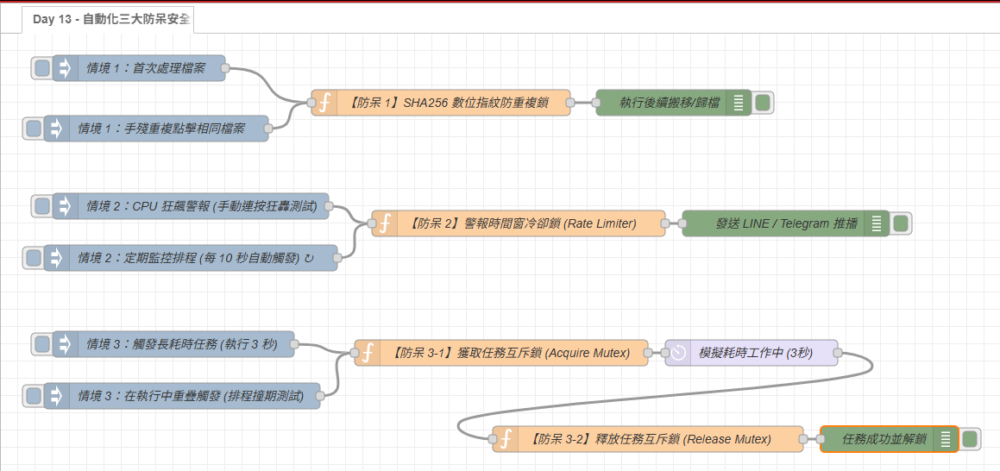

# Day 13｜場景評估：哪些電腦雜事值得自動化？與「防重複搞砸」的三大防呆設計

> 在剛接觸自動化時，往往會有一種衝動：「想把電腦上看到的所有事情全部自動化！」
> 但最後通常有八成會變成沒人維護的垃圾流程。今天就來聊聊：到底什麼雜事才真正值得做自動化？以及寫自動化時最關鍵的保命心法——**「就算手殘按了 10 次，也不會把電腦搞爛」的三大防呆安全設計**！

---

本文同步發布於 GitHub： [2026-18th-it-ironman](https://github.com/BingFengHung/2026-18th-it-ironman/blob/main/Day13_那些雜事值得自動化與防重複搞砸安全防呆鎖.md)

## 什麼雜事值得自動化？（3 個快速過濾標準）

在個人 Windows 電腦上，並不是每件事都值得寫程式。決定要不要動手前，只要問自己 3 個簡單問題：

1. **頻率高不高？** -> 這件事每週會發生 3 次以上嗎？
2. **容易手殘嗎？** -> 手動做時很容易點錯、漏掉或讓人分心嗎？
3. **規則清楚嗎？** -> 有固定邏輯，或者能用一句話讓 AI 判斷嗎？

> **💡 評估法則**：只要這 3 個問題的答案都是「是」，那就是極佳的自動化目標！如果手動做只要 5 秒、一個月才碰一次，那就直接手動做，別過度工程化。

### 適合自動化的三大場景：

1. **系統卡頓排查（高頻、繁瑣）**：
   - 電腦突然風扇狂轉、畫面變慢，不想每次都手動打開工作管理員在幾百個進程裡慢慢找是誰在搞鬼。
2. **Downloads 下載區自動整理（高頻、容易手殘）**：
   - 下載區永遠堆著幾十個螢幕截圖、軟體安裝檔、壓縮檔與暫存檔，久了根本懶得手動分類。
3. **每日工作與 Git 提交整理（重複、耗時）**：
   - 每天下班前要手動回顧今天改了哪些程式碼、提交了哪些 commit 並寫成日報。

---

## 寫自動化的第一法則：不怕重複執行的「防呆安全設計」

工程師在技術上常把這個概念叫做**「冪等性（Idempotency）」**，但說穿了，它的核心思想就是一句大白話：

> **「同一個自動化流程，無論你不小心手滑按了 1 次、10 次還是 100 次，電腦的狀態都要保持乾淨一致，絕不能製造重複的垃圾或副作用！」**

---

### 沒做防呆設計的「三大翻車現場」 vs 做好防呆的「聰明表現」：

| 翻車痛點           | ❌ 沒做防呆的災難現場                                                                                    | ✅ 做好防呆的聰明表現                                                | 對應防呆防線                 |
| :----------------- | :------------------------------------------------------------------------------------------------------- | :------------------------------------------------------------------- | :--------------------------- |
| **硬碟塞爆** | 下載區整理每 10 分鐘跑一次，因為沒檢查是否搬過，每次都複製一份，硬碟堆滿`pic (1).png`、`pic (2).png` | **處理前先驗指紋**：「這張圖片特徵碼以前處理過，直接略過！」   | **第一道：檔案資料鎖** |
| **通知轟炸** | 監控 CPU/記憶體飆高，排程每 10 秒跑一次，結果手機在 5 分鐘內連續被 30 封相同報警洗版                     | **通知前先冷靜**：「10 分鐘前已警報過了，冷卻期內保持靜音！」  | **第二道：警報冷卻鎖** |
| **排程打架** | 耗時 10 秒的大檔案備份還在跑，下一個定時排程又被觸發，兩邊同時搶同一個檔案導致衝突損毀                   | **執行前先確認**：「前一輪任務還在進行中，本輪排程自動跳過！」 | **第三道：任務互斥鎖** |

---

## 實戰動手做：在 Node-RED 實作「三大黃金防呆安全鎖」

我們在 Node-RED 畫布上針對以上三大翻車場景，分別實作出最堅固的防禦節點！

---

### 第一道防線：【檔案指紋去重鎖】—— 解決重複搬移與複本塞爆

#### 1. 核心觀念：

* **只認檔名？** 如果使用者重新命名，或不同軟體都剛好存成 `image.png`，比對檔名極易誤判。
* **認 SHA256 數位特徵指紋**：不管檔名、路徑怎麼變，只要檔案內容相同，算出來的 SHA256 指紋就完全一致！
* 結合 **Day 02** 學過的 `flow` Context 永久記憶庫，把處理過的指紋存起來，第二次看到直接 `return null` 物理中斷。

#### 2. Function 節點程式碼：

> **💡 Setup 設定提醒**：請在 Function 節點「設定（Setup）」➔「模組（Modules）」頁籤中引入 `fs` 與 `crypto`。

```javascript
// 【防呆 1】SHA256 數位指紋防重複鎖
const filePath = (msg.payload && msg.payload.file_path) || msg.payload;

// 🛡️ 防禦性檢查：必須是實體檔案（排除不存在或資料夾）
if (!fs.existsSync(filePath) || !fs.statSync(filePath).isFile()) {
    node.warn(`[防禦攔截] 路徑不存在或為資料夾: ${filePath}`);
    node.status({ fill: 'red', shape: 'ring', text: '路徑無效或不存在' });
    return null;
}

// 步驟 1: 計算 SHA256 檔案數位指紋
const buffer = fs.readFileSync(filePath);
const fingerprint = crypto.createHash('sha256').update(buffer).digest('hex');

// 步驟 2: 檢查 Context 記憶庫
const history = flow.get('processed_history', 'file') || {};
if (history[fingerprint]) {
    node.warn(`🛑 [防呆 1 攔截] 檔案先前已於 ${history[fingerprint]} 處理過，本次安全略過！`);
    node.status({ fill: 'yellow', shape: 'ring', text: '重複檔案已略過' });
    return null; // 攔截！中斷後續動作
}

// 步驟 3: 首次處理，記錄指紋到持久記憶庫
history[fingerprint] = new Date().toLocaleString();
flow.set('processed_history', history, 'file');

node.status({ fill: 'green', shape: 'dot', text: '新檔案驗證通過' });
msg.fileFingerprint = fingerprint;
msg.status = 'PASS_NEW_FILE';
return msg;
```

---

### 第二道防線：【警報冷卻時間鎖】—— 解決系統監控通知洗版

#### 1. 核心觀念：

呼應 **Day 08（風扇狂轉即時診斷）** 與 **Day 05（終端機報錯救援）**，當系統處於高溫或異常狀態時，排程每 10 秒掃描一次很合理，但絕不能每 10 秒都往你的手機發送一則 LINE 或 Telegram 警報。
我們需要一個**時間窗冷卻器（Rate Limiter / Cooldown Timer）**：

* 每次警報發送成功後，記住該類別警報的 `lastAlertTime`。
* 在設定的冷卻窗（例如 10 分鐘，測試時可設為 60 秒）之內，若再次偵測到警報，節點將其「靜音（Mute）」並在節點下方動態倒數剩餘冷卻秒數。

#### 2. Function 節點程式碼：

```javascript
// 【防呆 2】警報時間窗冷卻鎖 (Rate Limiter)
const alertKey = msg.topic || 'DEFAULT_ALERT';
const COOLDOWN_SECONDS = 60; // 測試環境設 60 秒冷卻；生產環境可設為 10 分鐘 (600)
const cooldownMs = COOLDOWN_SECONDS * 1000;
const now = Date.now();

// 從 Flow Context 讀取各警報類別的上次觸發時間
const alertHistory = flow.get('alert_cooldown_history') || {};
const lastAlertTime = alertHistory[alertKey] || 0;
const elapsedMs = now - lastAlertTime;

if (elapsedMs < cooldownMs) {
    const remainingSec = Math.ceil((cooldownMs - elapsedMs) / 1000);
    node.warn(`🛑 [防呆 2 攔截] 警報「${alertKey}」冷卻中（剩 ${remainingSec} 秒），靜音略過避免洗版！`);
    node.status({ fill: 'yellow', shape: 'ring', text: `冷卻中 (剩 ${remainingSec}s)` });
    return null; // 攔截！不往下游發送通知
}

// 超出冷卻期，更新時間戳記並放行
alertHistory[alertKey] = now;
flow.set('alert_cooldown_history', alertHistory);

node.status({ fill: 'green', shape: 'dot', text: `已發送警報: ${new Date(now).toLocaleTimeString()}` });
msg.cooldownSeconds = COOLDOWN_SECONDS;
return msg;
```

---

### 第三道防線：【任務排程互斥鎖】—— 解決長任務並發衝突與 Race Condition

#### 1. 核心觀念：

當自動化流程涉及較耗時的動作（例如大檔案備份、呼叫本機 AI 深度推理、磁碟整理解壓縮）：

* 如果排程設定每 30 秒觸發一次，但某次處理花費了 40 秒，下一次排程就會在「前一次還沒跑完」的情況下重入。
* 兩個程序同時讀寫相同的目錄或資料庫，極易造成檔案毀損（Race Condition）。
* 我們透過 **Mutex（互斥鎖）** 機制：
  - 任務開始時：「上鎖（Acquire Lock）」並記錄開始時間。
  - 重複觸發時：「阻斷重入」，直接略過本次觸發。
  - 附帶**超時保護保險絲**：即使下游執行異常崩潰，超過 30 秒後也會自動重置，絕不發生永久死鎖（Deadlock）！
  - 任務結束時：「釋放鎖（Release Lock）」。

#### 2. 上鎖節點程式碼（Acquire Mutex）：

```javascript
// 【防呆 3-1】獲取任務互斥鎖 (Acquire Mutex)
const isRunning = flow.get('task_is_running') || false;
const startTime = flow.get('task_start_time') || 0;
const TIMEOUT_MS = 30 * 1000; // 30 秒逾時保護保險絲，防止例外導致的永久死鎖
const now = Date.now();

// 檢查前一個任務是否正在跑（且在逾時安全期內）
if (isRunning && (now - startTime < TIMEOUT_MS)) {
    const runningSec = Math.floor((now - startTime) / 1000);
    node.warn(`🛑 [防呆 3 攔截] 前次任務仍在進行中（已執行 ${runningSec} 秒），本輪排程跳過！`);
    node.status({ fill: 'yellow', shape: 'ring', text: `執行中...阻斷重入 (${runningSec}s)` });
    return null; // 攔截！防止並發搶資源
}

// 成功獲取鎖：標記為執行中
flow.set('task_is_running', true);
flow.set('task_start_time', now);

node.status({ fill: 'blue', shape: 'dot', text: '已上鎖，任務執行中...' });
msg.taskLockTime = now;
return msg;
```

#### 3. 解鎖節點程式碼（Release Mutex）：

```javascript
// 【防呆 3-2】釋放任務互斥鎖 (Release Mutex)
flow.set('task_is_running', false);
flow.set('task_start_time', 0);

node.status({ fill: 'green', shape: 'dot', text: '已解鎖就緒' });

msg.payload = {
    status: 'SUCCESS',
    message: '長任務順利完成，已自動釋放互斥鎖！',
    finishedAt: new Date().toLocaleString()
};
return msg;
```

---

## 完整 Flow 程式與畫布架構

### 本範例 flow 位置：👉 [下載](https://github.com/BingFengHung/2026-18th-it-ironman/blob/main/flows/flow_day13_idempotent_lock.json)

本案例 flow



### 快速上手測試指南：

1. **測試防呆 1（檔案指紋鎖）**：點擊「首次處理檔案」會看到綠燈放行；接著點擊「手殘重複點擊相同檔案」，立刻亮起黃燈並提示 `重複檔案已略過`！
2. **測試防呆 2（警報冷卻鎖）**：狂按「CPU 狂飆警報」或讓每 10 秒排程自動觸發，第一次會放行推播，接下來 60 秒內所有重複警報都會被靜音，並顯示倒數秒數。
3. **測試防呆 3（任務互斥鎖）**：點擊觸發耗時 3 秒的長任務，在 3 秒內再次手動點擊「重疊觸發」，會發現第二個訊號被即刻阻斷，3 秒後任務完成自動解除互斥鎖！

---

## 今日總結與明日預告

自動化不只是把動作串起來，更重要的是**具備容錯與防呆的自癒能力**。今天我們把自動化防呆升級為三道堅不可摧的防線：

1. **檔案資料級**：SHA256 特徵碼，消滅重複垃圾與複本。
2. **警報通知級**：時間窗冷卻器，杜絕手機被訊息轟炸。
3. **任務執行級**：狀態互斥鎖與逾時保險絲，根絕長任務重入與資源打架。

* **明天（Day 14）**：隨著功能越來越強大，畫布上的節點也越來越多。我們將學習如何運用 **Subflow（子流程）**，把 Google 本機推理核心封裝成隨插即用的「AI 樂高積木」！
