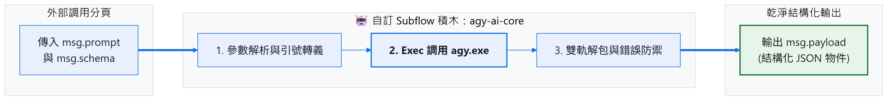
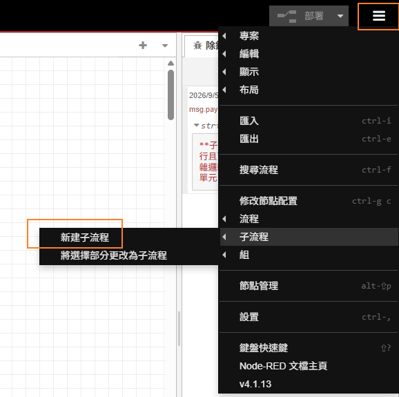
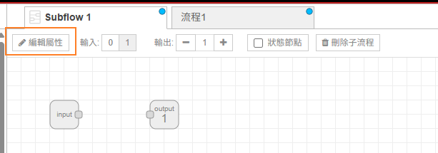
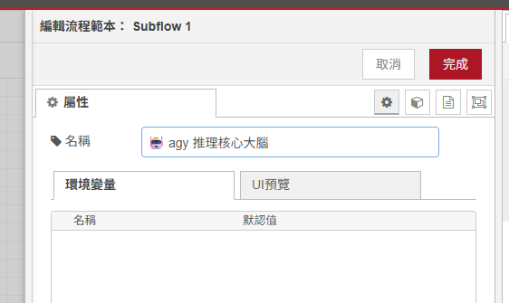
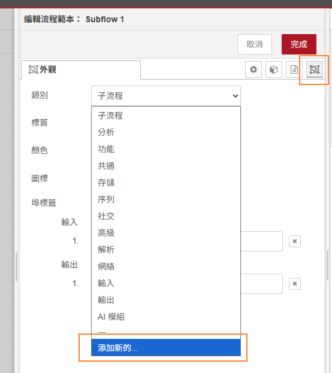
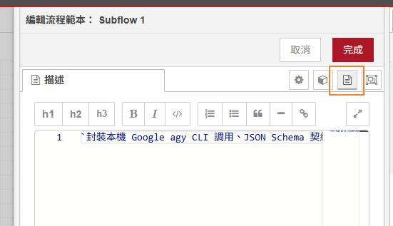
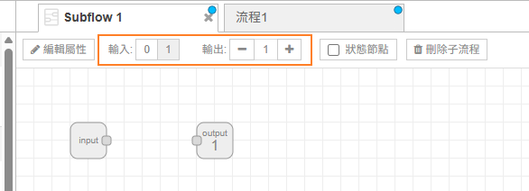
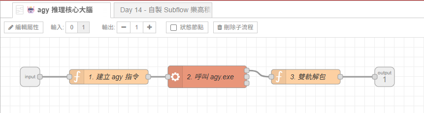

# Day 14｜模組化：打造專屬 Subflow 樂高積木（封裝 agy AI 推理核心節點）

> 當 Node-RED 自動化流程越來越多，如果每個分頁都要手動拉一次「Prompt 組裝 ➔ Exec 節點 ➔ 指令引號跳脫 ➔ JSON 解析 ➔ 雙軌解包防禦」，編輯畫面看起來會像是一坨打結的耳機線。
> 未來想加一個 `--effort low` 或更換模型參數，就得在 10 個分頁裡手動改 10 次，極度容易改漏。
> 今天會用 **Subflow（子流程）**，把 Google `agy.exe` 的呼叫邏輯集中在一個自訂節點 **`🤖 agy 推理核心大腦`**，讓其他分頁可以重複使用同一套處理流程。

---

本文同步發布於 GitHub： [2026-18th-it-ironman](https://github.com/BingFengHung/2026-18th-it-ironman/blob/main/Day14_打造專屬Subflow樂高積木_封裝agy推理核心節點.md)

## 為什麼必須封裝 Subflow？

| 比較項目                   | ❌ 分頁到處複製貼上（重複實作）                    | ✅ 封裝為共用 Subflow                                  |
| :------------------------- | :------------------------------------------------- | :-------------------------------------------------------- |
| **畫布整潔度**       | 每個流程都需要 4~5 顆節點，線條較多                 | **以 1 顆自訂節點代表共用邏輯**                      |
| **全域升級維護**     | 改一個參數（如`--max-tokens`）要手動改 10 個分頁 | **修改 Subflow 1 處，全專案所有分頁自動同步升級！** |
| **跨流程複用性**     | 靠 Copy-Paste，久了各分頁版本漂移不一致            | **像原生節點般陳列在左側面板**，隨拖隨用            |
| **輸入相容與健壯性** | 容易漏掉引號跳脫、Schema 轉義或雙軌解包防禦        | **內部自帶標準化輸入相容與解包防禦**，零出錯率      |

---

## 封裝架構設計與資料流向



Subflow 內部由三個核心環節緊密配合，外部只需要傳入 `msg.prompt`（或可選的 `msg.schema`），其餘所有繁瑣的 CLI 轉義與解包工作全在積木內部自體完成：

```
[外部流程輸入: msg.prompt / msg.schema] 
       ↓
【第 1 站：指令組裝與參數正規化 (Function)】 ➔ 自動相容字串/物件，安全跳脫引號，動態追加 Schema 參數
       ↓
【第 2 站：呼叫本機 agy CLI (Exec)】 ➔ 執行本機 agy.exe，具備非同步執行與權限自動跳過保護
       ↓
【第 3 站：雙軌解包防禦 (Function)】 ➔ 自動相容 structured_output 與純文字，永遠輸出乾淨的 JSON 物件
       ↓
[外部流程接收: 乾淨標準的 msg.payload]
```

---

## 實戰動手做：5 步驟打造專屬 AI Subflow 樂高積木

---

### 步驟 1：建立 Subflow 框架與節點屬性設定

在 Node-RED 編輯器中建立一個乾淨的子流程容器：

1. 點擊右上角「選單」➔「子流程（Subflows）」➔「**新建立子流程（Create Subflow）**」。
   
2. 點擊左上角「**編輯屬性**」按鈕：
   

   * **名稱（Name）**：`🤖 agy 推理核心大腦`
     
   * **分類（Category）**：選擇外觀選項，然後再類別的下拉式選單選擇添加新的，填寫 `AI 模組`（設定完成後，左側節點選單會自動多出一個名為「AI 模組」的自訂分組，專屬積木就躺在裡面！）。
     
   * **描述（Info）**：`封裝本機 Google agy CLI 調用、JSON Schema 契約約束與雙軌解包防禦的通用積木。`
     
   * **輸入埠（Inputs）**：`1`
   * **輸出埠（Outputs）**：`1`
     

---

先看一下最終子流程會拉出來的樣子



### 步驟 2：內部第 1 站——指令組裝與參數正規化（Function 節點）

拉入一個 Function 節點，命名為 `1. 建立 agy 指令`。

這個節點的職責是將外部傳來的各種雜亂輸入（可能是純文字、可能是物件、可能帶有 Schema 約束）標準化為安全可執行的本機 CLI 指令：

#### 核心組裝邏輯：

```javascript
// 1. 自動相容外部傳入的 prompt 或 payload
const prompt = msg.prompt || (typeof msg.payload === 'string' ? msg.payload : JSON.stringify(msg.payload));

// 2. 基礎指令：使用 JSON.stringify 確保 Windows 命令列引號安全跳脫
let cmd = `agy -p ${JSON.stringify(prompt)} --dangerously-skip-permissions`;

// 3. 動態 Schema 約束支援：若外部有傳入 msg.schema，自動追加結構化參數
if (msg.schema) {
    const schemaStr = typeof msg.schema === 'object' ? JSON.stringify(msg.schema) : msg.schema;
    cmd += ` --json-schema ${JSON.stringify(schemaStr)} --output-format json`;
}

msg.payload = cmd;
return msg;
```

> **💡 設計亮點**：
> 外部調用時完全不用管命令列的跳脫字元！無論提示詞裡面有沒有雙引號、換行符號或特殊的 JSON 語法，透過 `JSON.stringify` 處理後都能安全傳遞給 PowerShell / CMD 執行。

---

### 步驟 3：內部第 2 站——呼叫本機 `agy.exe`（Exec 節點）

拉入一個 Exec 節點，命名為 `2. 調用 agy.exe`，負責呼叫本機安裝好的 agy cli。

* **指令（Command）**：留空（因為完整指令已經在步驟 2 由 `msg.payload` 傳入）。
* **附加 msg.payload**：**勾選**。
* **輸出方式**：選擇「當指令完成時 - exec 模式」。
* **超時（Timeout）**：可設定為 `60` 秒，防止模型在極度複雜任務下無限期卡死。

連線方式：將步驟 2 的輸出端連至 Exec 節點的輸入端。

---

### 步驟 4：內部第 3 站——雙軌解包防禦（Function 節點）

拉入一個 Function 節點，命名為 `3. 雙軌解包`。

在串接 AI CLI 時，回傳的資料結構可能會因為有無指定 `--json-schema` 而有所不同：

* 有指定 Schema 時，模型會將結果封裝在 `structured_output` 屬性中。
* 一般問答時，可能包在 `response` 字串中，或者直接吐出純文字字串。

為了讓下游節點永遠不需要寫重複的 `try-catch` 或判斷式，我們在 Subflow 內部完成**雙軌安全解包**：

#### 核心解包邏輯：

```javascript
let parsed;
try {
    parsed = typeof msg.payload === 'string' ? JSON.parse(msg.payload) : msg.payload;
} catch (e) {
    parsed = { response: msg.payload };
}

// 軌道 1：優先提取 JSON Schema 約束下的 structured_output
let result = parsed.structured_output;

// 軌道 2：若無 structured_output，則檢查一般 response
if (!result && parsed.response) {
    try {
        result = typeof parsed.response === 'string' ? JSON.parse(parsed.response) : parsed.response;
    } catch (e) {
        result = parsed.response;
    }
}

// 終極保底：吐出最純淨的解包物件或原始結果
msg.payload = result || parsed;
return msg;
```

連線方式：將 Exec 節點的第一個輸出埠（標準輸出 stdout）連至此節點，最後將此節點的輸出端連至 Subflow 的輸出埠（Output Port）。

---

### 步驟 5：在任意業務流程中隨拖隨用

點擊子流程分頁右上角的「完成」，回到主畫布。

現在，你可以在任何日常流程中調用這顆專屬積木：

1. 從左側節點選單的「**AI 模組**」分類中，將 **`🤖 agy 推理核心大腦`** 拖拉至畫布。
2. 前方接上一個 **`inject`** 節點，後方接上一個 **`debug`** 節點。
3. 只需要在 `inject` 節點中注入想詢問的問題，整條 AI 推理與防禦解析即可自動完成！

---

## 成果驗收：雙場景實測成果

我們拉出兩個 Inject 測試節點，分別驗證「一般問答」與「嚴格 Schema 結構化輸出」的表現：

### 場景 A：一般自然語言問答測試（免 Schema）

* **Inject 節點設定**：
  ```json
  {
    "prompt": "請以繁體中文一句話解釋什麼是 Subflow 子流程"
  }
  ```
* **Debug 側邊欄輸出成果**：
  ```text
  "Subflow（子流程）是 Node-RED 中將多個節點封裝為單一可重複使用自訂積木的模組化機制。"
  ```
* 👉 **表現分析**：無需任何額外解析節點，Subflow 自動調度 CLI 並直接輸出乾淨的一句話繁體中文！

---

### 場景 B：嚴格 JSON Schema 約束輸出測試

* **Inject 節點設定**：傳入 Prompt 與 Schema 定義：
  ```json
  {
    "prompt": "分析這份日誌並歸納：[ERROR] Disk space low on C: drive (only 2% free)",
    "schema": {
      "type": "object",
      "properties": {
        "level": { "type": "string" },
        "component": { "type": "string" },
        "suggestion": { "type": "string" }
      },
      "required": ["level", "component", "suggestion"]
    }
  }
  ```
* **Debug 側邊欄輸出成果**：
  ```json
  {
    "level": "ERROR",
    "component": "Disk Storage (C:)",
    "suggestion": "請立即執行暫存檔清理或搬移 Downloads 檔案至外接儲存裝置，釋放磁碟空間。"
  }
  ```
* 👉 **表現分析**：Subflow 偵測到 `msg.schema`，自動注入 `--json-schema` 參數，並由雙軌解包節點自動抽取 `structured_output`，下游拿到的直接是型別嚴格的 JavaScript 物件！

---

## 完整 Flow 程式

本篇的 Subflow 定義、參數預處理、Exec 本機呼叫與雙軌解包邏輯已整理成 Flow JSON 檔。在 Node-RED 點擊「右上角選單」➔「匯入」即可載入：

### 本範例 flow 位置：👉 [下載](https://github.com/BingFengHung/2026-18th-it-ironman/blob/main/flows/flow_day14_subflow_agy.json)

---

## 今日總結與明日預告

這篇把原本分散在各分頁的節點集中成共用 Subflow，後續流程只需要傳入 Prompt 與選用的 Schema。

* **明天（Day 15）**：接著把本機推理流程包成 HTTP API，讓手機捷徑與其他程式可以送出請求。
