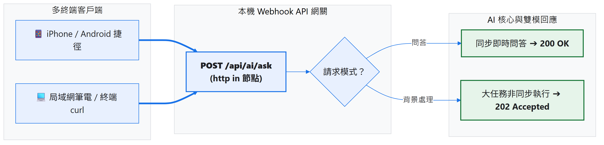
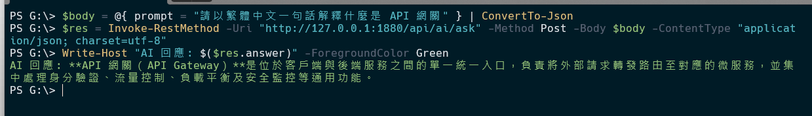
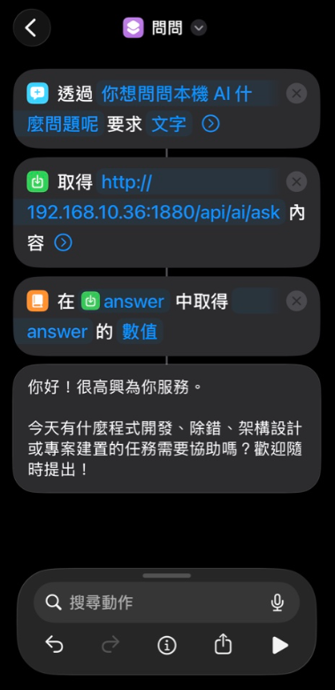
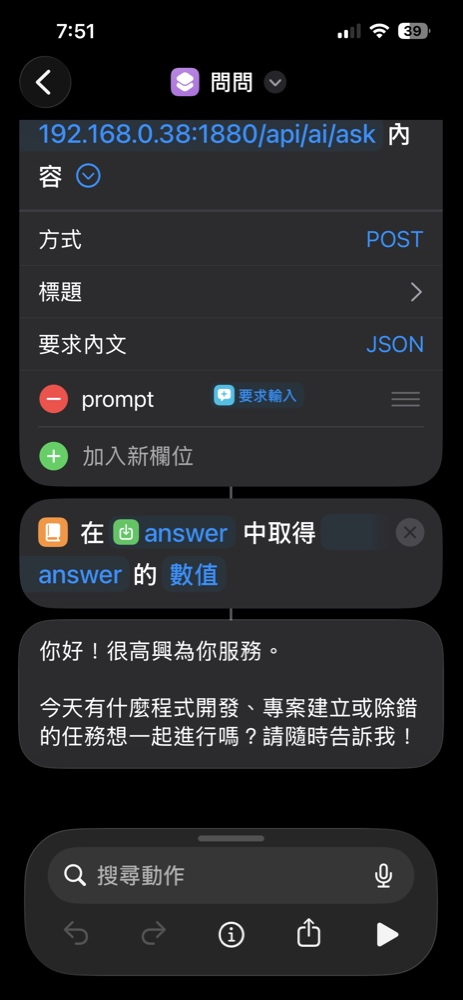
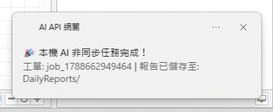
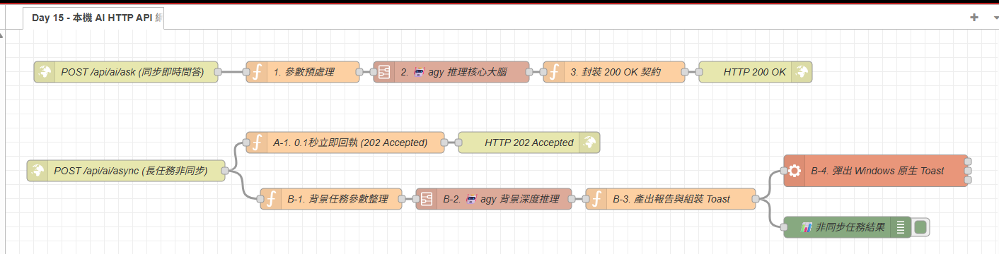

# Day 15：本機 API：本機 AI HTTP API 網關（手機捷徑與終端一鍵呼叫 AI）

> 平常坐在電腦前可以用終端機呼叫 `agy.exe`，但如果我們想「在 iPhone / Android 手機上按一下捷徑、或是從區域網路的另一台筆電發送請求」來使用家裡這台電腦強大的本機 AI 呢？
> 今天會沿用 Day 14 的 **`🤖 agy 推理核心大腦`** Subflow，搭配 Node-RED 的 `http in` 與 `http response` 節點，建立一個本機 HTTP API。文章會比較同步 200 回應與非同步 202 回應的使用情境。

---

本文同步發布於 GitHub： [2026-18th-it-ironman](https://github.com/BingFengHung/2026-18th-it-ironman/blob/main/Day15_本機AI_HTTP_API網關_手機捷徑與終端一鍵呼叫AI.md)

## HTTP API 網關架構設計

藉由 Node-RED 內建的 HTTP 伺服器能力，我們可以在 Windows 本機建立輕量級的 API 網關，將外部請求轉化為內部訊息流，最後調度本機 agy CLI 執行推理：



### 為什麼需要「雙模回應機制」？

在設計 API 網關時，必須考慮客戶端的等待耐受度：

* **同步即時問答（200 OK）**：適用於日常簡短問答、翻譯、摘要等可在 5~15 秒內完成的輕量任務，客戶端連線保持等待，AI 產生答案後即刻回傳。
* **非同步快速回執（202 Accepted）**：適用於大日誌深度分析、全硬碟清理等長任務。因為手機 iOS 捷徑通常有約 30 秒的連線逾時限制，網關應立即回傳 `202 Accepted`（代表「已收到請求，背景處理中」），避免終端因 Timeout 報錯。

---

## 實戰動手做：調用 Subflow 樂高積木組裝雙模 API 網關

得益於 Day 14 已經完成的 Subflow 封裝，我們不再需要在畫布上重複拉入「命令組裝、Exec 呼叫、雙軌解包」等繁瑣節點。整條 API 網關支援兩種運作模式：

```
【模式 A：同步即時問答 (200 OK)】
[POST /api/ai/ask (http in)] ➔ [參數預處理 (Function)] ➔ [🤖 agy 推理核心大腦 (Subflow)] ➔ [封裝 200 OK 契約 (Function)] ➔ [HTTP 200 OK (http response)]

【模式 B：非同步長任務快速回執 (202 Accepted 雙軌分岔)】
[POST /api/ai/async (http in)]
   ├─➔ [A-1. 0.1秒立即回執 (Function)] ➔ [HTTP 202 Accepted (http response)] （終端免等，秒收工單）
   └─➔ [B-1. 背景任務參數整理 (Function)] ➔ [B-2. 🤖 agy 背景深度推理 (Subflow)] ➔ [B-3. 產出報告與組裝 Toast (Function)] ➔ [B-4. 彈出 Windows 原生 Toast (Exec)]
```

---

### 模式 A 實作：同步即時問答端點（`POST /api/ai/ask`）

#### 步驟 1：開放 API 端點（`http in` 節點）

在 Node-RED 畫布中拉入一個 **`http in`** 節點：

* **Method**：`POST`
* **URL**：`/api/ai/ask`

> **💡 原理解析**：
> 當外部裝置發送 POST 請求至 `http://<本機IP>:1880/api/ai/ask` 時，Node-RED 會自動將 HTTP Request Headers 放入 `msg.req`，並將傳入的 JSON Body 自動解析掛載到 `msg.payload`。

#### 步驟 2：請求參數預處理（Function 節點）

接上第一個 Function 節點，命名為 `1. 參數預處理`：

```javascript
// 提取前端傳入的 prompt，若無則設定預設防呆
msg.prompt = (msg.payload && msg.payload.prompt) || '你好，請進行自我介紹';
return msg;
```

> **🔑 重點說明：為什麼程式碼變得如此精簡？**
> 在過去，我們必須在此處手動撰寫 `JSON.stringify` 轉義引號、拼接 `--dangerously-skip-permissions` 等繁瑣指令。現在這些 CLI 轉義與安全保護全都封裝在 Day 14 的 Subflow 內部自體完成，外部調用端只需優雅地提供 `msg.prompt` 即可！

#### 步驟 3：調用專屬 AI 樂高積木（`🤖 agy 推理核心大腦` Subflow）

從左側節點選單的「**AI 模組**」分類中，將昨天封裝好的 **`🤖 agy 推理核心大腦`** 拖拉至畫布中央，並將步驟 2 的輸出端連至此積木輸入端：

* 一鍵完成本機 CLI 調度、引號防禦跳脫與 `structured_output` 雙軌解包。
* 輸出端永遠傳出最純淨的答案文字或資料物件。

#### 步驟 4：封裝標準 API 契約（Function ➔ `http response` 節點）

接上第二個 Function 節點，命名為 `3. 封裝 200 OK 契約`：

```javascript
// 上游 Subflow 已經幫我們完成 CLI 調用與雙軌解包，直接輸出乾淨答案
msg.payload = {
    status: 'SUCCESS',
    timestamp: new Date().toISOString(),
    answer: typeof msg.payload === 'string' ? msg.payload.trim() : msg.payload
};
return msg;
```

後方接上 **`http response`** 節點：

* **Status code**：`200`
* **Headers**：`content-type: application/json; charset=utf-8`

> **🔑 重點說明**：
> Subflow 完成雙軌解包後，下游可以將結果包裝成包含狀態碼（`status`）、時間戳記（`timestamp`）與解答（`answer`）的 RESTful API 回應。

---

### 模式 B 實作：非同步長任務秒回（`POST /api/ai/async`）

在面臨大量請求、批次自動化呼叫，或是需要較長時間的分析時，若讓客戶端保持長連線等待，可能遭遇 iOS 捷徑逾時或網路中斷。我們利用 Node-RED 的「雙分岔（Forking）」機制，先回傳工作編號，再讓背景流程繼續處理：

#### 步驟 1：開放非同步端點（`http in` 節點）

拉入第二個 **`http in`** 節點：

* **Method**：`POST`
* **URL**：`/api/ai/async`

從此節點的輸出端拉出兩條連線，分別接入「快速回執軌」與「背景運算軌」。

#### 步驟 2：軌道 A——0.1 秒極速回執（Function ➔ `http response`）

接上 Function 節點，命名為 `A-1. 0.1秒立即回執 (202 Accepted)`：

```javascript
const jobId = 'job_' + Date.now();
msg.jobId = jobId;
msg.statusCode = 202;
msg.payload = {
    status: 'ACCEPTED',
    job_id: jobId,
    message: '大任務已成功受理，本機 AI 正在背景深度推理中，完成後將透過 Toast 彈窗通知！',
    timestamp: new Date().toISOString()
};
return msg;
```

後方直接連至 **`http response`** 節點（設定狀態碼為 `202`）。

> **💡 原理解析：為什麼能夠 0.1 秒回覆？**
> 當 HTTP 伺服器節點收到請求時，這條分支先建立工作編號並送入 `http response`，讓客戶端不用等待完整分析結果。實際回應時間仍取決於本機服務與網路狀態。

#### 步驟 3：軌道 B——背景深潛推理與結果通知

在另一條分岔接上 Function 節點，命名為 `B-1. 背景任務參數整理`：

```javascript
const task = (msg.payload && msg.payload.prompt) || '請對目前系統環境進行深度安全健檢報告';
const jobId = 'job_' + Date.now();

// 建立獨立的純淨 message 物件，同時設定 payload 與 prompt（避免 Debug 面板顯示 undefined）
return {
    jobId: jobId,
    prompt: task,
    payload: task
};
```

> **🔑 重點說明：記憶體與連線隔離**
> Node-RED 的 `http in` 預設在 `msg` 內部掛載了底層的 Node.js HTTP 連線物件。如果帶著這些連線物件去跑數十秒的 AI 任務，在外部連線早已關閉（202 回執已送出）的情況下，極易引發記憶體洩漏或連線例外。此處刻意返回一個嶄新的純資料物件 `{ jobId, prompt }`，與 HTTP 連線乾淨切割。

後續接入：

1. **`B-2. 🤖 agy 背景深度推理`**（調用 Day 14 封裝之 Subflow）。
2. **`B-3. 產出報告與組裝 Toast`**（Function 節點）：

   ```javascript
   const result = typeof msg.payload === 'string' ? msg.payload : JSON.stringify(msg.payload, null, 2);
   const homedir = os.homedir();
   const logDir = path.join(homedir, 'DailyReports');
   fs.mkdirSync(logDir, { recursive: true });

   const today = new Date().toISOString().slice(0, 10);
   const filePath = path.join(logDir, `${today}_${msg.jobId || 'task'}.md`);
   fs.writeFileSync(filePath, result, 'utf-8');

   const title = '🎉 本機 AI 非同步任務完成！';
   const message = `工單: ${msg.jobId} | 報告已儲存至: DailyReports/`;

   msg.payload = `powershell -NoProfile -Command "[Windows.UI.Notifications.ToastNotificationManager, Windows.UI.Notifications, ContentType = WindowsRuntime] > $null; $template = [Windows.UI.Notifications.ToastNotificationManager]::GetTemplateContent([Windows.UI.Notifications.ToastTemplateType]::ToastText02); $textNodes = $template.GetElementsByTagName('text'); $textNodes.Item(0).AppendChild($template.CreateTextNode('${title}')) > $null; $textNodes.Item(1).AppendChild($template.CreateTextNode('${message}')) > $null; [Windows.UI.Notifications.ToastNotificationManager]::CreateToastNotifier('AI API 網關').Show([Windows.UI.Notifications.ToastNotification]::new($template));"`;
   return msg;
   ```

   > **🔑 重點說明：字串安全與單行防禦**
   > 注意 `message` 採用直線符號 `|` 分隔而非換行符 `\n`。因為 Node-RED 的 Exec 節點在 Windows 底層是透過 `cmd.exe` 喚起 PowerShell，若字串中帶有真實換行符，會導致外層引號被提早截斷而引發 `error: 1`。保持通知參數單行化是確保跨 Shell 安全呼叫的關鍵防禦！
   >
3. **`B-4. 彈出 Windows 原生 Toast`**（Exec 節點）：執行 PowerShell 指令喚起 Windows 原生通知，並輸出 Debug 訊息。

---

## 跨裝置調用實戰測試

API 網關部署完成後，即可在各種終端無縫調用家裡的本機 AI：

### 💻 方式 1：PowerShell 同步即時問答（200 OK）

在終端機發送測試請求：

```powershell
$body = @{ prompt = "請以繁體中文一句話解釋什麼是 API 網關" } | ConvertTo-Json
$res = Invoke-RestMethod -Uri "http://127.0.0.1:1880/api/ai/ask" -Method Post -Body $body -ContentType "application/json; charset=utf-8"
Write-Host "AI 回應: $($res.answer)" -ForegroundColor Green
```

**測試結果**：



### 📱 方式 2：在 iPhone / iPad「捷徑」中一鍵呼叫

隨時隨地拿起手機按一下捷徑，即可使用家裡電腦強大的本機 AI：

1. 打開 iOS「捷徑」App ➔ 點擊右上角新增捷徑。
2. 新增動作：**「要求輸入」**（提示文字：`想問本機 AI 什麼？`，輸入類型選擇文字）。
3. 新增動作：**「取得 URL 的內容」**：
   * **URL**：`http://<你的電腦區網IP>:1880/api/ai/ask`
   * **方法**：`POST`
   * **要求主體**：選擇 `JSON`，新增鍵值 `prompt` 並綁定上方產生的變數 **`[要求輸入]`**。
4. 新增動作：**「取得辭典值」**：從 `取得 URL 的內容` 中取得鍵值 **`answer`** 的數值。
5. 新增動作：**「顯示結果」**，綁定取得的 `辭典值`。




點擊桌面小工具、捷徑圖示或透過 Siri 語音呼叫後，手機會顯示輸入框，再把內容送到本機電腦處理。

### ⚡ 方式 3：大量非同步請求與長任務呼叫（202 Accepted 快速回執）

當需要執行全硬碟健檢等重度長任務，或是自動化腳本需要短時間內批次塞入大量 AI 請求時，改呼叫非同步端點：

```powershell
# 1. 單次長任務調用：發送請求後 0.1 秒秒收 202 回執
$body = @{ prompt = "請對目前本機開發環境進行深度安全性與資源配置評估報告" } | ConvertTo-Json
$res = Invoke-RestMethod -Uri "http://127.0.0.1:1880/api/ai/async" -Method Post -Body $body -ContentType "application/json; charset=utf-8"

Write-Host "伺服器狀態: $($res.status)" -ForegroundColor Cyan
Write-Host "派工單號: $($res.job_id)" -ForegroundColor Yellow
Write-Host "伺服器回執: $($res.message)" -ForegroundColor Green
```



若有**大量請求連續發送**，終端也能極速完成派工，絕不卡死連線：

```powershell
# 2. 模擬高併發大量請求（連續批次派工）
1..5 | ForEach-Object {
    $body = @{ prompt = "非同步批次任務 #$($_)：請簡述第 $_ 項乾淨架構設計原則" } | ConvertTo-Json
    $res = Invoke-RestMethod -Uri "http://127.0.0.1:1880/api/ai/async" -Method Post -Body $body -ContentType "application/json; charset=utf-8"
    Write-Host "已受理批次任務 #$_ ➔ 工單: $($res.job_id)" -ForegroundColor DarkCyan
}
```

**測試結果**：

```text
伺服器狀態: ACCEPTED
派工單號: job_1725580800000
伺服器回執: 大任務已成功受理，本機 AI 正在背景深度推理中，完成後將透過 Toast 彈窗通知！

已受理批次任務 #1 ➔ 工單: job_1725580800101
已受理批次任務 #2 ➔ 工單: job_1725580800115
已受理批次任務 #3 ➔ 工單: job_1725580800130
已受理批次任務 #4 ➔ 工單: job_1725580800142
已受理批次任務 #5 ➔ 工單: job_1725580800156
```

> **🔑 重點說明：客戶端零負擔，背景吞吐自如**
> 所有批次任務在不到 0.5 秒內全數受理完成！終端機或手機不必懸掛連線等待，Node-RED 在背景依序吞吐並排程交給本機 AI CLI 運算，完成後自動在桌面彈出 Windows Toast 提示並於 `~/DailyReports/` 歸檔保存！

## 完整 Flow 程式

本篇包含完整的 `http in` 端點、Day 14 `🤖 agy 推理核心大腦` Subflow 積木與 `http response` 契約封裝，已完整包裝為 Flow 檔案，在 Node-RED 點擊「右上角選單」➔「匯入」即可一鍵部署：

### 本範例 flow 位置：👉 [下載](https://github.com/BingFengHung/2026-18th-it-ironman/blob/main/flows/flow_day15_http_api_gateway.json)

本範例 flow



---

## 今日總結與明日預告

今天將原本只能從終端機呼叫的本機 AI 接成 HTTP API，讓手機捷徑與區域網路設備可以送出請求。

* **明天（Day 16）**：接著整合前 15 天的記憶、AI 判斷與通知流程，完成第一階段的整合範例。
