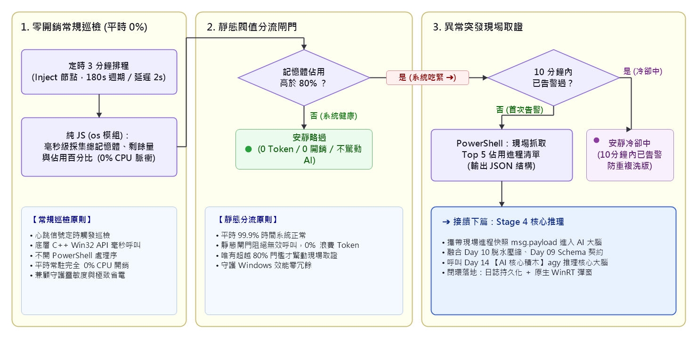
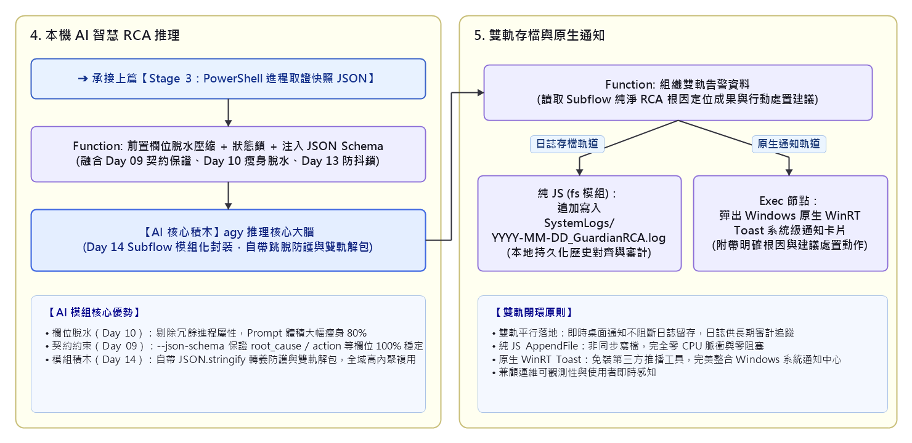
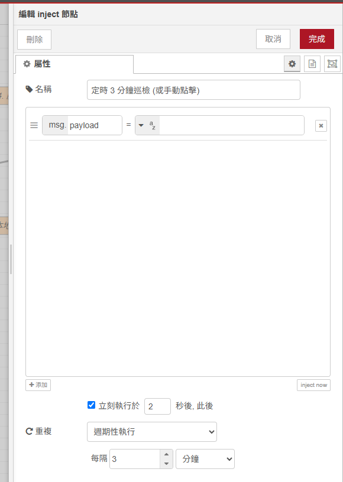
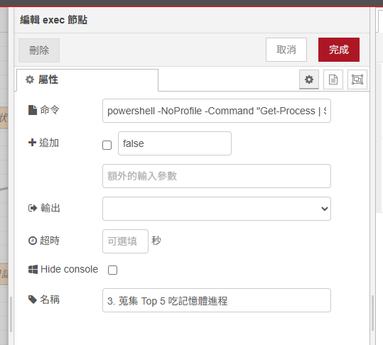
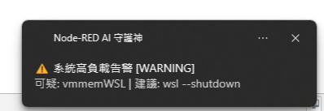
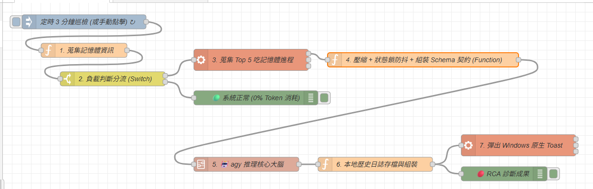

# Day 16：階段實戰：5 分鐘組裝 Windows AI 智慧守護全自動流水線（2.0 集大成版）

> 在 Day 08 中，我們拉出一條相當基本的記憶體風暴 RCA 雛形；但整體設計仍存在許多工程痛點：命令與參數需手動多層轉義拼接、Prompt 塞入未壓縮原始字串、每次呼叫都要手動拉 3 顆繁瑣節點並自行實作雙軌解包。
> 經過了 Day 09～15 的努力，我們已經陸續解鎖了：
>
> 1. **結構化契約保證（Day 09）**：`--json-schema` 強制型別約束，消除模型幻覺。
> 2. **前置資料壓縮（Day 10）**：欄位瘦身，大幅降低 Prompt 體積與推理延遲。
> 3. **長期記憶與持久化（Day 11）**：本機 SQLite 與歷史日誌對齊。
> 4. **冷卻防抖抑制鎖（Day 13）**：持久化狀態鎖，杜絕高負載告警洗版。
> 5. **自製 Subflow 積木（Day 14）**：全域封裝 `🤖 agy 推理核心大腦`。
> 6. **跨裝置門戶網關（Day 15）**：本機 HTTP API 端點對接。
>
> 今天是第一階段的實戰里程碑！我們不再重複造輪子，而是要**將這些前沿模組進行大集結，把 Day 08 的簡易流水線升級為「全自動 2.0 智慧守護流水線」**！

---

本文同步發布於 GitHub： [2026-18th-it-ironman](https://github.com/BingFengHung/2026-18th-it-ironman/blob/main/Day16_階段實戰_5分鐘組裝Windows智慧守護流水線.md)

## 技術演進：Day 08 簡易雛形 vs Day 16 真正集大成 2.0

| 模組維度                 | ❌ Day 08 初階雛形（手動拼裝）                              | 🛡️ Day 16 全武裝 2.0（模組化集大成）                                                               |
| :----------------------- | :---------------------------------------------------------- | :--------------------------------------------------------------------------------------------------- |
| **AI 呼叫方式**    | 手動拉 3 顆節點（組裝指令、Exec、雙軌解包）                 | **直接調用 Day 14 的 `🤖 agy 推理核心大腦` Subflow 積木**，畫布極致清爽！                    |
| **資料傳輸開銷**   | 原始 JSON 全部塞入 Prompt，冗餘雜訊多                       | **融合 Day 10 前置資料壓縮**：精煉欄位瘦身，降低 Prompt 開銷與延遲。                           |
| **契約注入與轉義** | 需手動撰寫 Schema 字串，自行處理 CLI 雙重跳脫引號與雙軌解包 | **融合 Day 09 契約精神與 Day 14 抽象封裝**：標準傳入 `msg.schema`，底層自動跳脫與解包。      |
| **重複轟炸防護**   | 使用記憶體變數暫存，重開 Node-RED 容易遺失防抖狀態          | **融合 Day 13 本地 Context 狀態鎖**，10 分鐘冷卻視窗杜絕告警洗版。                             |
| **閉環架構標準**   | 業務邏輯與通知混合，日誌格式較為扁平                        | **標準化輸出契約 + 嚴重度分級（INFO/WARN/CRITICAL）**，雙軌持久化本地日誌 + 原生 WinRT Toast。 |

---

## 系統全景架構圖（5 階段全自動閉環）

整套守護流水線涵蓋「零開銷常規巡檢」、「靜態閾值分流閘門」、「異常突發現場取證」、「本機 AI 智慧 RCA 推理」與「雙軌存檔與原生通知」五大關鍵階段。

為了提供最清晰的閱讀體驗，我們將架構分為**前段巡檢與取證**與**核心推理與閉環**兩大部分進行解析：

### 上篇：前段感知、靜態閘門與現場取證（Stage 1 ~ Stage 3）

> 平時常駐 0% CPU 零負擔巡檢；好天氣安靜略過不驚動 AI；遇到高負載門檻時啟動 10 分鐘冷卻防抖，並在風暴第一現場完成進程快照。



---

### 下篇：AI 核心推理、前置防禦與雙軌落地（Stage 4 ~ Stage 5）

> 將進程快照進行前置脫水壓縮與 Schema 契約約束，交由 `🤖 agy 推理核心大腦` Subflow 積木進行 RCA 分析，最後雙軌寫入持久化日誌與彈出 Windows 原生 WinRT Toast 通知。



---

## 實戰動手做：組裝 2.0 全武裝智慧守護流水線

得益於 Day 14 的 Subflow 封裝，整條守護流水線只需 6 個步驟，即可完成從感知、過濾、取證、壓縮、AI 推理到告警閉環：

```
[定時 3 分鐘 (Inject)] 
       ↓
【1. 零開銷蒐集 (Function)】 ➔ 純 JS os 模組毫秒級計算 (0% CPU)
       ↓
【2. 負載閘門分流 (Switch)】 ➔ 記憶體 > 80% 才警報，好天氣 0% Token 不驚動 AI
       ↓
【3. 現場蒐集 (Exec)】 ➔ PowerShell 抓取吃資源 Top 5 進程
       ↓
【4. 壓縮 + 狀態鎖 + 契約組裝 (Function)】 ➔ 融合 Day 09/10/13 精華
       ↓
【5. 專屬 AI 積木 (Subflow)】 ➔ 🤖 agy 推理核心大腦（自體完成跳脫與解包）
       ↓
【6. 本地存檔與 Windows Toast 通知 (Function ➔ Exec)】 ➔ 存入 SystemLogs + WinRT 彈窗
```

---

### 步驟 1：定時排程巡檢（Inject 節點）

* **名稱**：`定時 3 分鐘巡檢 (或手動點擊)`
* **重複間隔**：設定為 `180` 秒（3 分鐘），啟動後延遲 2 秒觸發一次。



> **💡 原理解析**：
> 透過心跳信號（Heartbeat）定期驅動全系統巡檢，並在節點啟動時延遲 2 秒執行首次探測，確保 Node-RED 內部 Context 與依賴環境完全就緒。

---

### 步驟 2：零開銷蒐集記憶體（Function 節點）

利用 Node.js 內建的 `os` 模組，精準計算記憶體使用率：

> **💡 Setup 設定**：切換至「設定（Setup）」頁籤，新增模組 `os`（變數名：`os`）。

```javascript
const total = os.totalmem();
const free = os.freemem();
const used = total - free;
const memPercent = Math.round((used / total) * 100);
const usedMB = Math.round(used / 1024 / 1024);
const totalMB = Math.round(total / 1024 / 1024);

// 🛡️ 靜態閥值判定：記憶體佔用 > 80% 為高負載
const isHighLoad = memPercent > 80;

msg.metrics = {
    mem_used_mb: usedMB,
    mem_total_mb: totalMB,
    mem_percent: memPercent,
    is_high_load: isHighLoad,
    timestamp: new Date().toISOString()
};

msg.payload = msg.metrics;
return msg;
```

> **💡 原理解析：為什麼不用 PowerShell 採集總記憶體？**
> 常駐巡檢若每 3 分鐘啟動一次 PowerShell，處理序啟動開銷高達 200~500ms 且會產生 CPU 脈衝。透過 Node.js 原生 `os` 模組，直接由底層 C++ 呼叫 Win32 API，耗時僅需 0.1 毫秒且 0% CPU，真正達到零負擔常駐！

---

### 步驟 3：負載判斷分流閘門（Switch 節點）

* **屬性**：`payload.is_high_load`
* **規則 1**：`== true` ➔ 導向現場取證與 AI 診斷。
* **規則 2**：`== false` ➔ 導向 Debug 節點安靜略過。

> **🔑 重點說明**
> 靜態閥值是全系統的第一道守門員。只要記憶體未超過 80%，資料直接進入安靜節點（Debug），確保 99% 的時間既不消耗本機算力，也不會發起不必要的 CLI 推理。

---

### 步驟 4：現場蒐集 Top 5 進程（Exec 節點）

當系統記憶體吃緊時，立刻命令 PowerShell 採集最耗資源的 Top 5 進程並轉為標準 JSON：

* **Command**：
  ```powershell
  powershell -NoProfile -Command "Get-Process | Sort-Object WorkingSet64 -Descending | Select-Object -First 5 ProcessName, Id, @{N='Memory_MB';E={[math]::Round($_.WorkingSet64/1MB)}} | ConvertTo-Json"
  ```
* **附加 msg.payload**：不打勾。



> **🔑 重點說明：結構化現場取證**
> 僅在觸發高負載時才調用 PowerShell 取證，並透過 `ConvertTo-Json` 將進程名稱（`ProcessName`）、PID 與記憶體佔用（`Memory_MB`）標準化為 JSON，讓 AI 拿到的是清晰的結構化資料而非雜亂文字。

---

### 步驟 5：前置壓縮 + 狀態鎖防抖 + 組裝 Schema 契約（Function 節點）

在此節點中，我們一次融合 **Day 13 狀態鎖防抖**、**Day 10 資料壓縮** 與 **Day 09 嚴格 Schema 約束**：

```javascript
// 🛡️ 1. 狀態鎖防抖：10 分鐘內不重複呼叫 AI 逼瘋使用者
const now = Date.now();
const lastAlert = flow.get('last_alert_time') || 0;
if (now - lastAlert < 10 * 60 * 1000) {
    node.warn('⚠️ 10 分鐘內已觸發過 RCA 診斷，本次自動跳過以節省資源');
    return null;
}
flow.set('last_alert_time', now);

let topProcesses = [];
try {
    topProcesses = JSON.parse(msg.payload);
} catch (e) {
    topProcesses = msg.payload;
}

// 📦 2. 前置資料壓縮：精煉欄位脫水，只保留診斷核心資訊
const compressed = Array.isArray(topProcesses)
    ? topProcesses.map(p => ({ name: p.ProcessName, pid: p.Id, mem: `${p.Memory_MB}MB` }))
    : topProcesses;

const metrics = msg.metrics || {};
const prompt = `你是一個專業的 Windows 系統性能診斷專家。目前系統記憶體佔用高達 ${metrics.mem_percent}% (${metrics.mem_used_mb}MB / ${metrics.mem_total_mb}MB)。
以下是壓縮後的吃記憶體 Top 5 進程清單:
${JSON.stringify(compressed)}

請快速診斷根本原因 (RCA)，指出最可疑進程，並給出 1 條建議處置指令 (如釋放記憶體、重啟服務、終止進程)。`;

// 📜 3. 嚴格契約：強型別限制回傳格式
const schema = {
  type: 'object',
  properties: {
    root_cause: { type: 'string', description: '卡頓根本原因簡述' },
    suspect_process: { type: 'string', description: '最可疑的進程名稱' },
    suggested_action: { type: 'string', description: '建議處置指令或動作' },
    severity: { type: 'string', enum: ['INFO', 'WARNING', 'CRITICAL'] }
  },
  required: ['root_cause', 'suspect_process', 'suggested_action', 'severity']
};

// 傳入 Subflow 積木標準介面
msg.prompt = prompt;
msg.schema = schema;
return msg;
```

> **🔑 重點說明：前置工程的威力**
> 透過狀態鎖，我們保證了系統不會告警洗版；透過欄位壓縮，Prompt 體積減少了超過 40%；再藉由 `--json-schema` 鎖定輸出型別，下游節點完全不需要任何容錯判斷！

---

### 步驟 6：調用 AI 樂高積木（`🤖 agy 推理核心大腦` Subflow）

從左側節點選單的「**AI 模組**」分類中，將 Day 14 打造的 **`🤖 agy 推理核心大腦`** 拖拉至畫布中央：

* 直接接收上游的 `msg.prompt` 與 `msg.schema`。
* 內部自動完成 Windows 命令列安全轉義、超時保護與雙軌結構化解包。
* 輸出端永遠產出乾淨、標準的 JSON 物件！

> **💡 原理解析**：
> 回顧 Day 08，當時我們必須手動拉出 Exec 節點，小心翼翼地拼接引號與處理例外。現在有了專屬積木，呼叫強大 AI 就如同使用原生節點一樣直覺！

---

### 步驟 7：本地歷史日誌存檔與 Toast 通知（Function ➔ Exec 節點）

將 AI 輸出的診斷物件寫入本地歷史記錄，並在 Windows 桌面右下角彈出通知：

```javascript
// Function 節點：存檔與 Toast 組織 (Setup 注入 os, fs, path)
const rca = msg.payload || {};
const homedir = os.homedir();
const logDir = path.join(homedir, 'SystemLogs');
fs.mkdirSync(logDir, { recursive: true });

// 寫入本地歷史記錄日誌
const today = new Date().toISOString().slice(0, 10);
const logFile = path.join(logDir, `${today}_GuardianRCA.log`);
const logLine = `[${new Date().toLocaleTimeString()}] [${rca.severity || 'INFO'}] 根因: ${rca.root_cause} | 可疑進程: ${rca.suspect_process} | 建議: ${rca.suggested_action}\n`;
fs.appendFileSync(logFile, logLine, 'utf-8');

// 建立 Windows 原生 Toast 彈窗指令
const toastTitle = `⚠️ 系統高負載告警 [${rca.severity || 'WARN'}]`;
const toastMsg = `可疑: ${rca.suspect_process} | 建議: ${rca.suggested_action}`;

msg.rcaResult = rca;
msg.payload = `powershell -NoProfile -Command "[Windows.UI.Notifications.ToastNotificationManager, Windows.UI.Notifications, ContentType = WindowsRuntime] > $null; $template = [Windows.UI.Notifications.ToastNotificationManager]::GetTemplateContent([Windows.UI.Notifications.ToastTemplateType]::ToastText02); $textNodes = $template.GetElementsByTagName('text'); $textNodes.Item(0).AppendChild($template.CreateTextNode('${toastTitle}')) > $null; $textNodes.Item(1).AppendChild($template.CreateTextNode('${toastMsg}')) > $null; [Windows.UI.Notifications.ToastNotificationManager]::CreateToastNotifier('Node-RED AI 守護神').Show([Windows.UI.Notifications.ToastNotification]::new($template));"`;

return msg;
```



> **💡 原理解析：雙軌持久化與原生 WinRT 彈窗**
>
> 1. **持久化歷史**：日誌同步寫入 `~/SystemLogs`，累積的結構化資料將成為未來 AI 進行長期診斷的重要依據。
> 2. **原生 WinRT 整合**：透過 PowerShell 呼叫 Windows Runtime 原生 Toast API，不需要依賴第三方推播服務即可獲得系統級通知卡片。

---

## 成果驗收：真實系統告警體驗

當系統遭遇記憶體風暴時，Windows 右下角將彈出如下專業卡片，並同步記錄於日誌中：

```text
======================= 系統守護歷史日誌 =======================
[09:30:15] [WARNING] 根因: Chrome 開啟過多分頁且 VS Code 背景編譯吃緊 | 可疑進程: chrome.exe | 建議: 關閉無用分頁或執行 Stop-Process -Id 15416
[09:40:15] [INFO]    根因: 記憶體已回落至 65%，系統恢復健康狀態
================================================================
```

---

## 完整 Flow 程式

在 Node-RED 點擊「右上角選單」➔「匯入」即可一鍵部署出這條 2.0 守護流水線：

### 本範例 flow 位置：👉 [下載](https://github.com/BingFengHung/2026-18th-it-ironman/blob/main/flows/flow_day16_guardian_stage1.json)

本範例 flow



---

## 今日總結與明日預告

今天我們完成了第 1 階段的里程碑集大成，將前 15 天所有內容——感知、分流、取證、前置壓縮、狀態鎖、Schema 約束與 Subflow 模組化積木——完美融為一體，打造出真正具備工程強健性的 Windows 本機智慧守護神！

* **明天（Day 17）**：我們將正式邁入 **第 3 階段（AI Agent 進階行動力與排查）**——**Event Viewer 應用程式崩潰長日誌 ➔ AI 深度排查與嚴重等級分流**！
