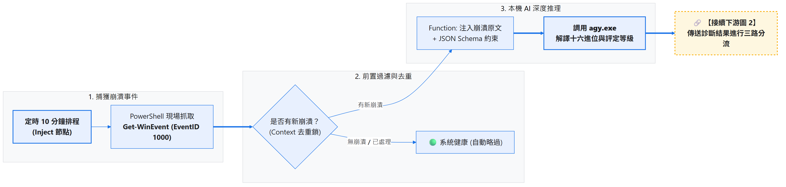
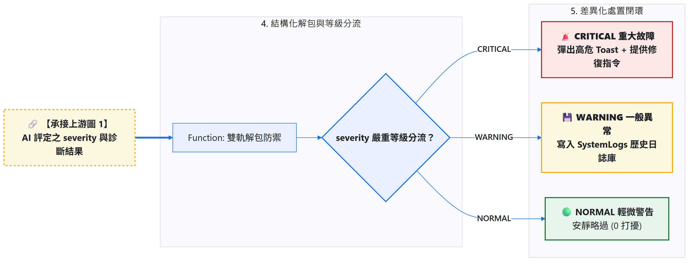
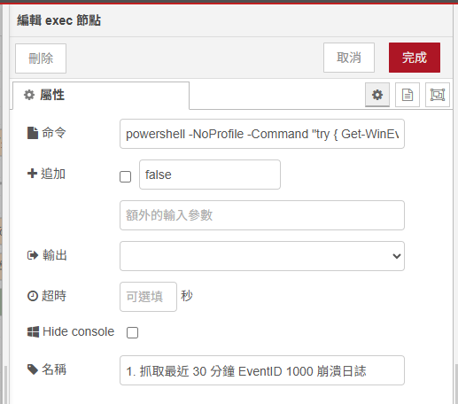
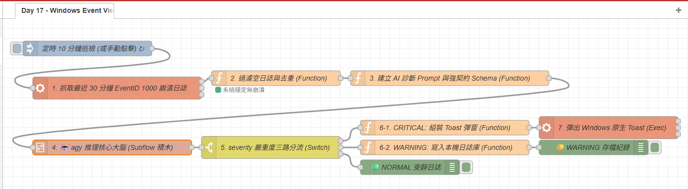

# Day 17：AI 實戰 6：Windows Event Viewer 崩潰日誌 ➔ AI 深度排查與嚴重等級分流

> 當 Windows 上的某個軟體（如 VS Code、Docker、Node.js 服務或大型遊戲）突然無預警閃退或崩潰時，Windows 事件檢視器（Event Viewer）通常會在背後默默寫入一條 `Event ID 1000 (Application Error)`。
> 但當你滿懷期待打開事件檢視器，映入眼簾的卻是滿滿晦澀的十六進位代碼（如 `0xc0000005`）與故障模組（如 `ntdll.dll`），完全不知道到底是記憶體問題、驅動衝突還是外掛崩潰。
> 今天我們結合 Day 14 的 **`🤖 agy 推理核心大腦`** Subflow 積木，打造 Windows 崩潰守護中樞：**定時自動捕獲最新 Application Error ➔ 由本機 AI 深度解讀堆疊 ➔ 依嚴重等級（CRITICAL / WARNING / NORMAL）進行智慧三路分流與自動自癒**！

---

本文同步發布於 GitHub： [2026-18th-it-ironman](https://github.com/BingFengHung/2026-18th-it-ironman/blob/main/Day17_EventViewer應用程式崩潰日誌_AI深度排查與嚴重等級分流.md)

## 痛點剖析：解密 Windows 崩潰日誌

在 Windows 事件檢視器中，典型的崩潰日誌原文長這樣：

```text
Faulting application name: Code.exe, version: 1.85.1.0, time stamp: 0x6579f648
Faulting module name: ntdll.dll, version: 10.0.22621.2506, time stamp: 0xbced4b4e
Exception code: 0xc0000005
Fault offset: 0x000000000001f370
Faulting process id: 0x3d94
Faulting application path: %USERPROFILE%\AppData\Local\Programs\Microsoft VS Code\Code.exe
```

### 傳統手動排查的痛點：

1. **十六進位代碼難以理解**：`0xc0000005` 代表「Access Violation（記憶體非法存取）」、`0xe0434352` 代表「.NET 未捕捉異常」，看到根本沒辦法反應過來。
2. **故障模組誤導**：日誌常寫 `ntdll.dll` 或 `kernel32.dll`，但真正的元兇往往是應用程式自己的外掛或記憶體洩漏，並不是 Windows 核心壞掉。
3. **缺乏自動分流機制**：有些崩潰是背景更新時的暫態警告（無需理會），有些是核心服務崩潰（需要立刻重啟或報警），人工很難即時篩選。

---

## 系統工作流架構（雙圖清晰銜接）

### 1. 【上游】捕獲崩潰事件 ➔ 前置過濾與去重 ➔ 調用專屬 AI 積木：



### 2. 【下游】嚴重度三路分流 ➔ 差異化處置閉環：



---

## 實戰動手做：組裝 6 大核心流水線節點

```
[定時 10 分鐘 (Inject)] 
       ↓
【步驟 1：捕獲 Event ID 1000 (Exec)】 ➔ PowerShell 抓取最近 30 分鐘崩潰日誌
       ↓
【步驟 2：過濾空日誌與狀態去重 (Function)】 ➔ 本地 Context 狀態鎖防重複
       ↓
【步驟 3：建立 Prompt 與 Schema 契約 (Function)】 ➔ 嚴格鎖定分析欄位
       ↓
【步驟 4：調用專屬 AI 積木 (Subflow)】 ➔ 🤖 agy 推理核心大腦（內部自體解包）
       ↓
【步驟 5：severity 等級三路分流 (Switch)】 ➔ CRITICAL / WARNING / NORMAL
       ↓
【步驟 6：差異化閉環處置】 ➔ CRITICAL 彈出紅警 Toast，WARNING 靜態日誌存檔
```

---

### 步驟 1：使用 PowerShell 精準抓取 Event ID 1000（Exec 節點）

拉出一個 **`exec`** 節點，執行以下優化過的高效 PowerShell 指令（只抓取最近 30 分鐘內發生的 Application Error）：

* **Command**：
  ```powershell
  powershell -NoProfile -Command "try { Get-WinEvent -FilterHashtable @{LogName='Application'; ProviderName='Application Error'; Id=1000; StartTime=(Get-Date).AddMinutes(-30)} -MaxEvents 3 -ErrorAction Stop | Select-Object -Property TimeCreated, Message | ConvertTo-Json -Compress } catch { '[]' }"
  ```
* **附加 msg.payload**：不打勾。
* 

> **💡 原理解析：為什麼必須用 try-catch 包裹而不是只用 -ErrorAction SilentlyContinue？**
>
> 1. **避免 Exec 節點虛驚報錯（Exit Code 0）**：在 Windows PowerShell 中，當過去 30 分鐘系統健康無任何崩潰時，`Get-WinEvent` 會因查無紀錄拋出非終止例外。即使加上 `-ErrorAction SilentlyContinue` 隱藏報錯文字，PowerShell 終止時的行程結束代碼仍為 `1`，會導致 Node-RED 的 Exec 節點下方懸掛紅色的 `error: 1` 徽章造成誤判。
> 2. **優雅降級空陣列**：透過 `try-catch` 捕捉「查無事件」例外並主動輸出標準的合法空 JSON 陣列 `'[]'`，既能讓 PowerShell 以 Exit Code 0 正常退出，又能讓下游過濾節點無縫識別並亮出綠燈「系統穩定無崩潰」！
> 3. **極致輕量取證**：透過 `FilterHashtable` 直接由 Windows 核心事件日誌引擎在底層完成過濾，耗時不到 50ms，且設定 `StartTime` 為最近 30 分鐘，避免無謂地遍歷數百 MB 的歷史舊日誌。

---

### 步驟 2：過濾空日誌與狀態去重（Function 節點）

利用 Node-RED 的 `flow.get('last_crash_time')` 狀態鎖，確保同一條崩潰事件絕不重複送給 AI 推理：

```javascript
// Function 節點：過濾與防重複機制
let raw = (msg.payload || '').trim();

// 🛡️ 防禦 1：若無任何崩潰日誌，安靜結束
if (!raw || raw === 'null' || raw === '[]') {
    node.status({ fill: 'green', shape: 'dot', text: '系統穩定無崩潰' });
    return null;
}

let events = [];
try {
    events = JSON.parse(raw);
    if (!Array.isArray(events)) events = [events];
} catch (e) {
    events = [{ Message: raw, TimeCreated: new Date().toISOString() }];
}

if (events.length === 0) {
    node.status({ fill: 'green', shape: 'dot', text: '無崩潰日誌' });
    return null;
}

const latest = events[0];
// 🛡️ 防禦 2：比對上次處理的時間戳，避免重複告警
const lastHandledTime = flow.get('last_crash_time') || '';
if (latest.TimeCreated && latest.TimeCreated === lastHandledTime) {
    node.warn('該崩潰事件先前已處理過，自動略過');
    return null;
}
flow.set('last_crash_time', latest.TimeCreated);

msg.crashData = latest;
msg.payload = latest.Message;
node.status({ fill: 'red', shape: 'dot', text: '發現崩潰日誌！' });
return msg;
```

> **🔑 重點說明：雙層防護網**
> 既避免了系統正常時無謂消耗 AI 算力，又利用持久化狀態時間戳，徹底杜絕同一個崩潰事件反覆彈窗打擾使用者。

---

### 步驟 3：建立 AI 診斷 Prompt 與強契約 Schema（Function 節點）

我們透過 `--json-schema` 強制模型必須輸出包含嚴重度（`severity`）、白話說明原因（`plain_cause`）與修復指令（`recommended_cmd`）的嚴格 JSON：

```javascript
// Function 節點：建立崩潰診斷 Prompt 與 Schema 契約
const crashText = msg.payload || 'Faulting application name: Code.exe, faulting module: ntdll.dll, exception code: 0xc0000005';

const prompt = `你是一個專業的 Windows 核心除錯專家。請分析以下 Windows Event ID 1000 (Application Error) 應用程式崩潰日誌：
1. 找出故障應用程式名稱 (target_app)。
2. 評定嚴重等級 (severity: CRITICAL / WARNING / NORMAL)。
3. 用一句白話文解釋為何會崩潰 (plain_cause，解譯十六進位 Exception code 如 0xc0000005 為記憶體違規存取)。
4. 給出 1 條建議的具體修復指令或行動 (recommended_cmd)。
5. 判定是否為可重啟恢復的暫態故障 (is_recoverable)。

崩潰日誌原文:
${crashText}`;

const schema = {
  type: 'object',
  properties: {
    target_app: { type: 'string', description: '崩潰應用程式' },
    severity: { type: 'string', enum: ['CRITICAL', 'WARNING', 'NORMAL'] },
    plain_cause: { type: 'string', description: '白話崩潰原因與代碼解析' },
    recommended_cmd: { type: 'string', description: '建議修復指令或處理動作' },
    is_recoverable: { type: 'boolean', description: '是否可重啟自癒' }
  },
  required: ['target_app', 'severity', 'plain_cause', 'recommended_cmd', 'is_recoverable']
};

// 直接傳遞給 Day 14 Subflow 積木標準介面
msg.prompt = prompt;
msg.schema = schema;
return msg;
```

> **🔑 重點說明：契約型推理**
> 利用 `enum: ['CRITICAL', 'WARNING', 'NORMAL']` 鎖定嚴重度評級，確保下游的 Switch 分流閘門能 100% 精準捕捉條件，絕不發生條件遺漏。

---

### 步驟 4：調用專屬 AI 樂高積木（`🤖 agy 推理核心大腦` Subflow）

從左側「**AI 模組**」分類中拉出 Day 14 打造的 **`🤖 agy 推理核心大腦`**：

* 接上步驟 3 的輸出端。
* 內部自動完成 CLI 轉義呼叫與結構化雙軌解包。
* 輸出端直接傳出解包完成的 JavaScript 物件（內含 `severity`, `plain_cause`, `recommended_cmd` 等欄位）。

> **💡 原理解析**：
> 我們不需要在每個實戰流程中重新寫一遍 Exec 節點與雙軌解包邏輯。只要拉出這顆 Subflow 積木，就能立刻獲得帶有雙軌防禦與 Schema 保證的本機推理輸出！

---

### 步驟 5：severity 嚴重度三路分流（Switch 節點）

上游 Subflow 輸出的 `msg.payload` 已經是乾淨的物件，我們直接用 **Switch 節點** 進行三路精確分流：

* **屬性**：`payload.severity`
* **第 1 條輸出 (`== "CRITICAL"`)** ➔ 接往「紅色緊急 Toast 彈窗」。
* **第 2 條輸出 (`== "WARNING"`)** ➔ 接往「本機日誌庫持久化存檔」。
* **第 3 條輸出 (`否則 otherwise / NORMAL`)** ➔ 接往 Debug 節點安靜記錄。

---

### 步驟 6：差異化處置閉環（Toast 彈窗 & 寫入日誌）

* **CRITICAL 緊急處置（Function ➔ Exec 節點）**：
  在 Windows 桌面右下角彈出顯眼的紅色告警卡片：

  ```javascript
  const rca = msg.payload || {};
  const title = `🚨 應用程式崩潰告警: ${rca.target_app || '未知'}`;
  const message = `原因: ${rca.plain_cause || '異常閃退'} | 建議: ${rca.recommended_cmd || '請查看事件檢視器'}`;

  msg.payload = `powershell -NoProfile -Command "[Windows.UI.Notifications.ToastNotificationManager, Windows.UI.Notifications, ContentType = WindowsRuntime] > $null; $template = [Windows.UI.Notifications.ToastNotificationManager]::GetTemplateContent([Windows.UI.Notifications.ToastTemplateType]::ToastText02); $textNodes = $template.GetElementsByTagName('text'); $textNodes.Item(0).AppendChild($template.CreateTextNode('${title}')) > $null; $textNodes.Item(1).AppendChild($template.CreateTextNode('${message}')) > $null; [Windows.UI.Notifications.ToastNotificationManager]::CreateToastNotifier('Node-RED 崩潰守護').Show([Windows.UI.Notifications.ToastNotification]::new($template));"`;
  return msg;
  ```
* **WARNING 存檔處置（Function 節點）**：
  非致命崩潰不彈窗打擾工作，自動靜默歸檔至 `~/SystemLogs`：

  ```javascript
  const rca = msg.payload || {};
  const homedir = os.homedir();
  const logDir = path.join(homedir, 'SystemLogs');
  fs.mkdirSync(logDir, { recursive: true });

  const today = new Date().toISOString().slice(0, 10);
  const logFile = path.join(logDir, `${today}_CrashWarning.log`);
  const line = `[${new Date().toLocaleTimeString()}] [WARNING] 程式: ${rca.target_app} | 根因: ${rca.plain_cause} | 建議: ${rca.recommended_cmd}\n`;
  fs.appendFileSync(logFile, line, 'utf-8');
  return msg;
  ```

---

## 成果驗收：AI 智慧分流實測效果

當 VS Code 發生外掛崩潰時，AI 的結構化分析輸出範例：

```json
{
  "target_app": "Code.exe",
  "severity": "CRITICAL",
  "plain_cause": "VS Code 嘗試存取未經授權的記憶體位址 (0xc0000005 Access Violation)，通常由損壞的外掛擴充套件引起。",
  "recommended_cmd": "code --disable-extensions",
  "is_recoverable": true
}
```

Windows 桌面右下角將立刻彈出紅色警告 Toast，明確提示原因與建議的修復指令！

---

## 完整 Flow 程式

在 Node-RED 點擊「右上角選單」➔「匯入」即可一鍵部署：

### 本範例 flow 位置：👉 [下載](https://github.com/BingFengHung/2026-18th-it-ironman/blob/main/flows/flow_day17_event_crash.json)

本範例 flow



---

## 今日總結與明日預告

今天我們打通了 Windows 原生 Event Viewer 的監聽能力，並透過 Day 14 的 Subflow 樂高積木，用極致清爽的節點流完成了「十六進位崩潰排查 ➔ 嚴重度三路分流 ➔ 差異化閉環處置」。

* **明天（Day 18）**：我們將探索如何賦予本機 AI 真正的四肢——**agy MCP 掛載 Windows 本機工具與自主行動 Agent**！
