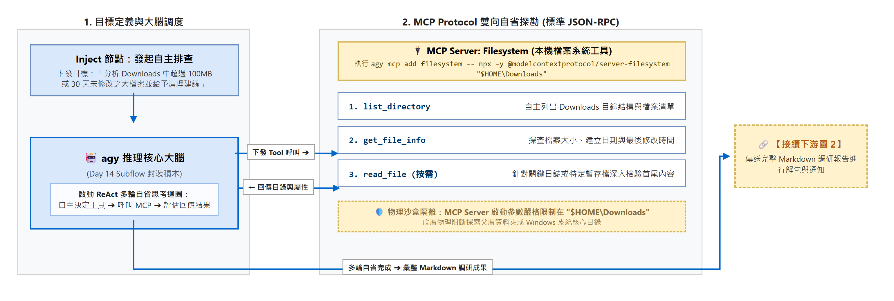
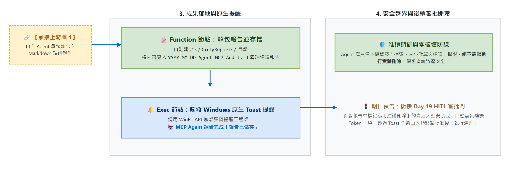
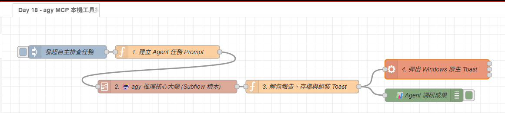

# Day 18：自主行動：利用 agy MCP 掛載 Windows 本機工具與自主排查

> 如果 AI 只能在對話框裡給文字建議，查檔案與執行命令仍要由使用者手動完成，那它的角色就是提供建議。這篇會進一步說明工具掛載後的目標導向流程。
> 這類流程的差異在於：使用者只需要提供目標，模型再依可用工具讀取資料並整理結果。工具權限與資料範圍仍需要先限制。
> 今天會介紹 **Model Context Protocol（MCP）**，利用 `agy mcp` 掛載 Windows 工具，並結合 Day 14 的 **`🤖 agy 推理核心大腦`** Subflow，完成一個可延伸的目標導向流程。

---

本文同步發布於 GitHub： [2026-18th-it-ironman](https://github.com/BingFengHung/2026-18th-it-ironman/blob/main/Day18_agy_MCP掛載Windows本機工具與自主行動.md)

## 什麼是 MCP（Model Context Protocol）？

在過去，要讓 AI 擁有呼叫外部工具（Tool Calling / Function Calling）或讀取本機檔案的能力，開發者面臨著巨大的工程痛點：**每家模型與平台的通訊規格完全各自為政**。這讓工具的複用率極低且維護成本高昂。

* 如果你想讓 Claude 讀取檔案，得寫一套 Anthropic 專屬的 Tool 定義與回調；
* 想讓 OpenAI 存取資料庫，又得按照其 Function Calling Schema 重寫一遍；
* 若想在本地 LangChain、Semantic Kernel 或 Node-RED 串接，就必須手刻大量的「膠水代碼（Glue Code）」。

為了解決這個困境，Anthropic 提出了 **MCP（Model Context Protocol，模型上下文協定）**，並迅速獲得開源社群與 Google `agy` 的原生全面支援。

---

### AI 時代的「USB-C 開放標準」

理解 MCP 最直覺的生活化比喻就是 **硬體世界的 USB-C**：

在 USB 出現以前，鍵盤、滑鼠、印表機各有各的特規插孔；而 USB 規格統一了通訊格式，從此任何周邊只要實作 USB 介面，就能插上任意電腦即插即用。

**MCP 正是 AI 應用程式的 USB-C**！它基於標準的 **JSON-RPC 2.0** 雙向通訊協定，將「大腦模型」與「本機/外部工具」徹底解耦：

* **工具開發者**只要依循 MCP 標準實作一次（例如開發一個 Filesystem MCP Server）；
* **任何支援 MCP 的主控端**（如 Google `agy`、Claude Desktop、Cursor 等），就能以「零代碼適配」的方式一鍵掛載、立即呼叫！

---

### MCP 核心架構：三層分工角色

在 MCP 的運作體系中，清楚劃分了三個協作角色：

1. **Host（宿主主控端）**：
   * 負責協調整個 Agent 的生命週期，定義高層次目標與維護對話上下文。
   * 在本專案中，**Node-RED 與 `agy CLI`** 共同扮演 Host 角色（Node-RED 負責事件調度與成果落地，`agy` 負責調度 Gemini 推理大腦）。
2. **Client（客戶端通訊庫）**：
   * 內建於 `agy` 核心之中，負責與各個 MCP Server 建立標準連線（透過 `stdio` 標準輸入輸出或 HTTP `SSE`），自動探測並向模型宣告可用工具清單（Schema）。
3. **Server（工具提供端）**：
   * 獨立運行的輕量級進程（例如本篇使用的 `@modelcontextprotocol/server-filesystem`）。
   * 專注於向 AI 提供具體的能力，並**透過物理進程隔離實現安全邊界**（例如啟動時限定只能存取特定目錄）。

---

### MCP 規範的三大核心能力

傳統的 Tool Calling 通常只支援單向的「執行函數」，而 MCP 規範了完整的上下文擴展生態：

* 🔧 **Tools（工具執行）**：具備副作用或操作能力的動作（如 `list_directory`、`get_file_info`），由 AI 在推理迴圈中自主決定參數並發起呼叫。
* 📄 **Resources（資源檢索）**：唯讀的資料讀取介面（類似 REST API 的 GET），透過標準 URI（如 `file:///logs/app.log`）讓 AI 按需檢索背景資料，不浪費多餘的 Token 上下文空間。
* 💬 **Prompts（提示範本）**：由 Server 端預先封裝好的專業任務 Prompt 樣板，可被使用者或 Agent 快速調用與重複使用。

---

### 傳統 Prompt vs MCP 自主 Agent 的本質差異：

| 比較維度           | 傳統 Prompt 做法（Day 04~15）                       | 🚀 具備 MCP 的自主 Agent（Day 18+）                                   |
| :----------------- | :-------------------------------------------------- | :-------------------------------------------------------------------- |
| **資料獲取** | Node-RED 必須預先寫死 JS/PowerShell 抓好資料傳給 AI | **AI 在思考過程中自主決定何時呼叫工具讀取資料**                 |
| **迭代輪數** | 單輪問答（一次性完成）                              | **多輪自省（Tool Use ➔ Tool Output ➔ 深入探勘 ➔ 最終結論）** |
| **擴展性**   | 每多一個功能，Node-RED 畫布就要多拉 3 顆節點        | **只需掛載一個 MCP Server，AI 自動學會 10+ 種新工具**           |
| **安全邊界** | 依賴腳本邏輯限制                                    | **透過 MCP Server 啟動參數進行物理沙盒隔離（如限制唯讀目錄）**  |

> **💡 架構思維：為什麼不直接用 Exec 節點跑 PowerShell 抓好資料丟給 AI？**
>
> 「*在前面的文章中，直接拉 Exec 節點跑 PowerShell 抓日誌或檔案，再整包丟給 AI，不也能解決問題嗎？*」
>
> 這兩者背後是「**被動餵食**」與「**主動探勘**」的根本代差：
>
> 1. **多輪自適應探勘（Adaptive Multi-turn）**：傳統腳本是「單輪定生死」，工程師必須預先猜到 AI 需要什麼。如果 AI 看到目錄後發現某個日誌檔異常龐大、想深入讀取其中前 50 行日誌，傳統流程就斷了（除非 Node-RED 再拉出複雜的迴圈與分支）；而 MCP 能讓 AI 在思考鏈中自主發起下一輪工具呼叫。
> 2. **Token 精準度與防範幻覺**：傳統做法因為怕遺漏，往往把幾百個檔案或數千行日誌「整包倒進 Prompt」，不僅浪費 Token、增加延遲，還容易引發模型注意力分散；MCP 則是按需自取，先讀檔名，有疑慮才讀內容。
> 3. **物理沙盒邊界**：PowerShell Exec 具備整台電腦的最高權限；而 MCP Server 可在通訊底層硬性限制存取目錄（例如嚴格限制在 `Downloads`），即便 AI 嘗試讀取系統敏感路徑也會在底層被物理攔截。

---

## Windows 實戰：配置 `agy mcp` 工具伺服器

Google `agy` 內建了完整的 MCP 工具管理指令。我們只需在 Windows 終端機中配置即可：

### 步驟 1：查看當前 MCP 工具清單

```powershell
agy mcp list
```

### 步驟 2：掛載官方本機檔案系統工具（Filesystem MCP）

我們使用官方開源的 `@modelcontextprotocol/server-filesystem`，並**將存取權限嚴格限制在你的 Downloads 目錄**（確保安全性）：

```powershell
# 在 PowerShell 中掛載 Downloads 資料夾工具 (需先確認本機已安裝 Node.js/npx)
agy mcp add filesystem -- npx -y @modelcontextprotocol/server-filesystem "$HOME\Downloads"
```

> **🛡️ 安全與路徑防呆提醒**：
>
> 1. **路徑引號必備**：若你的 Windows 使用者名稱包含空格（例如 `C:\Users\User X`），務必確保路徑使用雙引號 `"$HOME\Downloads"` 包裹，避免指令參數解析錯誤。
> 2. **嚴格沙盒隔離**：此命令將 MCP 工具的讀寫邊界強制限制在 Downloads 內，即便 AI 試圖探索父層資料夾或 Windows 核心目錄，也會被底層直接阻擋。

掛載完成後，`agy` 會自動註冊以下工具：

* `list_directory`：列出指定目錄檔案與子資料夾。
* `read_file`：讀取文字或日誌內容。
* `get_file_info`：獲取檔案大小、建立日期與最後修改時間。

---

## 系統工作流架構（雙圖清晰銜接）

在進入 Node-RED 實作前，我們先透過雙圖綜觀整套自主排查調研流水線的完整運作路徑：

### 1. 【上游】任務目標定義 ➔ agy 推理大腦 ➔ MCP 雙向自省探勘：



* **【目標注入與推理大腦】**：Node-RED 藉由 Inject 節點注入高層次目標，調用 Day 14 封裝的 `🤖 agy 推理核心大腦` 啟動 ReAct 自省迴圈。
* **【底層雙向探勘】**：`agy` 內建 MCP Client，透過標準 JSON-RPC 雙向協定調用沙盒限定的 Filesystem MCP（`list_directory` ➔ `get_file_info` ➔ `read_file`）。
* **【物理沙盒安全鎖】**：MCP 工具邊界嚴格限定於 `$HOME\Downloads`，在系統底層物理阻斷越權存取。

### 2. 【下游】調研報告解包存檔 ➔ Windows 原生 Toast 提醒閉環：



* **【成果解包與存檔】**：將 AI 彙整的多輪探勘結論解包為乾淨 Markdown，自動寫入 `~/DailyReports/` 目錄。
* **【原生 WinRT 提醒】**：呼叫 PowerShell 原生 Toast 彈窗通知使用者（「🤖 MCP Agent 調研完成」）。
* **【零破壞防線】**：自主調研 Agent 僅具備建議權限，絕不自動物理刪除檔案，平滑銜接明日（Day 19）的 Human-in-the-loop 審批門！

---

## 實戰動手做：在 Node-RED 中調度自主 Agent

結合 Day 14 封裝的專屬積木，調度具備 MCP 能力的 Agent 變得無比精煉：

```
[發起排查任務 (Inject)] 
       ↓
【步驟 1：建立目標導向 Prompt (Function)】 ➔ 定義目標與邊界，交由 AI 自主探索
       ↓
【步驟 2：調用專屬 AI 積木 (Subflow)】 ➔ 🤖 agy 推理核心大腦（自主執行多輪 MCP Tool Use）
       ↓
【步驟 3：解包存檔與原生 Toast 提醒 (Function ➔ Exec)】 ➔ 產出 Markdown 報告並彈窗
```

---

### 步驟 1：建立目標導向的 Agent Prompt（Function 節點）

自主 Agent 的 Prompt 特點是：**只給目標與驗收標準，不指導具體執行步驟**：

```javascript
// Function 節點：建立目標導向 Prompt
const task = `請使用已掛載的 filesystem 工具，自主檢查使用者的 Downloads 目錄。
目標任務：
1. 列出 Downloads 中的所有檔案與目錄。
2. 找出大小超過 100MB 或超過 30 天未修改的大型暫存檔、安裝包 (.iso, .exe, .zip)。
3. 產出一份專業的 Markdown 清理建議報告 (包含檔案名稱、大小、最後修改時間、建議動作與保留/清理理由)。`;

// 直接傳遞給 Day 14 Subflow 積木標準介面
msg.prompt = task;
return msg;
```

> **🔑 重點說明：從「指導步驟」轉變為「驗收目標」**
> 過去我們必須先用 PowerShell 列出目錄，再將清單文字丟給 AI。現在我們只需給出高層次驗收目標，`agy` 會在底層自動調用 `list_directory` 與 `get_file_info`，並自主進行過濾分析。

---

### 步驟 2：調用共用 AI Subflow（`🤖 agy 推理核心大腦`）

從左側「**AI 模組**」將 Day 14 打造的 **`🤖 agy 推理核心大腦`** 拖拉至畫布：

* 自動銜接 Windows CLI 命令列。
* 由於涉及多輪 MCP 工具呼叫，Subflow 內建逾時機制，避免單次任務長時間佔用流程。
* 輸出端直接回傳 AI 彙整後的調研報告內容。

> **💡 原理解析**：
> `agy` 在接收到 Prompt 時，會自動探測已掛載的 MCP 工具定義，並向 Gemini 發起帶有 Function Declarations 的對話。模型自主完成「呼叫工具 ➔ 取得本機目錄 ➔ 計算大小 ➔ 彙整結論」的完整自省閉環。

---

### 步驟 3：解包 Agent 報告、覆蓋存檔與 Toast 提醒（Function ➔ Exec 節點）

當 Agent 完成多輪探索後，我們將其最終彙整的調研報告儲存至 `DailyReports/`，並彈出 Windows Toast 提示：

```javascript
// Function 節點：解包報告與存檔 (Setup 注入 os, fs, path)
const report = typeof msg.payload === 'string' ? msg.payload : (msg.payload.response || JSON.stringify(msg.payload));
msg.agentReport = report;

const homedir = os.homedir();
const logDir = path.join(homedir, 'DailyReports');
fs.mkdirSync(logDir, { recursive: true });

const today = new Date().toISOString().slice(0, 10);
const filePath = path.join(logDir, `${today}_Agent_MCP_Audit.md`);
fs.writeFileSync(filePath, report, 'utf-8');

msg.savedPath = filePath;
msg.payload = `powershell -NoProfile -Command "[Windows.UI.Notifications.ToastNotificationManager, Windows.UI.Notifications, ContentType = WindowsRuntime] > $null; $template = [Windows.UI.Notifications.ToastNotificationManager]::GetTemplateContent([Windows.UI.Notifications.ToastTemplateType]::ToastText02); $textNodes = $template.GetElementsByTagName('text'); $textNodes.Item(0).AppendChild($template.CreateTextNode('🤖 MCP Agent 調研完成！')) > $null; $textNodes.Item(1).AppendChild($template.CreateTextNode('清理建議報告已儲存至 DailyReports/')) > $null; [Windows.UI.Notifications.ToastNotificationManager]::CreateToastNotifier('Node-RED MCP 大腦').Show([Windows.UI.Notifications.ToastNotification]::new($template));"`;

return msg;
```

> **🔑 重點說明：節點關鍵設定細節**
>
> 1. **Function 節點模組注入**：此腳本直接調用 Node.js 核心庫寫入報告。若是手動新增節點，請務必在 Function 節點的「**設定 (Setup)**」分頁中加入 `os`、`fs`、`path` 三個模組名稱；若直接匯入文末 Flow 則已自動配妥。
> 2. **Exec 節點「附加 msg.payload」**：後方銜接的 Exec 節點「**命令 (Command)**」欄位留空，並**務必勾選「附加 msg.payload」**（JSON 中為 `"addpay": "payload"`），以正確觸發動態組裝的 PowerShell 原生 Toast 彈窗。

---

## 成果驗收：Agent 自主生成的深度調研報告

以下是 `agy` 透過 MCP 檔案工具自主探索 Downloads 目錄後，產出的高品質報告內容：

```markdown
# 📊 Downloads 下載區空間占用與清理調研報告 (2026-08-23)

### 🎯 總覽摘要
透過 `filesystem` 工具深度掃描 `%USERPROFILE%\Downloads`，共發現 14 個檔案，總占用空間 **3.82 GB**。其中有 3 個超過 30 天未存取的大型安裝包，預估可釋放 **2.95 GB** 空間。

### 🗑️ 建議清理候選清單

| 檔案名稱 | 檔案大小 | 最後修改時間 | 建議動作 | 判定理由 |
| :--- | :---: | :---: | :---: | :--- |
| `Ubuntu-24.04-live-server.iso` | 1.85 GB | 2026-05-12 | **建議刪除** | 距今超過 90 天未修改，系統光碟鏡像安裝後已無需保留 |
| `Docker_Desktop_Installer.exe` | 620 MB | 2026-06-18 | **建議刪除** | 舊版安裝程式，Docker 官方已發布新版，本機已完成安裝 |
| `node-v22.2.0-x64.msi` | 480 MB | 2026-06-20 | **建議封存** | 建議移至 Installers/ 子目錄或刪除暫存安裝檔 |

### 📌 後續處置建議
可搭配明日之「Human-in-the-loop 審批門」，針對上述標記為【建議刪除】之項目發送確認彈窗進行一鍵安全清理。
```

---

## 完整 Flow 程式

在 Node-RED 點擊「右上角選單」➔「匯入」即可一鍵部署：

本案例 flow



### 本範例 flow 位置：👉 [下載](https://github.com/BingFengHung/2026-18th-it-ironman/blob/main/flows/flow_day18_mcp_agent.json)

---

## 今日總結與明日預告

今天說明了如何用 `agy mcp` 掛載本機檔案工具，讓模型依目標讀取資料並產生報告；實際可執行的操作仍取決於 MCP 工具的權限設定。

* **明天（Day 19）**：接著處理 AI 可能執行高風險操作的情況，加入 Human-in-the-loop 審批流程。
