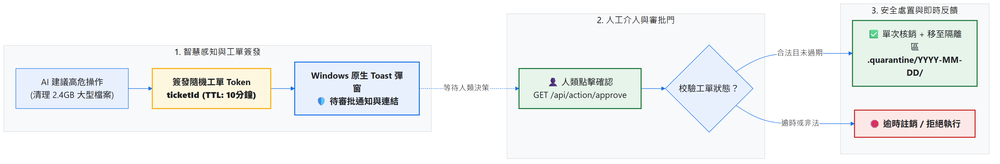
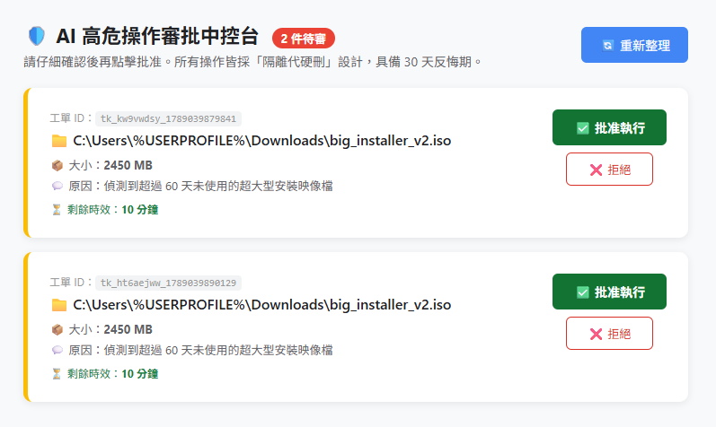
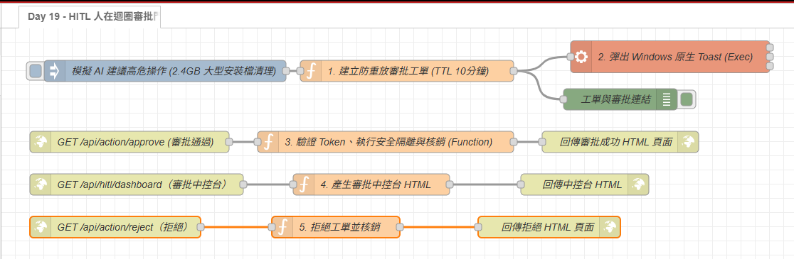

# Day 19：安全防禦：Human-in-the-loop 審批門（高危 AI 動作 Toast 確認機制）

> 當本機 AI 具備了操作檔案系統、終止系統進程與執行命令列工具的能力時，**「安全性」就是最重要的事情**。
> 想像一下：當 AI Agent 判斷「這個 2.4GB 的檔案看起來像過期暫存檔，建議刪除」，若系統直接默默在背景執行直接刪除，萬一那是你剛編譯好的 Release ISO 映像檔，就會造成難以挽回的災難。
> 今天我們在自動化流水線中引入軟體工程級別的 **Human-in-the-loop 審批門**：當 AI 提出高危操作時，自動發送確認工單，並透過 Windows 原生 Toast 彈窗要求工程師親自點擊確認，只有經過人類批准，動作才會安全執行！

---

本文同步發布於 GitHub： [2026-18th-it-ironman](https://github.com/BingFengHung/2026-18th-it-ironman/blob/main/Day19_Human_in_the_loop審批門_高危AI動作Toast確認機制.md)

## 為什麼需要 Human-in-the-loop（HITL）？

在 AI 驅動的自動化系統中，依據「風險等級」劃分四個層次：

| 操作風險等級                             | 典型場景                                                     | 系統策略                                        |
| :--------------------------------------- | :----------------------------------------------------------- | :---------------------------------------------- |
| 🟢**唯讀操作（Read-Only）**        | 讀取 Event Viewer 日誌、查詢記憶體、分析 Git 提交            | **全自動執行**（0 阻礙，秒級反饋）        |
| 🟡**低危寫入（Reversible Write）** | 產出工作日報、寫入 Markdown 表格、記錄除錯 Log               | **全自動執行**（具備冪等性覆蓋）          |
| 🟠**高危破壞（High-Risk Action）** | 清理大型安裝檔、強制關閉常駐進程、批次重構檔案               | **🛡️ 觸發 HITL 審批門（必須人手確認）** |
| 🔴**毀滅性操作（Destructive）**    | 刪除`.git` 倉庫、刪除 `.env` 金鑰、修改 Windows 系統目錄 | **🛑 程式碼層級物理阻斷（絕對禁止）**     |

---

## 審批門全景工作流架構

### 從高危觸發 ➔ 工單簽發 ➔ 人類審核閘門 ➔ 安全處置閉環：



* **【智慧感知與工單簽發】**：當上游 AI 判定操作風險達到高危等級，Function 節點立即生成帶有隨機防偽 Token 的工單並存入 Flow Context，設定 10 分鐘 TTL 到期自動失效。
* **【中控台審批閘門】**：Toast 彈窗直接顯示中控台 URL，工程師在瀏覽器開啟即可看到所有待審工單、剩餘時效，並一鍵批准或拒絕。
* **【安全隔離閉環】**：人工點擊批准後，系統驗證 Token 有效性並立即核銷（防重放），檔案僅搬移至 `.quarantine/YYYY-MM-DD/` 隔離區，絕不物理硬刪。逾時或無效工單則直接拒絕執行。

## 實戰動手做：打造 HITL 互動式審批中樞

整條安全審批流水線由「工單簽發」、「審批核銷」、「審批中控台」與「拒絕端點」四大模組構成：

```
【工單簽發支線】
[高危動作觸發] ➔ 【1. 簽發防重放工單】 ➔ [彈出 Windows 通知視窗]

【審批核銷支線】
[GET /api/action/approve] ➔ 【2. 驗證 Token、安全隔離與工單核銷】 ➔ [HTTP 200 成功頁面]

【審批中控台支線】
[GET /api/hitl/dashboard] ➔ 【3. 讀取 Flow Context 產生待審清單 HTML】 ➔ [互動式中控台頁面]

【拒絕端點支線】
[GET /api/action/reject]  ➔ 【4. 刪除工單並核銷】 ➔ [HTTP 200 拒絕確認頁面]
```

---

### 步驟 1：AI 產生高危操作建議並簽發工單（Function 節點）

當上游 AI 判定需要執行清理或高危操作時，我們為其生成隨機防偽工單 Token，設定 10 分鐘過期時間（TTL），並存入 Flow Context 狀態機：

```javascript
// 🔑 核心一：單次防偽 Token（含 timestamp 確保唯一性）
const ticketId = 'tk_' + Math.random().toString(36).substring(2, 10) + '_' + Date.now();

// 🔑 核心二：存入 Flow Context 並設定 10 分鐘 TTL
const pending = flow.get('pending_tickets') || {};
pending[ticketId] = { plan, status: 'PENDING', expiresAt: Date.now() + 10 * 60 * 1000 };
flow.set('pending_tickets', pending);

// 🔑 核心三：Toast 訊息直接嵌入審批中控台網址
const dashUrl = 'http://127.0.0.1:1880/api/hitl/dashboard';
const message = `檔案: ${safeFile} (${safeSize}MB)` + '`n' + `原因: ${safeReason}` + '`n' + `👉 審批中控台: ${dashUrl}`;

msg.ticketInfo = { ticketId, approveUrl, rejectUrl, dashUrl, plan };
```

> **🔑 重點說明：TTL 過期防護與防偽 Token**
> 透過動態生成的單次 Token 與 10 分鐘 TTL 機制，杜絕工單被隔夜誤按或重複觸發，確保每一次高危指令都是即時且唯一的。

Function 節點下方接上 **`exec` 節點**（「附加 msg.payload」**打勾（true）**），彈出 Windows 原生 Toast 卡片。Toast 內容直接顯示中控台 URL：

```
👉 審批中控台: http://127.0.0.1:1880/api/hitl/dashboard
```

看到通知視窗之後，直接在瀏覽器開啟該網址即可進入**審批中控台** 進行確認。

---

### 步驟 2：審批通過 HTTP 端點（`http in` 節點）

1. 拉出 **`http in`** 節點：
   * **Method**：`GET`
   * **URL**：`/api/action/approve`
2. 接上 **Function 節點（核銷與安全執行）**：
   * **單次消耗性 Token 防重放（Replay Attack）**：審批完成後立即銷毀 Token。
   * **逾時檢查（TTL Check）**：超過 10 分鐘自動作廢，防止隔夜誤按。
   * **以隔離代替物理刪除**：將檔案搬移至 `%USERPROFILE%\.quarantine\YYYY-MM-DD\`。

> **💡 Setup 設定提醒**：請在 Function 節點「設定」頁籤中引入 `os`、`fs`、`path`。

```javascript
// 🛡️ 防禦一：無效工單（已核銷 or 不存在）→ 直接拒絕
const ticket = pending[ticketId];
if (!ticket) { msg.statusCode = 404; return msg; }

// 🛡️ 防禦二：TTL 逾時自動失效（超過 10 分鐘）
if (Date.now() > ticket.expiresAt) {
    delete pending[ticketId];
    flow.set('pending_tickets', pending);
    msg.statusCode = 410; return msg;
}

// 🛡️ 防禦三：單次消耗性 Token，批准後立即核銷防止重放
delete pending[ticketId];
flow.set('pending_tickets', pending);

// ✅ 以「搬移隔離」代替「物理硬刪」— 保留 30 天反悔期
const quarantineDir = path.join(os.homedir(), '.quarantine', new Date().toISOString().slice(0, 10));
fs.mkdirSync(quarantineDir, { recursive: true });
if (fs.existsSync(target)) fs.renameSync(target, path.join(quarantineDir, fname));
```

> **💡 原理解析：以隔離代硬刪的後悔藥設計**
> 哪怕經過人工確認，檔案也只是被搬移至隱藏的 `.quarantine` 資料夾，享有 30 天的「反悔期」，把人為誤判的損失風險降至最低。

後方接上 **`http response`** 節點（Header: `content-type: text/html; charset=utf-8`）。

---

### 步驟 3：審批中控台頁面（`http in` 節點）

在看到通知視窗彈出之後，直接打開瀏覽器輸入 `http://127.0.0.1:1880/api/hitl/dashboard`，即可看到所有待審工單並一鍵批准或拒絕！



1. 拉出 **`http in`** 節點：
   * **Method**：`GET`
   * **URL**：`/api/hitl/dashboard`
2. 接上 **Function 節點**，讀取 Flow Context 中所有待審工單並產生互動式 HTML：

```javascript
// 🔑 從 Flow Context 即時讀取所有待審工單（與簽發節點共用同一塊記憶體）
const pending = flow.get('pending_tickets') || {};
const now = Date.now();
const tickets = Object.entries(pending).map(([id, t]) => ({ id, ...t }));

// 🔑 每張工單卡片動態渲染：TTL 剩餘倒數 + 批准/拒絕按鈕（逾時則顯示「已失效」）
const rows = tickets.map(t => {
    const expired = now > t.expiresAt;
    const remaining = Math.max(0, Math.ceil((t.expiresAt - now) / 60000));
    return expired
        ? `<div>📁 ${t.plan.target_file} — ⏰ 已逾時失效</div>`
        : `<div>📁 ${t.plan.target_file} ⏳ 剩餘 ${remaining} 分鐘
             <a href="/api/action/approve?ticket=${t.id}">✅ 批准執行</a>
             <a href="/api/action/reject?ticket=${t.id}">❌ 拒絕</a></div>`;
}).join('');
// （完整 HTML 樣板請參考 Flow JSON）
```

> **🔑 重點說明：中控台讀取的是 Flow Context**
> `flow.get('pending_tickets')` 與工單簽發 Function 共用同一塊記憶體，每次開啟頁面都能即時看到最新待審狀態與 TTL 倒數，無需額外資料庫。

後方接上 **`http response`** 節點（Header: `content-type: text/html; charset=utf-8`）。

---

### 步驟 4：拒絕端點（`http in` 節點）

1. 拉出 **`http in`** 節點：
   * **Method**：`GET`
   * **URL**：`/api/action/reject`
2. 接上 **Function 節點**，刪除工單並回傳拒絕確認頁：

```javascript
// 🔑 核心邏輯：工單存在性驗證 → 從 Flow Context 刪除 → 留下拒絕稽核紀錄
if (!pending[ticketId]) { msg.statusCode = 404; return msg; }

delete pending[ticketId];           // 工單核銷，AI 動作永不執行
flow.set('pending_tickets', pending);
node.warn(`🚫 [人工拒絕] 工單 ${ticketId} 已被拒絕，AI 動作未執行`);
```

後方接上 **`http response`** 節點即完成整條安全稽核閉環。

---

## 成果驗收：審批門防禦效果實測

1. 按下 Inject 節點觸發後，Windows 右下角立即彈出 Toast，通知內容直接顯示中控台網址：
   ```
   👉 審批中控台: http://127.0.0.1:1880/api/hitl/dashboard
   ```
2. 直接在瀏覽器輸入上述網址，即可看到**審批中控台頁面**，列出所有待審工單（含剩餘 TTL 倒數）。
3. 點擊 **「✅ 批准執行」**：
   * 立即顯示綠色成功頁面，工單銷毀，檔案安全搬入隔離區。
   * 若重新整理同一個批准 URL，立即顯示 **「❌ 無效或已核銷的工單 ID」**，徹底杜絕重複誤觸！
4. 點擊 **「❌ 拒絕」**：
   * 工單立即從 Flow Context 中銷毀，顯示拒絕確認頁，AI 提議的高危動作全程未執行。
   * 頁面底部提供「← 返回審批中控台」連結，方便繼續管理其他待審工單。

---

## 完整 Flow 程式

在 Node-RED 點擊「右上角選單」➔「匯入」即可一鍵部署：

本案例 flow



### 本範例 flow 位置：👉 [下載](https://github.com/BingFengHung/2026-18th-it-ironman/blob/main/flows/flow_day19_human_in_the_loop.json)

---

## 今日總結與明日預告

今天我們在 AI 自主行動的道路上加裝了最重要的保險絲——**Human-in-the-loop 審批門**。透過「防重放 Token + 10 分鐘 TTL + 隔離代替硬刪」，讓工程師能在享受 AI 高效的同時，始終掌握系統最終主導權。

* **明天（Day 20）**：我們將打造日常開發的小幫手——**智慧剪貼簿管家：複製程式碼或報錯，AI 背景自動翻譯與診斷**！
