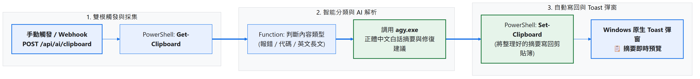
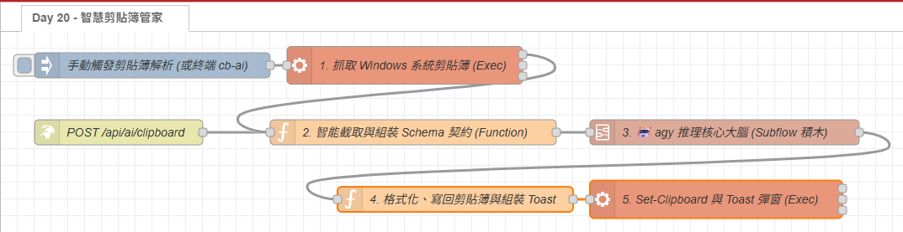

# Day 20：AI 實戰 7：智慧剪貼簿管家（複製代碼或報錯自動翻譯與解析）

> 在日常開發與維運過程中，遇到長篇英文日誌、看不懂的 Stack Trace 或生澀的技術文件時，標準的動作是：
>
> 1. 按 `Ctrl + c` 複製文字。
> 2. 打開瀏覽器切換到 Google 翻譯或 ChatGPT 網頁。
> 3. 按 `Ctrl + v` 貼上，等待回覆。
> 4. 再切回 IDE 或終端機。
>
> 這個過程雖然不難，但仍會打斷開發時的節奏。
> 今天我們結合 Day 14 的 **`🤖 agy 推理核心大腦`** Subflow，讓選取的文字可以透過快捷鍵讓 AI 進行分析。分析結果會寫回剪貼簿，並以 Toast 通知處理完成，之後可以直接按 `Ctrl + v` 貼到目前的工作視窗。

---

本文同步發布於 GitHub： [2026-18th-it-ironman](https://github.com/BingFengHung/2026-18th-it-ironman/blob/main/Day20_智慧剪貼簿管家_複製代碼或報錯自動翻譯與解析.md)

## 傳統手動翻譯 vs 智慧剪貼簿管家

| 比較項目           | ❌ 傳統手動切瀏覽器                              | ✅ AI 智慧剪貼簿管家                                  |
| :----------------- | :----------------------------------------------- | :---------------------------------------------------- |
| **操作步驟** | 複製 ➔ 切換視窗 ➔ 貼上 ➔ 等待 ➔ 複製 ➔ 切回 | **複製 ➔ 快捷觸發 ➔ 貼出分析結果**            |
| **視窗切換** | 需要在瀏覽器與工作視窗之間來回切換               | **不需要切換視窗**                              |
| **內容識別** | 通用翻譯軟體不會針對代碼提供排查建議             | **依內容類型產生摘要與排查建議**                |
| **結果輸出** | 留在網頁上                                       | **自動覆蓋寫入系統剪貼簿 + Windows Toast 預覽** |

---

## 系統工作流架構



* **【取得與截取剪貼簿內容】**：PowerShell `Get-Clipboard` 取得系統剪貼簿文字，只取前 800 字元送入分析，並用 JSON Schema 約束回傳欄位。
* **【交給 AI Subflow 處理】**：沿用 Day 14 封裝的 `🤖 agy 推理核心大腦` Subflow。引號跳脫、CLI 呼叫與結構化結果解析都集中在 Subflow 內處理。
* **【寫回分析結果】**：AI 結果透過 PowerShell `Set-Clipboard` 寫回系統剪貼簿，同時顯示 WinRT Toast。完成後可以按 `Ctrl + V` 貼出摘要與建議。

---

## 實戰動手做：打造剪貼簿智慧中樞

這個 Flow 可以拆成四個主要步驟：

```
[快捷觸發 (Inject / HTTP)] 
       ↓
【步驟 1：抓取 Windows 剪貼簿 (Exec)】 ➔ PowerShell Get-Clipboard
       ↓
【步驟 2：截取脫水與組裝契約 (Function)】 ➔ 截取前 800 字元 + Schema 強制約束
       ↓
【步驟 3：調用專屬 AI 積木 (Subflow)】 ➔ 🤖 agy 推理核心大腦（自體完成跳脫與解包）
       ↓
【步驟 4：格式化並寫回剪貼簿 (Function ➔ Exec)】 ➔ Set-Clipboard + 原生 Toast
```

---

### 快捷觸發設定：`Ctrl + Alt + c` 全域熱鍵

如果希望從目前的應用程式直接觸發 Flow，可以使用 **AutoHotkey 全域熱鍵**。安裝 [AutoHotkey v2](https://www.autohotkey.com/) 後建立一個 `.ahk` 腳本：

```autohotkey
; cb-ai.ahk — 選取文字後直接按 Ctrl+Alt+C
; 複製選取內容後，呼叫 Node-RED 的 HTTP endpoint
^!c:: {
    Send "^c"      ; 模擬 Ctrl+C，把選取文字複製到剪貼簿
    Sleep 300      ; 等 300ms 確保剪貼簿已更新
    Run 'powershell -NoProfile -WindowStyle Hidden -Command "Invoke-RestMethod -Uri http://127.0.0.1:1880/api/ai/clipboard -Method POST"',, "Hide"
}
```

將此檔案放在「**啟動資料夾**」（在執行對話框輸入 `shell:startup`）中，讓 Windows 開機時自動載入。之後的使用流程如下：

1. 按下 `Ctrl + Alt + c`，自動複製選取內容並送出 AI 請求
2. Toast 從右下角彈出後，按 `Ctrl + v` 貼出分析結果

> **操作步驟比較**
>
> | 方法                         | 動作步驟                                                 | 視窗切換                  |
> | ---------------------------- | -------------------------------------------------------- | ------------------------- |
> | 傳統切 ChatGPT / Google 翻譯 | 選取 → Ctrl+c → 切視窗 → 貼上 → 等待 → 複製 → 切回 | **2 次**            |
> | **本版 AHK 單鍵** ✅   | 選取 →`Ctrl+Alt+c` → `Ctrl+v`                      | **0 次，只需 2 步** |

---

### 步驟 1：抓取 Windows 系統剪貼簿內容（Exec 節點）

拉出一個 **`exec`** 節點，執行 PowerShell 內建指令抓取剪貼簿字串：

* **Command**：`powershell -NoProfile -Command "Get-Clipboard"`
* **附加 msg.payload**：**不要打勾（false）**。

> **💡 原理解析**：
> 透過 PowerShell 原生 `Get-Clipboard` cmdlet，可精確取得剪貼簿中的純文字、代碼或多行日誌，相容性極高且無需安裝額外的本機全域依賴。

---

### 步驟 2：內容長度截取與 Prompt 組裝（Function 節點）

在 Function 節點中，先限制輸入長度，再定義回傳資料需要包含的欄位：

```javascript
// 🔑 核心一：空內容防呆（避免觸發無意義的 AI 呼叫）
const text = (msg.payload || '').toString().trim();
if (!text || text.length < 5) { node.warn('剪貼簿為空，跳過'); return null; }

// 🔑 核心二：截取前 800 字元「脫水」— 精準鎖定報錯核心，大幅縮短推理延遲
const cleanText = text.substring(0, 800);

// 🔑 核心三：固定回傳欄位，讓後續節點可以穩定讀取分析結果
msg.schema = {
  type: 'object',
  required: ['content_type', 'summary_zh', 'action_suggestion'],
  properties: {
    content_type: { type: 'string' },   // 'ERROR_LOG' | 'CODE_SNIPPET' | 'ENGLISH_TEXT' | 'GENERAL'
    summary_zh:   { type: 'string' },   // 白話中文摘要
    action_suggestion: { type: 'string' } // 建議排查動作
  }
};
msg.prompt = `你是智慧剪貼簿管家，請分析下列文字並回傳 JSON：\n"""\n${cleanText}\n"""`;
return msg;
```

> **🔑 重點說明：限制輸入長度**
> 剪貼簿有時會包含數千行日誌。限制為前 800 字元可以降低請求量與處理時間，但也可能截掉後段的重要資訊。如果實際使用的錯誤訊息通常位於內容後方，就需要改用保留開頭與結尾，或提高字數上限。

---

### 步驟 3：調用專屬 AI 樂高積木（`🤖 agy 推理核心大腦` Subflow）

從左側「**AI 模組**」拖入 Day 14 封裝完成的 **`🤖 agy 推理核心大腦`**，接在步驟 2 後方即可。Subflow 內部已自體完成引號跳脫、CLI 呼叫與結構化雙軌解包（詳見 [Day 14](https://github.com/BingFengHung/2026-18th-it-ironman/blob/main/Day14_打造專屬Subflow樂高積木_封裝agy推理核心節點.md)），輸出端直接傳出含有 `content_type`、`summary_zh`、`action_suggestion` 的純淨物件。

> **💡 重複使用 Subflow**：其他 Flow 只要傳入 `msg.prompt`，也可以選擇傳入 `msg.schema`。這樣可以沿用 Day 14 的跳脫與結果解析邏輯，避免每個案例都重新實作一次。

---

### 步驟 4：格式化並寫回系統剪貼簿（Function ➔ Exec 節點）

在 Function 節點中組裝乾淨的中文文字，透過 PowerShell `Set-Clipboard` 寫回本機剪貼簿並彈出 Toast：

```javascript
// 🔑 核心一：組裝格式化輸出（寫回剪貼簿的內容）
const formattedOutput = `【AI 剪貼簿解析】\n📌 摘要: ${data.summary_zh}\n💡 建議: ${data.action_suggestion}`;

// 🔑 核心二：單引號跳脫（防止 PowerShell 命令被截斷）
const escapedText = formattedOutput.replace(/'/g, "''");

// 🔑 核心三：Toast 換行必須用 PowerShell `n，不能用 JS \n
const toastMsg = data.summary_zh;
msg.payload = `powershell -NoProfile -Command "Set-Clipboard -Value '${escapedText}'; ` +
  `[Windows.UI.Notifications.ToastNotificationManager, Windows.UI.Notifications, ContentType = WindowsRuntime] > $null; ` +
  `$template = [Windows.UI.Notifications.ToastNotificationManager]::GetTemplateContent([Windows.UI.Notifications.ToastTemplateType]::ToastText02); ` +
  `$textNodes = $template.GetElementsByTagName('text'); ` +
  `$textNodes.Item(0).AppendChild($template.CreateTextNode('📋 AI 剪貼簿: ${data.content_type}')) > $null; ` +
  `$textNodes.Item(1).AppendChild($template.CreateTextNode('${toastMsg}')) > $null; ` +
  `[Windows.UI.Notifications.ToastNotificationManager]::CreateToastNotifier('AI 剪貼簿管家').Show([Windows.UI.Notifications.ToastNotification]::new($template));"`;
return msg;
```

> **🔑 重點說明：回寫剪貼簿**
> PowerShell 執行完成後，系統會顯示 Toast 通知。此時按下 `Ctrl + V`，就能貼出整理後的摘要與排查建議。由於這個流程會覆蓋原本的剪貼簿內容，若原文還需要保留，應先另行儲存，或改成使用獨立的結果欄位。

---

## 執行結果範例

當你複製了一段報錯：
`npm ERR! code ENOENT syscall open path package.json`

執行後，Windows 右下角會彈出 Toast，剪貼簿內容則會被替換為類似以下的結果：

```text
【AI 剪貼簿解析】
📌 摘要: 找不到 package.json 檔案，導致 npm 命令無法定位專案設定。
💡 建議: 請確認當前終端機路徑是否位於包含 package.json 的專案根目錄下。
```

按下 `Ctrl + v` 後，就能把解析結果貼給同事或貼入筆記。

---

## 完整 Flow 程式

在 Node-RED 點擊「右上角選單」➔「匯入」即可一鍵部署：

本案例 flow



**💡 測試 / 除錯用途**：Flow 中的 `inject` 節點（Node-RED 畫布上那顆按鈕）僅供開發時在畫布上手動觸發驗證，`http in` 節點才是正式供 AutoHotkey 呼叫的入口。兩者並列是「開發除錯」與「日常使用」的雙軌設計。

### 本範例 flow 位置：👉 [下載](https://github.com/BingFengHung/2026-18th-it-ironman/blob/main/flows/flow_day20_smart_clipboard.json)

### 本範例 ahk 腳本位置：👉 [下載](https://github.com/BingFengHung/2026-18th-it-ironman/blob/main/flows/flow_day20_smart_clipboard.ahk)

---

## 今日總結與明日預告

今天我們用 Node-RED 串接 Windows 剪貼簿與 Day 14 的 AI Subflow，完成一個可以從快捷鍵觸發的文字分析流程。選取內容後，AutoHotkey 會呼叫 Node-RED，AI 分析結果再由 PowerShell 寫回剪貼簿，方便貼到目前的工作視窗中。

* **明天（Day 21）**：我們將處理多個 AI 任務同時執行時的資源問題——**Semaphore 號誌機制：限制 AI 並行數，避免 CPU 與記憶體被佔滿**！
