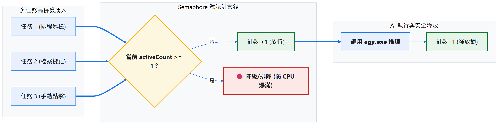
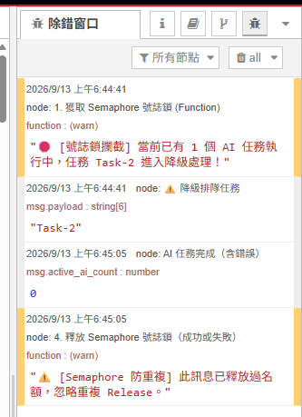
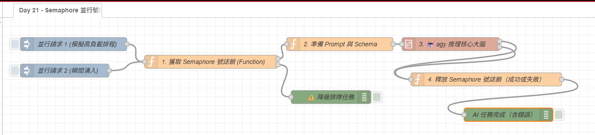

# Day 21｜系統調優：Semaphore 號誌機制（限制 AI 並行任務數）

> 當檔案分類、日誌分析與監控等流程都在背景執行時，同一時間可能會有多個事件觸發 AI 分析。若每個事件都直接啟動 `agy.exe`，CPU 與記憶體使用量可能在短時間內升高，也會影響其他自動化任務。
> 這篇會在 Node-RED 中加入 **Semaphore（號誌）** 機制，限制同時執行的 AI 任務數。當 `Concurrency` 設為 1 時，同一時間只放行一個任務，其餘請求則送到降級處理路徑。

---

## 為什麼需要 Semaphore 並行控制？

| 比較項目                   | ❌ 無並行限制                    | ✅ 使用 Semaphore 號誌機制                 |
| :------------------------- | :------------------------------- | :----------------------------------------- |
| **多任務同時觸發**   | 同時啟動 5~10 個`agy.exe`      | **依設定限制同時推理的任務數**       |
| **CPU / 記憶體負載** | 可能在短時間內升高，影響其他工作 | **同時執行數量固定，較容易控制負載** |
| **衝突防護**         | 多個任務可能同時使用相同資源     | **超過上限的請求送到降級處理路徑**   |
| **超載應對**         | 需要由各個流程自行處理           | **可以記錄、丟棄或另外實作排隊機制** |

---

### Semaphore 在保護什麼？

可以把 Semaphore 想成 AI 推理區入口的「車位管理員」：`MAX_CONCURRENCY` 是停車位總數，`active_ai_count` 是目前已經使用的車位數。任務開始前先取得名額，完成或失敗後歸還名額。

這裡使用的是「計數型」Semaphore，而不是單純的 `true / false` 開關：

| 設定值                  | 行為                                   |
| :---------------------- | :------------------------------------- |
| `MAX_CONCURRENCY = 1` | 嚴格序列化，一次只允許一個 AI 任務     |
| `MAX_CONCURRENCY = 2` | 同時允許兩個 AI 任務，其餘進入降級路徑 |
| `MAX_CONCURRENCY = 0` | 所有任務都會被攔截，不適合作為正常設定 |

本篇先使用 `1` 來清楚展示鎖的取得與釋放。實際數值應依 CPU 核心數、可用記憶體與 AI 平均執行時間調整，不是越高越好。

---

## 號誌機制架構設計



整個流程可以拆成三個階段：

1. **Acquire**：檢查目前名額。還有空位就把 `active_ai_count` 加一，沒有空位則送往降級處理。
2. **AI 任務**：只有成功取得名額的訊息，才會進入 Prompt、AI Subflow 與  `agy.exe`。
3. **Release**：不論 AI 成功、回傳錯誤或非零結束狀態，都必須把計數器減回去。

這個順序很重要。若在 AI 執行前就釋放名額，Semaphore 就失去意義；若只在成功路徑釋放，任何一次錯誤都可能留下「幽靈鎖」，讓後續任務一直被攔截。

---

## 實戰動手做：加入 Semaphore 號誌機制

### 步驟 1：獲取號誌鎖（Acquire Lock - Function 節點）

在呼叫 `agy.exe` 之前，先檢查目前執行中的計數器（`active_ai_count`）：

```javascript
// Function 節點：獲取 Semaphore 號誌鎖
const MAX_CONCURRENCY = 1; // 嚴格限制最多 1 個 AI 任務同時運行
let activeCount = flow.get('active_ai_count') || 0;

if (activeCount >= MAX_CONCURRENCY) {
    node.warn(`🛑 [號誌機制攔截] 目前已有 ${activeCount} 個 AI 任務執行中，略過任務 ${msg.payload}，交由降級路徑處理。`);
    msg.status = 'THROTTLED';
    return [null, msg]; // 第 2 路：降級處理
}

// 成功取得名額，計數 +1，並建立本次任務的一次性 token
activeCount++;
const token = `sem_${Date.now()}_${Math.random().toString(36).slice(2, 8)}`;
const activeTokens = flow.get('active_ai_tokens') || {};
activeTokens[token] = true;
flow.set('active_ai_count', activeCount);
flow.set('active_ai_tokens', activeTokens);
msg.semaphore_token = token;
node.status({ fill: 'green', shape: 'dot', text: `執行中 (${activeCount}/${MAX_CONCURRENCY})` });

msg.status = 'ACQUIRED';
return [msg, null]; // 第 1 路：放行進入 AI 推理
```

#### 這段程式的三個關鍵點

- `flow.get()` 與 `flow.set()` 讓同一個 Flow 分頁內的不同事件共享計數器。
- 只有成功取得名額後才遞增，避免被攔截的任務誤占用資源。
- Function 節點透過兩個輸出端分流：第 1 路進入 AI，第 2 路直接降級。

這個範例依賴 Node-RED Function 節點逐一處理訊息的特性，因此同一時間抵達的訊息仍會依序執行這段檢查；真正耗時的工作則發生在取得名額之後的 AI 推理階段。

---

### 步驟 2：準備任務並進入 AI Subflow

取得號誌名額後，Function 節點只準備本次任務的 Prompt 與輸出契約，接著將訊息送進前面建立的 **`🤖 agy 推理核心大腦`**：

```javascript
msg.prompt = `請簡要說明為什麼本機自動化需要控制 AI 並行數（任務：${msg.payload}）`;
msg.schema = {
  type: 'object',
  properties: {
    explanation: { type: 'string', description: '並行控制的白話說明' }
  },
  required: ['explanation']
};
return msg;
```

這裡的重點不是 Prompt 本身，而是**只有通過 Acquire 的訊息才能走到這個節點**。AI 任務完成後，成功輸出與錯誤輸出都會進入下一步釋放號誌鎖。

### 超過上限時會發生什麼？

當 `active_ai_count` 已經等於 `MAX_CONCURRENCY`，本範例會設定：

```javascript
msg.status = 'THROTTLED';
return [null, msg];
```

這代表本 Flow 採用的是**即時降級**：任務會被送到第二條 Debug 路徑，但不會自動等待，也不會稍後重試。

因此要把兩種行為區分清楚：

- **降級**：記錄、通知或直接丟棄本次任務；本次示範的是這個方式。
- **排隊**：儲存任務，等名額釋放後再重新執行；需要另外加入佇列、重試次數、退避時間與逾時清理。

---

### 步驟 3：釋放並行名額（Release Lock - Function 節點）

當共用 Subflow 成功完成、發生錯誤或回傳非零結束狀態時，都要讓訊息進入這個 Function，確保計數器減 1：

```javascript
// Function 節點：釋放 Semaphore 號誌鎖
let activeCount = flow.get('active_ai_count') || 1;
const token = msg.semaphore_token;
const activeTokens = flow.get('active_ai_tokens') || {};

// 同一任務若因多個輸出路徑重複抵達，只允許第一次 Release
if (!token || !activeTokens[token]) {
    node.warn('⚠️ [Semaphore 防重複] 此訊息已釋放過名額，忽略重複 Release。');
    return null;
}

delete activeTokens[token];
activeCount = Math.max(0, activeCount - 1);
flow.set('active_ai_count', activeCount);
flow.set('active_ai_tokens', activeTokens);
msg.active_ai_count = activeCount;

node.status({ fill: 'blue', shape: 'ring', text: `已釋放鎖 (剩餘 ${activeCount})` });
return msg;
```

成功輸出、錯誤輸出與非零結束狀態都要導向釋放名額的流程。由於 `exec` 可能產生分段輸出或多個結果訊息，Release 端另外使用一次性 token，確保同一任務最多只會歸還一次名額。

---

## 實際測試：驗證並行限制是否生效

匯入 Flow 後，可以依照以下順序測試：

1. 先點擊「並行請求 1」，讓第一個任務取得名額並進入 AI 推理。
2. 在第一個任務尚未完成前，立刻點擊「並行請求 2」。
3. 查看 Debug：第一個任務應走 AI 任務路徑，第二個任務應出現 `THROTTLED` 並進入降級節點。
4. 等第一個任務完成，查看「釋放 Semaphore 號誌鎖」節點，應顯示剩餘 `0`；Debug 也應輸出 `active_ai_count = 0`。
5. 再次點擊「並行請求 2」，確認名額已歸還後，第二個任務可以正常進入 AI 路徑。



### 預期結果

| 測試事件             | 預期結果                                        |
| :------------------- | :---------------------------------------------- |
| 第一個任務進入推理   | `active_ai_count` 從 `0` 變成 `1`         |
| 第二個任務同時抵達   | 被標記為`THROTTLED`，不啟動第二個 `agy.exe` |
| 第一個任務成功或失敗 | 都會進入 Release，計數回到`0`                 |
| 名額歸還後的新任務   | 可以重新取得鎖並執行                            |

注意：Acquire 節點上的 `執行中 (1/1)` 是取得名額當下留下的節點狀態，不會在另一個 Release 節點完成後自動改成 `0/1`。因此要以 Release 節點的「剩餘數量」與 Debug 輸出的 `active_ai_count` 為準。

如果第二個任務一直被攔截，且 Release 節點沒有顯示剩餘 `0`，才表示第一個任務可能沒有走過 Release；通常代表某條錯誤或結束路徑沒有接回釋放節點。

---

## 常見陷阱與安全邊界

### 1. 不要只接成功輸出，也不要把成功結束碼當成錯誤

AI 程式可能回傳錯誤訊息或非零結束碼。這些路徑若沒有釋放鎖，下一個任務會被誤判為超載。因此本 Flow 將成功輸出與真正的失敗路徑都接到 Release。

Node-RED `exec` 節點的第 3 個輸出會回傳結束碼，即使成功也會回傳 `0`；在這個節點中通常要讀取 `msg.rc.code`。此外，Release 端的 token 防重複邏輯會攔截同一任務後續重複抵達的訊息。

### 2. Semaphore 不是佇列

Semaphore 只回答「現在能不能進入」，不負責保存被拒絕的任務。若任務不能遺失，就要增加佇列資料結構、重試次數、退避時間與逾時清理；否則降級路徑只能記錄或通知使用者。

### 3. 不要把並行數設得過大

提高 `MAX_CONCURRENCY` 不代表整體吞吐量一定變好。當每個 AI 任務都需要大量 CPU 或記憶體時，過高的並行數反而會增加資源競爭，讓每個任務都變慢。建議先從 `1` 開始，觀察實際負載後再逐步調高。

### 4. Node-RED 重啟後的計數器

本範例使用記憶體型 Flow Context。若 Node-RED 在 AI 任務執行期間重啟，計數器會回到初始狀態；這對示範與單機流程很直觀，但不代表能追蹤重啟前仍存在的外部程序。

若改用檔案或資料庫保存計數，則還要設計任務逾時租約，避免中斷的任務永久占住名額。這是正式環境需要額外處理的生命週期問題。

---

## 完整 Flow

在 Node-RED 點擊「右上角選單」➔「匯入」即可一鍵部署：

本案例 flow



### 本範例 Flow 位置：👉 [下載](https://github.com/BingFengHung/2026-18th-it-ironman/blob/main/flows/flow_day21_semaphore_lock.json)

---

## 今日總結與明日預告

透過 Semaphore 號誌機制，我們限制了本機 AI 同時執行的任務數，讓 CPU 與記憶體的使用量比較容易控制。這個範例的核心不是把任務硬塞進 AI，而是在資源不足時先擋下來，避免多個昂貴的推理程序同時啟動。

今天採用「超量即降級」策略，不會自動保存或重試被攔截的任務。若日後需要保證每一筆任務都完成，可以在這個 Semaphore 前方再加入佇列與退避重試機制。

* **明天（Day 22）**：如何讓重複的報錯根本不需要呼叫 AI？——**MD5 特徵快取：重複報錯 0ms 零延遲秒回**！
