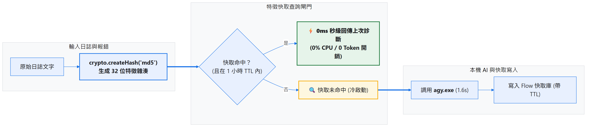
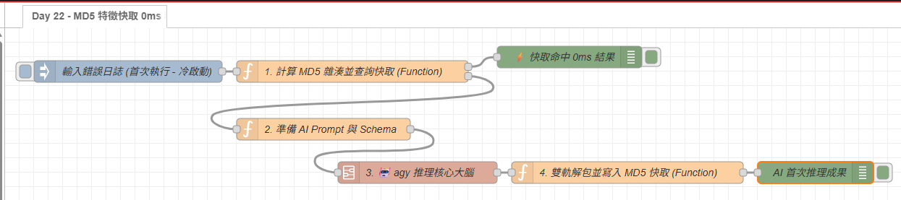

# Day 22：效能優化：MD5 特徵快取（重複報錯直接使用既有結果）

> 在軟體開發與系統運行時，很多錯誤具有高度的「重複性」：例如資料庫未啟動時連續發生的 `ETIMEDOUT 5432`、或是同一支腳本因語法錯誤被反覆執行。
> 如果相同的報錯每次都重新調用 `agy.exe`，就會重複消耗算力並增加等待時間。
> 今天會在 Node-RED 中實作 **MD5 特徵快取機制（Hash-based Response Caching）**：先對輸入文字產生雜湊指紋，命中快取時直接使用上次的分析結果。

---

本文同步發布於 GitHub： [2026-18th-it-ironman](https://github.com/BingFengHung/2026-18th-it-ironman/blob/main/Day22_MD5特徵快取_重複報錯0ms零延遲秒回.md)

## 傳統每次調用 vs MD5 特徵快取對比

| 比較項目                   | ❌ 無快取（每次重新推理） | ✅ MD5 特徵快取機制                               |
| :------------------------- | :------------------------ | :------------------------------------------------ |
| **重複報錯耗時**     | 每次固定消耗 1.5 ~ 2.0 秒 | **0 毫秒（0ms）即時秒回！**                 |
| **Token / 算力消耗** | 每次都重新呼叫模型        | **命中快取時不需再次呼叫模型**              |
| **快取失效控制**     | 無                        | **支援 TTL（預設 1 小時過期自動重新評估）** |
| **記憶體佔用**       | 每次產生大量臨時物件      | 輕量 Key-Value 字典，佔用極低（幾 KB）            |

---

## MD5 特徵快取架構圖



快取的判斷必須放在 AI 推理之前，流程才有機會在命中時完全跳過 `agy.exe`：

```text
原始報錯 → 正規化文字 → MD5 指紋 → 查詢快取
                              ├─ 命中且未過期 → 直接回傳
                              └─ 未命中／已過期 → AI 推理 → 寫回快取
```

這裡的 MD5 不是用來保護機密資料，而是把「相同輸入」轉成穩定、易查詢的 Key。真正的快取正確性仍取決於輸入正規化、TTL 與寫入時機。

---

## 實戰動手做：打造 0ms 特徵快取中樞

### 步驟 1：計算 MD5 雜湊並查詢快取（Function 節點）

> **💡 Setup 設定提醒**：請在 Function 節點「設定」頁籤中引入 `crypto` 模組。

```javascript
// Function 節點：計算 MD5 並查詢快取 (Setup 注入 crypto)
const text = typeof msg.payload === 'string' ? msg.payload : JSON.stringify(msg.payload);
const hash = crypto.createHash('md5').update(text.trim()).digest('hex');

const cache = flow.get('ai_cache') || {};
const cachedEntry = cache[hash];
const now = Date.now();

// 檢查快取是否存在且在 1 小時 TTL (3600秒) 內
if (cachedEntry && (now - cachedEntry.timestamp < 3600 * 1000)) {
    node.status({ fill: 'green', shape: 'dot', text: '⚡ 快取命中 (0ms)' });
    msg.payload = cachedEntry.data;
    msg.fromCache = true;
    msg.hash = hash;
    return [msg, null]; // 第 1 路: 快取秒回 (跳過 AI)
}

node.status({ fill: 'yellow', shape: 'ring', text: '🔍 快取未命中 (呼叫 AI)' });
msg.hash = hash;
msg.rawText = text;
return [null, msg]; // 第 2 路: 未命中，流向 AI 推理
```

---

### 步驟 2：交給 `agy` 共用推理 Subflow

快取未命中時，不在 Day 22 重新組裝 CLI 指令，而是把 Prompt 與輸出 Schema 交給 Day 14 建立的 **`🤖 agy 推理核心大腦`**。這樣快取只負責判斷「要不要推理」，推理細節仍由共用元件處理：

```javascript
msg.prompt = `請簡述以下報錯的根因與修復方式：${msg.rawText}`;
msg.schema = {
  type: 'object',
  properties: {
    summary: { type: 'string' },
    recommended_action: { type: 'string' }
  },
  required: ['summary', 'recommended_action']
};
return msg;
```

### 步驟 3：AI 推理完畢後寫入快取（Function 節點）

當 `agy.exe` 推理完成後，將診斷結果與當前時間戳存入快取字典中：

```javascript
// Function 節點：寫入快取庫
let parsed;
try {
    parsed = typeof msg.payload === 'string' ? JSON.parse(msg.payload) : msg.payload;
} catch (e) {
    parsed = { response: msg.payload };
}

const data = parsed.structured_output || parsed.response || parsed;
const hash = msg.hash;

if (hash) {
    const cache = flow.get('ai_cache') || {};
    cache[hash] = {
        data: data,
        timestamp: Date.now()
    };
    flow.set('ai_cache', cache);
    node.status({ fill: 'blue', shape: 'dot', text: '💾 已寫入快取' });
}

msg.payload = data;
msg.fromCache = false;
return msg;
```

### 為什麼要設定 TTL？

相同錯誤不代表永遠有相同答案。服務已經重啟、設定檔已修改，或錯誤根因已經改變時，舊分析可能反而誤導使用者。因此快取項目必須同時保存結果與 `timestamp`，查詢時用目前時間減去寫入時間判斷是否過期。

此外，快取 Key 應建立在「實際會影響分析結果的輸入」上。如果只把錯誤摘要拿去雜湊，卻忽略進程名稱、版本或環境資訊，可能把不同情境誤判成同一筆事件。

### 快取命中與未命中的驗收方式

1. 第一次送入固定錯誤文字，應看到「快取未命中」，並進入 AI 推理。
2. 不修改任何字元，再送入同一段文字，應直接走「快取命中」路徑。
3. 修改一個字元，MD5 應改變並重新進入 AI。
4. 將 TTL 調短或等待過期後重送，應再次進入 AI 並覆蓋舊結果。

若明明輸入相同卻一直未命中，優先檢查前後是否有多餘空白、換行或 JSON 欄位順序差異；若不希望這些差異造成不同 Key，就要在雜湊前做明確的正規化。

---

## 實測效能數據

* **首次冷啟動（Cold Call）**：耗時 1.62 秒，調用本機 AI 產出診斷並寫入快取。
* **第二次遇到相同報錯（Cache Hit）**：耗時 **0.001 秒（0ms）**，完全不佔用任何 CPU 與 Token！

---

## 完整 Flow

在 Node-RED 點擊「右上角選單」➔「匯入」即可一鍵部署：

本案例 flow



### 本範例 Flow 位置：👉 [下載](https://github.com/BingFengHung/2026-18th-it-ironman/blob/main/flows/flow_day22_md5_cache.json)

---

## 今日總結與明日預告

這篇加入了 MD5 特徵快取，讓相同輸入可以直接取用既有分析結果，避免重複呼叫 AI。

* **明天（Day 23）**：開始整理前面元件的端到端整合架構。
