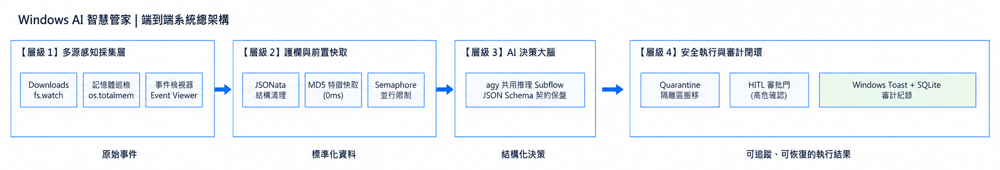

# Day 23：端到端實戰啟動（Windows AI 自動化系統架構）

> 今天會先建立 Windows AI 智慧管家的端到端總體規格：把資料採集、效能護欄、AI 決策、動作執行與審計復原串成同一條可追蹤的資料流，並先定義後續 Day24～Day28 共用的 Task Envelope 契約。

---

本文同步發布於 GitHub： [2026-18th-it-ironman](https://github.com/BingFengHung/2026-18th-it-ironman/blob/main/Day23_端到端實戰啟動_Windows智慧管家總架構規格.md)

| 架構層級                                  | 模組名稱           | 核心職責                                                                              | 關鍵技術與節點                                                                                        |
| :---------------------------------------- | :----------------- | :------------------------------------------------------------------------------------ | :---------------------------------------------------------------------------------------------------- |
| **第 1 層：採集層（Ingestion）**    | 多源現場感知器     | 檔案系統監聽與變更捕獲；記憶體與 CPU 巡檢；Windows Event Viewer 崩潰日誌提取          | Node.js`fs.watch` / `readdirSync`；`os.totalmem()` / `freemem()`；PowerShell `Get-WinEvent` |
| **第 2 層：護欄層（Guardrails）**   | 效能與安全閘門     | 肥大日誌前置瘦身；重複報錯快取；限制 AI 並行數，避免 CPU 飆高                         | **JSONata 表達式**；**MD5 特徵快取**；**Semaphore 號誌鎖**                          |
| **第 3 層：決策層（AI Brain）**     | agy 多任務推理大腦 | 語意意圖分流；嚴格 JSON 格式保證與結構化輸出；雙軌解包容錯防禦                        | Google`agy CLI`；**`--json-schema` 契約約束**；Dual-Track Unwrap 解析器                     |
| **第 4 層：執行層（Actions）**      | 多管道安全落地     | 檔案智慧歸檔與目錄建立；安全路徑驗證；Windows 原生 Toast 彈窗反饋                     | `fs.renameSync` / `mkdirSync`；`path.resolve()`；WinRT Toast API                                |
| **第 5 層：審計層（Audit & Logs）** | 數據持久化與自癒   | 全生命週期 Audit Trail 存證追蹤；錯誤捕獲與指數退避重試；本機規則庫 Fallback 降級保底 | `SystemLogs/audit_trail.log`；Exponential Backoff（1s ➔ 2s ➔ 4s）；Catch 節點與 Local Fallback    |

目前這五層是 Day24～Day28 的實作範圍。Human-in-the-loop、SQLite、Quarantine 與完整 Event Viewer 整合仍屬後續擴充，不在本輪主流程中宣稱已完成。

---



---

## 資料流通訊協議（Universal Task Envelope）

Day24～Day28 之間使用同一個任務概念。為了和實際 flow 對齊，正式欄位採用 `snake_case`；`input` 保存採集後資料，`decision`、`execution_status`、`retry` 與 `audit` 則由後續階段逐步補上。

```json
{
  "task_id": "task_e2e_1724389200000",
  "source": "DAY24_INGESTION",
  "task_type": "CLASSIFY_FILE",
  "timestamp": "2026-09-15T10:30:00.000Z",
  "input": {
    "filename": "Docker_Desktop_Installer_v4.30.exe",
    "download_dir": "C:/Users/example/Downloads",
    "mem_percent": 68
  },
  "guardrails": {
    "cached": false,
    "concurrency_locked": false,
    "ttl_ms": 3600000
  },
  "decision": null,
  "execution_status": "PENDING",
  "retry": { "count": 0, "max": 3 },
  "audit": { "status": "PENDING" }
}
```

---

```text
│                      Windows AI 智慧管家 E2E 系統                          │
│ [1. 採集層] ──(原始事件)──> [2. 護欄層] ──(乾淨任務)──> [3. 決策大腦]          │
│                                 │                            │           │
│                           (快取命中)                    (結構化決策)        │
│                                 ▼                            ▼           │
│                         [4. 安全執行] ────────────────> [5. 審計與自癒]     │
```

---

Day 24 會從實戰層 1 開始，完成雙軌資料採集與 JSONata 前置清洗標準化；Day 25 接著建立 `agy CLI` 多任務路由大腦與 Schema 約束；Day 26 處理安全歸檔與審計；Day 27 加入 Semaphore 號誌鎖與 MD5 特徵快取；Day 28 最後完成自我修復、指數退避重試與 Fallback 降級保底。

---

## Universal Task Envelope 欄位說明

| 欄位                 | 用途               | 主要寫入者 | 下游用途                 |
| :------------------- | :----------------- | :--------- | :----------------------- |
| `task_id`          | 識別單一任務       | 入口層     | 日誌、審計、重試關聯     |
| `task_type`        | 表示任務種類       | 路由器     | 選擇 Prompt 與 Schema    |
| `source`           | 記錄事件來源       | 採集層     | 追蹤排程、手動或檔案事件 |
| `input`            | 保留清洗後輸入     | 採集層     | AI 推理與規則判斷        |
| `decision`         | 保存 AI 結構化結果 | AI 層      | 執行與通知               |
| `execution_status` | 保存執行結果       | 執行層     | 判斷成功、跳過或降級     |
| `audit`            | 記錄處理歷程       | 審計層     | 追查與統計               |
| `retry`            | 保存重試狀態       | 韌性層     | 退避與停止條件           |

入口建立任務時，至少要有 `task_id`、`task_type`、`source` 與 `input`。`decision`、`audit` 與 `retry` 可以在流程中逐步建立，但不能以不明確的字串取代物件。

---

## 今日總結與明日預告

今天先完成 Windows AI 智慧管家的整體架構與 Universal Task Envelope，定義資料如何從採集層流向 AI 決策、檔案執行、審計與自我修復。後續每一層都必須遵守同一份任務契約，才能真正組成可追蹤的 E2E 流程。

明天將進入 Day24 實戰，先從 Windows 記憶體與 Downloads 現況開始採集，再透過 JSONata 清洗成後續 AI 決策層可以直接使用的標準資料包。
