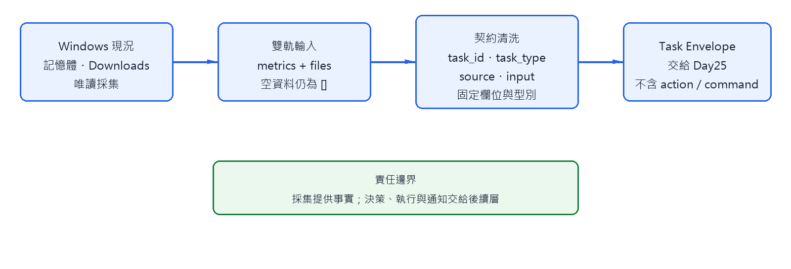
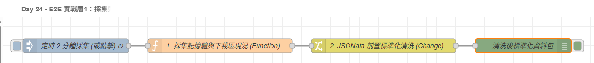

# Day 24：E2E 實戰層 1：採集層的資料契約

> 前面幾天已經示範過檔案掃描、系統負載採集與 JSONata。今天不再重教這些零件，而是把它們組成 E2E 流程的第一個穩定邊界：採集層只提供事實，並輸出後續層可以依賴的 Task Envelope。

本文同步發布於 GitHub：[2026-18th-it-ironman](https://github.com/BingFengHung/2026-18th-it-ironman/blob/main/Day24_實戰層1_雙軌資料採集與前置清洗.md)

## 採集層在整體流程中的位置



```text
Windows 現況 → 採集 → 契約清洗 → 決策 → 執行
```

今天的重點不是「怎麼讀記憶體」或「怎麼列出 Downloads」。這一層真正要解決的是：不同來源如何放進同一筆任務、空資料如何表示，以及下游如何知道資料是否完整。

## Task Envelope：後續層共同依賴的介面

採集層輸出至少包含以下欄位：

| 欄位                   | 責任                        | 注意事項                     |
| ---------------------- | --------------------------- | ---------------------------- |
| `task_id`            | 追蹤同一筆任務              | 每次採集都要唯一             |
| `task_type`          | 指示 Day25 選擇哪個決策契約 | 不可用模糊字串代替           |
| `source`             | 標示資料來源                | 方便日後查 Audit Trail       |
| `input.metrics`      | 當下環境資訊                | 只描述現況，不直接下處置決定 |
| `input.files`        | 檔案事件清單                | 沒有檔案時仍為`[]`         |
| `input.collected_at` | 採集時間                    | 使用 ISO 8601                |

採集層不應輸出 AI 的 `decision`、執行用的 `action` 或任意 PowerShell 指令。把這些責任留給後續層，才能讓採集流程可重複執行，也不會因為資料剛進來就觸發高風險動作。

## 雙軌資料如何合併

本篇 Flow 仍使用既有的 `os`、`fs` 與 `path` 取得記憶體和 Downloads，但結果不再散落於 `msg` 的臨時欄位，而是經由 Change 節點整理成固定結構：

```json
{
  "task_id": "task_...",
  "task_type": "CLASSIFY_FILE",
  "source": "DAY24_INGESTION",
  "input": {
    "collected_at": "2026-09-16T08:00:00.000Z",
    "metrics": { "mem_percent": 62, "is_heavy": false },
    "files": []
  }
}
```

這裡的 `is_heavy` 只是環境訊號，不是 AI 結論。`files` 使用空陣列而不是 `null`，讓 Day25 可以安全使用固定型別處理；若未來加入 CPU、磁碟或 Event Viewer，只需擴充 `metrics`，不必改變外層契約。

## 邊界條件與驗收

- Downloads 不存在：輸出空清單並保留錯誤狀態，不能讓整筆訊息消失。
- 檔案正在下載：標記 `stable: false`，不交給後續分類。
- 同時觸發兩筆任務：`task_id` 必須不同，不能共用可變的全域資料。
- 記憶體超過門檻：只標記 `is_heavy`，不在採集層呼叫 AI 或執行命令。

驗收時要檢查的不只是 Debug 有輸出，而是每一筆訊息都能被 Day25 直接接收，且 `files`、`metrics`、時間與來源欄位的型別穩定。

## 本篇 Flow

本案例 flow



### 本範例 Flow 位置：👉 [下載](https://github.com/BingFengHung/2026-18th-it-ironman/blob/main/flows/flow_day24_e2e_ingestion.json)

## 今日總結與明日預告

今天的產出是穩定的輸入契約，不是另一個檔案分類或記憶體監控。
明天會只依賴這份 Envelope，將任務交給正確的 Prompt 與 Schema。
