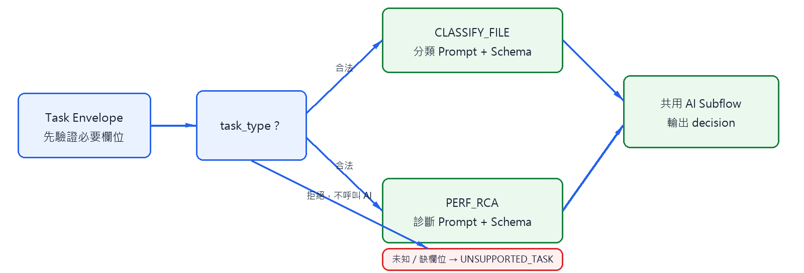
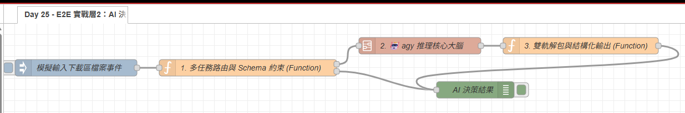

# Day 25：E2E 實戰層 2：任務路由與決策契約

> `agy CLI`、JSON Schema 與共用 Subflow 已在前面完成。今天的問題不是如何再呼叫一次 AI，而是如何讓同一個推理元件接收不同任務，並且不把分類結果誤當成系統診斷結果。

本文同步發布於 GitHub：[2026-18th-it-ironman](https://github.com/BingFengHung/2026-18th-it-ironman/blob/main/Day25_實戰層2_agyCLI卡頓診斷與檔案分類大腦.md)

## 決策層的責任



今天只做三件事：驗證任務、選擇決策契約、把結果交給 Day26。它不掃描檔案、不搬移檔案，也不執行 AI 回傳的指令。

| `task_type`     | 輸入位置                     | 決策輸出                                           |
| ----------------- | ---------------------------- | -------------------------------------------------- |
| `CLASSIFY_FILE` | `input.files`              | `category`、`reason`                           |
| `PERF_RCA`      | `input.metrics` 與事件資料 | `severity`、`root_cause`、`suggested_action` |
| 其他              | 任務 Envelope                | `UNSUPPORTED_TASK`，不呼叫 AI                    |

## 路由器的三道檢查

路由器先確認 `task_id`、`task_type` 與 `input` 存在，再用白名單判斷任務類型，最後才載入對應 Prompt 與 Schema。未知類型不能套用通用 Prompt，因為那會把輸入錯誤偽裝成正常 AI 結果。

```javascript
const task = msg.payload;
const route = routes[task.task_type];

if (!task.task_id || !task.input || !route) {
    msg.payload = {
        status: 'UNSUPPORTED_TASK',
        task_id: task.task_id || null,
        reason: '缺少必要欄位或不支援的 task_type'
    };
    return [null, msg];
}

msg.prompt = route.prompt(task);
msg.schema = route.schema;
msg.taskInfo = task; // 保全原始任務上下文
return [msg, null];
```

這段核心邏輯的價值是把「選擇任務」和「執行 AI」分開。Schema 只描述輸出形狀，Prompt 才描述判斷背景；兩者都完成後才進入 Day14 的共用推理 Subflow。

### 💡 原理解析：為什麼將任務路由與 Schema 約束分開？

- **動態契約映射（Dynamic Contract Mapping）**：每個任務類型（如 `CLASSIFY_FILE` 與 `PERF_RCA`）所需要的業務上下文與輸出結構截然不同。透過路由表將 Prompt 模板與 JSON Schema 綁定，能確保不同任務絕對不會被套用到錯誤的推理邊界。
- **嚴格 Schema 約束杜絕幻覺**：在 Schema 中定義 `enum: ['Installers', ...]`，可以在 AI 模型推理時進行硬性輸出格式約束，迫使 CLI 輸出合規的 JSON，大幅減輕後續執行層的解析負擔。
- **快速失敗（Fail-Fast）**：缺少 `task_id` 或未知類型在進入 AI 推理前直接由第二輸出退回 `UNSUPPORTED_TASK`，避免耗費昂貴的 AI 計算資源去處理無效請求。

---

## 雙軌解包容錯防禦（Dual-Track Unwrap）

呼叫 `agy CLI` 時，終端輸出可能受到模型版本或底層環境影響，有時回傳標準的 `{ structured_output: {...} }`，有時則包裝在 `{ response: "{...}" }` 的字串中。決策層必須具備雙軌解包能力，避免 JSON 解析拋出致命例外：

```javascript
let parsed;
try {
    parsed = typeof msg.payload === 'string' ? JSON.parse(msg.payload) : msg.payload;
} catch (e) {
    parsed = { response: msg.payload };
}

// 雙軌解包：優先取結構化輸出，次取 response 字串二次解析
let result = parsed.structured_output || parsed.response || parsed;
if (typeof result === 'string') {
    try { result = JSON.parse(result); } catch (e) {}
}

// 將決策回填至 Task Envelope，不可覆蓋原始輸入事實
msg.decision = result;
msg.payload = { ...(msg.taskInfo || {}), decision: result };
return msg;
```

### 🔑 重點說明：原始上下文保全

AI 的推理結果是「附加決策（Enrichment）」，絕不可直接用 `msg.payload = result` 覆蓋掉 Day 24 採集到的 `input` 與 `task_id`。保留完整的 Envelope 才能讓 Day 26 知道原始檔案的真正路徑，並讓 Day 28 在出錯時能夠回溯任務來源。

---

## 結果如何交接給 Day26

AI 結果附加完成後，傳遞給下游 Day 26 的標準結構如下：

```json
{
  "task_id": "task_...",
  "task_type": "CLASSIFY_FILE",
  "source": "DAY24_INGESTION",
  "input": {
    "download_dir": "C:/Users/example/Downloads",
    "files": [{ "filename": "Docker_Desktop_Installer_v4.30.exe" }]
  },
  "decision": {
    "category": "Installers",
    "reason": "檔名與副檔名顯示為安裝程式"
  }
}
```

Day26 仍須重新檢查類別白名單、實際路徑與檔案是否存在。AI 的輸出是建議，不是授權。

---

## 驗收矩陣

| 案例                         | 預期結果                            |
| ---------------------------- | ----------------------------------- |
| 合法`CLASSIFY_FILE`        | 產生分類 Schema 結果                |
| 合法`PERF_RCA`             | 產生診斷 Schema 結果                |
| 缺少`task_id` 或 `input` | 路由層拒絕                          |
| 未知`task_type`            | 不呼叫 AI，輸出`UNSUPPORTED_TASK` |
| CLI 失敗                     | 保留原始 Envelope，交給 Day28       |
| 非 JSON 結果                 | 雙軌解包防禦，不進入執行層          |

---

## 完整 Flow

在 Node-RED 點擊「右上角選單」➔「匯入」即可一鍵部署：



### 本範例 Flow 位置：👉 [下載](https://github.com/BingFengHung/2026-18th-it-ironman/blob/main/flows/flow_day25_e2e_ai_brain.json)

---

## 今日總結與明日預告

今天建立了清晰的「任務到決策」邊界，透過路由表、Schema 約束與雙軌解包，確保不同任務都能得到可信賴的結構化決策。

明天我們會將決策當做不可信輸入，必須經過路徑沙盒與白名單等嚴密安全檢查後，才真正執行本機搬移、審計存證與推播通知！