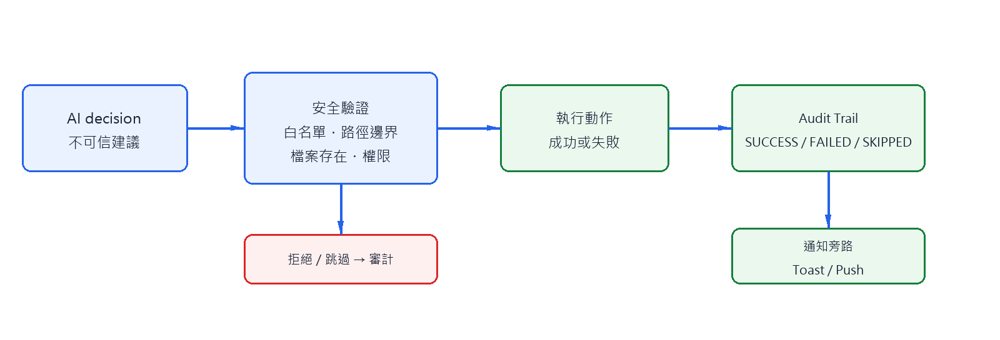
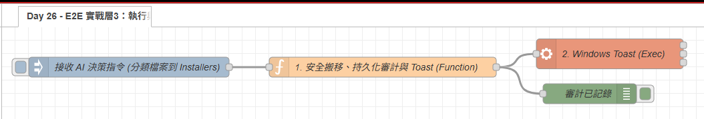

# Day 26：E2E 實戰層 3：執行結果、通知與審計

> 在昨天只產生 AI 建議，今天才進入可改變本機狀態的執行層。
> 重點不是重新示範搬檔案或 Toast，而是建立「先驗證、再執行、最後留下證據」的完整邊界。

本文同步發布於 GitHub：[2026-18th-it-ironman](https://github.com/BingFengHung/2026-18th-it-ironman/blob/main/Day26_實戰層3_多管道推播安全歸檔與SQLite審計.md)

## 執行層的三段式責任



```text
AI decision → 安全驗證 → 執行動作 → Audit Trail → 通知
```

Day04 已示範過檔案搬移，Day12 與 Day19 也已建立安全防線。因此本篇只保留它們在 E2E 中的交接規則：AI 回傳的 `category`、`filename` 和 `action` 全部視為不可信資料，必須由程式端重新檢查。

## 驗證清單與防禦性執行

執行前至少確認：

- `task_id`、`decision` 與來源檔案存在
- `category` 位於固定白名單
- `source` 和 `target` 經 `path.resolve()` 後仍在 Downloads 邊界內
- 來源是檔案而不是目錄，且目標不存在或已明確處理衝突
- 高風險操作已經過 Day19 的人工審批流程

以下是執行層 Function 節點的核心驗證與落地邏輯：

```javascript
// 0. 解析任務 Envelope 與決策上下文 (相容 Day 25 產出與單獨測試)
const task = typeof msg.payload === 'string' ? JSON.parse(msg.payload) : msg.payload;
const data = task.decision || task;
const input = task.input || {};
const homedir = os.homedir();
const base = path.resolve(input.download_dir || path.join(homedir, 'Downloads'));

// 1. 零信任白名單檢查：不可直接使用 AI 產生的字串作為目錄名
const allowed = ['Installers', 'Documents', 'Archives', 'Media', 'Others'];
const category = allowed.includes(data.category) ? data.category : null;
const filename = path.basename(String(data.filename || input.files?.[0]?.filename || ''));

// 2. 邊界沙盒防禦：防止 Directory Traversal (目錄遍歷逃逸)
const source = path.resolve(path.join(base, filename));
const target = category ? path.resolve(path.join(base, category, filename)) : null;

let status = 'REJECTED';
let error = null;

if (!category) {
    error = '分類不在白名單';
} else if (!filename || filename === '.' || filename === '..') {
    error = '缺少合法檔名';
} else if (!source.startsWith(base + path.sep) || !target.startsWith(base + path.sep)) {
    error = '路徑越界 (逃逸出 Downloads 邊界)';
} else if (!fs.existsSync(source) || !fs.statSync(source).isFile()) {
    status = 'SKIPPED';
    error = '來源檔案不存在或非一般檔案';
} else {
    try {
        fs.mkdirSync(path.dirname(target), { recursive: true });
        if (source !== target) fs.renameSync(source, target);
        status = 'SUCCESS';
    } catch (err) {
        status = 'FAILED';
        error = err.message;
    }
}
```

### 💡 原理解析：為什麼這樣設計？

- **零信任白名單（Zero-Trust Whitelist）**：AI 的輸出是**決策建議**，不是系統授權。無論 AI 模型給出的字串多麼逼真，只要不在白名單內一律標記為 `REJECTED`，杜絕任意目錄建立。
- **嚴密防堵路徑穿越（Directory Traversal Defense）**：利用 `path.basename()` 去除任何潛在的 `../` 符號，再透過 `path.resolve()` 與 `startsWith(base + path.sep)` 進行邊界絕對鎖定，確保讀寫範圍絕對不超出 `Downloads` 沙盒。
- **檔案狀態原子驗證**：搬移前使用 `fs.statSync().isFile()` 排除資料夾或特殊設備檔案，避免因目標狀態異常導致程序崩潰。
- **確定性錯誤分類**：驗證失敗時直接留下 `REJECTED` 或 `SKIPPED`，這類屬於語意或安全邊界錯誤，下游的 Day 28 看到此狀態便絕不會進行無謂重試。

## Audit Trail 是執行結果的一部分

審計記錄不是事後加上的除錯文字，而是每一筆執行結果的最小資料契約：

```json
{
  "task_id": "task_...",
  "timestamp": "2026-09-16T08:00:00.000Z",
  "action": "MOVE_FILE",
  "status": "SUCCESS",
  "source": "C:/Users/example/Downloads/a.exe",
  "target": "C:/Users/example/Downloads/Installers/a.exe",
  "reason": "AI 分類建議",
  "error": null
}
```

成功、失敗與跳過都要有紀錄；通知只告知結果，不取代審計。實作上先寫入 `SystemLogs/audit_trail.log`，再送 Toast 或其他推播，避免通知成功但沒有留下證據。

### 💡 架構權衡：為什麼 E2E 即時主流程優先使用 Append-only 日誌？與 SQLite 的關係是什麼？

你可能會好奇：*「我們在 Day 11 已經實作了強大的本機 SQLite 與 Text-to-SQL，為什麼在 Day 26 的主流程中優先寫入 `audit_trail.log`？」*

背後的工程考量在於**架構關注點分離（Separation of Concerns）**：

1. **零外部依賴與極致抗崩潰**：在執行層的關鍵路徑上，`fs.appendFileSync` 寫入純文字 JSON Lines 是最輕量、最原子化的動作。即使 SQLite 驅動出錯或資料庫檔案鎖定（`SQLITE_BUSY`），純日誌寫入依然 100% 穩定，能為最後現場留下黑盒子紀錄。
2. **日誌存證（Log-first）vs 關聯檢索（SQLite-ready）雙軌並行**：`audit_trail.log` 每行都是一筆合規的 JSON。這是一份標準的資料資產，後續隨時能透過排程 ETL 批次倒入 Day 11 的 `pc_guardian.db`，既享有單純日誌的極速落盤，又保留日後讓 AI 進行 SQL 歷史查詢的擴充彈性。

---

## 多管道推播的架構定位

在自動化架構中，推播通知（Notification）必須與動作執行（Action）徹底**解耦**：

1. **人機互動即時管道（Windows Toast）**：使用 PowerShell 調用 WinRT Toast API，在螢幕右下角彈出通知。讓操作者對 AI 自動處理進度一目了然。
2. **開發除錯與監控管道（Debug 節點）**：將完整的 `audit` 物件即時拋送給 Node-RED 除錯側欄，供即時觀察變數。
3. **擴充遠端管道（Webhook / 手機通知）**：藉由銜接 [Day 15 的 HTTP API 網關](./Day15_本機AI_HTTP_API網關_手機捷徑與終端一鍵呼叫AI.md)，亦可平行分流發送至 LINE Notify、Telegram Bot 或外部告警系統。

> 🔑 **關鍵防呆原則**：通知只是「狀態反饋」，不是「業務核心」。若 Windows Toast 因系統勿擾模式或 PowerShell 權限而發送失敗，**絕對不可回滾已經成功搬移的檔案**，也不能將整個任務標記為失敗。二者各自獨立記錄。

---

## 驗收案例

| 案例       | 執行結果           | 審計結果                   | 說明                           |
| ---------- | ------------------ | -------------------------- | :----------------------------- |
| 合法分類   | 搬移至目標目錄     | `SUCCESS`                | 成功歸檔並發出 Toast 完成通知  |
| 未知類別   | 原地不動           | `REJECTED`               | 不符白名單，安全攔截           |
| 路徑越界   | 原地不動           | `REJECTED`               | 目錄遍歷逃逸，立即阻斷         |
| 來源不存在 | 不做搬移           | `SKIPPED`                | 檔案已不存在，乾淨跳過         |
| Toast 失敗 | 檔案維持已完成狀態 | 動作成功、通知失敗分開記錄 | 通知錯誤不影響已完成的檔案狀態 |

---

## 完整 Flow

在 Node-RED 點擊「右上角選單」➔「匯入」即可一鍵部署：



### 本範例 Flow 位置：👉 [下載](https://github.com/BingFengHung/2026-18th-it-ironman/blob/main/flows/flow_day26_e2e_actions_audit.json)

---

## 今日總結與明日預告

今天我們把「AI 的結構化建議」落實為「可嚴密驗證、可追溯存證、可多管道反饋」的安全執行層，為整條主業務鏈條畫下完美的閉環。

有了穩健的執行與審計後，明天我們將回頭加固管線入口：**實裝 Semaphore 號誌鎖與 MD5 特徵快取**，徹底杜絕高頻重複事件消耗 AI 資源與並行崩潰的隱患！
