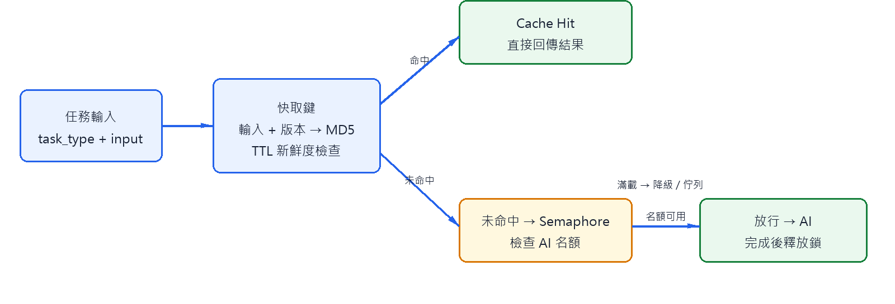
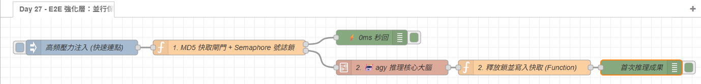

# Day 27：E2E 強化層：快取與並行控制的整合

> Day21 已介紹 Semaphore，Day22 已介紹 MD5 快取。今天不重複兩個元件的基本用法，而是處理它們放在同一條 E2E 管線時最容易出錯的順序、狀態與失敗清理問題。

本文同步發布於 GitHub：[2026-18th-it-ironman](https://github.com/BingFengHung/2026-18th-it-ironman/blob/main/Day27_全系統並行保護與快取加速實裝.md)

## 兩道護欄的正確順序



```text
任務 → 快取查詢 → 命中直接返回
             ↓ 未命中
        Semaphore → 取得名額 → AI → 釋放名額 → 寫入快取
```

快取應先於 Semaphore。命中快取的任務不需要消耗 AI 名額；反過來會讓重複事件短暫占住唯一名額，延遲真正需要推理的任務。

### 💡 原理解析：為什麼快取必須先於 Semaphore？

- **保護關鍵臨界區（Critical Section）**：`agy.exe` 的本機推理屬於重度消耗 CPU/GPU 與記憶體的資源臨界區。若將號誌鎖置於快取之前，哪怕是連續 10 次完全相同的重複事件，也會無端占用並行名額並引起不必要的佇列排隊。
- **0ms 秒級短路（Short-Circuiting）**：將快取前置，能讓重複的請求在進入 Node-RED 的 Function 時直接經由第一輸出 0ms 原路返回，徹底隔絕下游的高負擔計算。

---

## 快取鍵的語意完整性與動態 TTL

MD5 只是雜湊索引，不是安全驗證。快取鍵應由**所有會影響 AI 決策結果的關鍵因子**共同組成，例如任務類型、標準化後的輸入資料、Prompt 版本與 Schema 結構。若只對一段終端顯示文字做雜湊，可能導致完全不同的任務因為字串相似而誤命中過期快取。

```javascript
// 組合具備完整語意契約的快取鍵特徵物件
const cacheInput = {
    task_type: msg.task?.task_type || msg.payload?.task_type,
    input: msg.task?.input || msg.payload?.input,
    prompt_version: 'v1'
};

const cacheKey = crypto
    .createHash('md5')
    .update(JSON.stringify(cacheInput))
    .digest('hex');
```

### 💡 原理解析：動態 TTL（存活時間）策略

- **檔案靜態屬性（Long TTL）**：如 Downloads 區安裝檔分類，檔名與副檔名本質不變，TTL 可放寬至 1 小時至 24 小時。
- **系統動態指標（Short TTL）**：若任務涉及 CPU、記憶體或 Windows Event Viewer 崩潰日誌，因系統環境每秒都在變動，TTL 應嚴格限制在 30 秒至 1 分鐘內，避免 AI 引用陳舊指標給出過期的診斷結論。

---

## Semaphore 號誌鎖核心實裝與狀態流轉

以下是護欄層 Function 節點將「快取」與「號誌鎖」無縫整合的核心邏輯：

```javascript
// 1. 前置快取查詢：命中則 0ms 直接返回
const cache = flow.get('e2e_cache') || {};
if (cache[cacheKey] && (Date.now() - cache[cacheKey].timestamp < 3600 * 1000)) {
    msg.payload = cache[cacheKey].data;
    msg.fromCache = true;
    return [msg, null]; // 第 1 路：直接輸出跳過 AI
}

// 2. Semaphore 號誌鎖名額檢查 (本機 AI 最大並行數 = 1)
const activeCount = flow.get('active_e2e_ai') || 0;
if (activeCount >= 1) {
    node.warn('🛑 [並行保護] AI 推理名額已滿，任務進入降級處理');
    msg.payload = { 
        status: 'THROTTLED', 
        task_id: msg.task?.task_id || null, 
        reason: 'AI 資源並行保護中，請稍後重試' 
    };
    return [null, msg]; // 第 2 路：降級或轉交 Day28 佇列
}

// 3. 獲取號誌鎖並標記占用
flow.set('active_e2e_ai', activeCount + 1);
msg.cacheKey = cacheKey;
return [null, msg]; // 進入下游 agy CLI 推理
```

而在 AI 推理結束（或出錯）時，必須立即釋放鎖並更新快取：

```javascript
// 出口釋放：重置並行計數，並將新結果寫入快取
flow.set('active_e2e_ai', 0);

if (msg.cacheKey && msg.decision) {
    const cache = flow.get('e2e_cache') || {};
    cache[msg.cacheKey] = { data: msg.decision, timestamp: Date.now() };
    flow.set('e2e_cache', cache);
}
return msg;
```

### 🔑 重點說明：All-Exit Release（全出口必釋放原則）

取得號誌鎖後，**所有後續出口都必須保證釋放**：

1. **AI 成功返回**：釋放鎖，同時將結果寫入快取。
2. **AI CLI 執行崩潰或逾時**：交給 Day 28 Catch 節點處理前，必須確保釋放鎖。
3. **重試等待或 Fallback 降級**：在等待退避延遲期間，鎖必須處於釋放狀態，否則整個系統將發生**死鎖（Deadlock）**，導致後續所有合法任務全部被攔截！

---

## 一致性與壓力測試矩陣

| 測試情境                       | 系統預期反應                                          | 資源與狀態表現                          |
| :----------------------------- | :---------------------------------------------------- | :-------------------------------------- |
| **同一任務連續高頻觸發** | 第 1 筆呼叫 AI 推理，後續連點 100% 命中快取           | 後續耗時 0ms，完全不消耗 CPU            |
| **不同任務快速並行湧入** | 第 1 筆獲取號誌鎖進入 AI，其餘任務觸發 THROTTLED 降級 | 嚴格維持最多 1 筆占用 CLI，防範系統卡頓 |
| **AI 推理成功**          | 釋放號誌鎖，更新記憶體快取                            | 狀態歸零，下一筆任務可立即進入          |
| **AI 推理失敗或逾時**    | 依舊釋放號誌鎖，將 Envelope 移交 Day 28               | 不遺留殘留鎖，管線保持健康流暢          |
| **快取 TTL 過期**        | 忽略過期資料，重新獲取號誌鎖進入 AI                   | 確保決策與系統當前現況同步              |

---

## 完整 Flow

在 Node-RED 點擊「右上角選單」➔「匯入」即可一鍵部署：

本案例 flow



### 本範例 Flow 位置：👉 [下載 flow_day27_e2e_perf_opt.json](https://github.com/BingFengHung/2026-18th-it-ironman/blob/main/flows/flow_day27_e2e_perf_opt.json)

完整端到端串接版請參考：[flow_day24_28_e2e_pipeline.json](./flows/flow_day24_28_e2e_pipeline.json)。


---

## 今日總結與明日預告

今天我們完成了「快取短路」與「並行號誌鎖」的架構整合，為系統築起最堅固的效能防波堤。

明天（Day 28）我們將迎來 E2E 的最終章：**全流程自我修復與異常退避重試**，處理 AI 呼叫失敗時的退避重試與安全 Fallback 降級！
