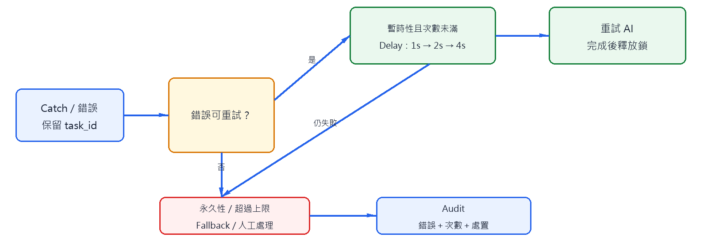
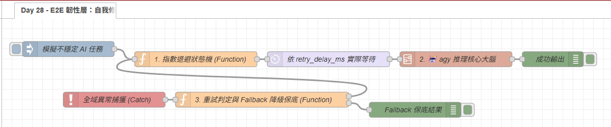
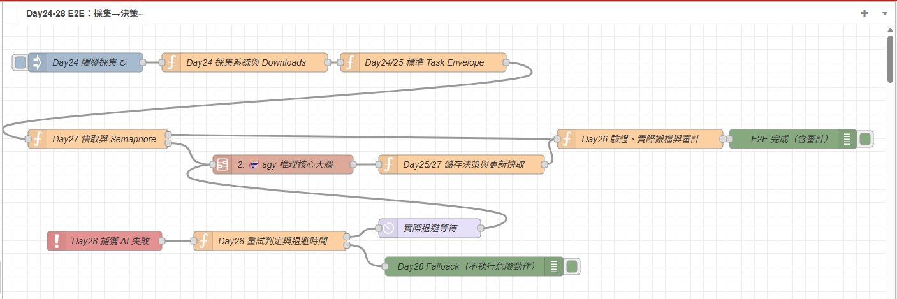

# Day 28：E2E 韌性層：錯誤分類、退避與安全降級

> Day21 已指出「超量即降級」不等於重試，Day23 也已定義 `retry` 與 Fallback 欄位。今天把這些設計真正接到 E2E 失敗路徑，讓系統知道什麼可以重試、什麼必須停止。

本文同步發布於 GitHub：[2026-18th-it-ironman](https://github.com/BingFengHung/2026-18th-it-ironman/blob/main/Day28_全流程自我修復與異常退避重試實戰.md)

## 韌性層的決策流程



```text
錯誤 → 分類 → 暫時性？ ─否→ Fallback / 人工處理
             └─是→ 未超過上限？ ─否→ Fallback
                              └─是→ Delay → 重試
```

重試不是「失敗就再呼叫一次」。它必須同時受到錯誤類型、最大次數、退避上限與任務生命週期約束。

## 先分類，再決定動作

| 錯誤                       | 是否重試 | 處理                 |
| -------------------------- | -------- | -------------------- |
| CLI 暫時忙碌、短暫逾時     | 是       | 1、2、4 秒退避後重試 |
| 服務暫時不可用             | 視情況   | 有上限地重試         |
| JSON Schema 或輸入格式錯誤 | 否       | 記錄並交人工修正     |
| 權限不足、路徑越界         | 否       | 拒絕執行，不可重試   |
| 超過最大次數               | 否       | 安全 Fallback        |

錯誤分類應依 `msg.error`、CLI 結束碼或 Node-RED Catch 訊息完成，不能只用「有沒有例外」判斷；否則永久性錯誤會形成重試迴圈。

## 重試狀態要跟著任務走

```javascript
const retry = msg.retry || { count: 0, max: 3 };
const transient = msg.error?.code === 'ETIMEDOUT' || msg.error?.code === 'EBUSY';

// 1. 瞬時性錯誤且未達上限：計算退避時間並準備重試
if (transient && retry.count < retry.max) {
    retry.count += 1;
    msg.retry = retry;
    // 指數退避：1s -> 2s -> 4s (上限截斷)
    msg.retry_delay_ms = Math.min(4000, 2 ** (retry.count - 1) * 1000);
    return [msg, null]; // 第 1 路：進入 Delay 節點
}

// 2. 永久性錯誤或重試耗盡：啟動 Fallback 本機降級保底
msg.retry = retry;
msg.payload = {
    status: 'FALLBACK_LOCAL',
    action: 'SKIP_FILE_OPERATION',
    reason: transient ? '重試次數已耗盡' : '不可重試之永久性錯誤'
};
return [null, msg]; // 第 2 路：進入 Fallback 處理
```

### 💡 原理解析：為什麼這樣設計？

- **Message Context 隔離性**：將重試狀態綁定在 `msg.retry` 而非 `flow.set()` 全域變數中，確保每筆獨立任務的重試計數器互不干擾，避免並行任務互相踩踏重試次數。
- **指數退避防雪崩（Exponential Backoff）**：採用 $2^{(n-1)} \times 1000$ 毫秒退避（1s ➔ 2s ➔ 4s），給予作業系統與 CLI 進程釋放資源的時間；搭配 `Math.min(4000, ...)` 截斷上限，避免失敗任務過度延遲。
- **運算與等待職責分離**：Function 節點**絕對嚴禁**使用同步 `sleep` 阻塞程式碼，這會癱瘓 Node-RED 單線程事件循環。Function 節點只計算出 `retry_delay_ms`，實際的非同步等待交給獨立的 Delay 節點執行。

---

## Fallback 的安全預設與跨篇防死鎖

Fallback 的核心目標是**保住資料與可追蹤性**，絕不是隨機猜測一個 AI 分類答案繼續執行：

1. **安全保守預設**：檔案分類失敗時，採取「原地不動（Skip）」或移動到隔離目錄，不可自行猜測目錄；同時標記 `FALLBACK_LOCAL`，讓使用者明白此操作未經 AI 處理。
2. **審計存證對齊**：降級結果依然會送交 [Day 26 的 Audit Trail](./Day26_實戰層3_多管道推播安全歸檔與SQLite審計.md)，完整記錄 `task_id`、錯誤代碼與重試歷程。

> 🔑 **重點說明：跨篇號誌鎖釋放（Deadlock Prevention）**
> 在整合了 [Day 27 並行控制](./Day27_全系統並行保護與快取加速實裝.md) 的管線中，當任務進入重試等待（Delay）或轉入 Fallback 降級路徑時，**必須優先執行 `flow.set('active_e2e_ai', 0)`（或布林模式 `flow.set('ai_busy', false)`）釋放號誌名額**！否則在退避延遲等待的數秒內，整條管線將陷入假死，後續所有合法任務都會被攔截。

---

## 驗收案例

| 測試案例                      | 預期執行路徑                        | 審計與系統狀態                     |
| :---------------------------- | :---------------------------------- | :--------------------------------- |
| **第 1 次暫時逾時**     | 等待 1 秒退避後重新呼叫 CLI         | `retry.count = 1`，釋放號誌名額  |
| **第 2 次暫時失敗**     | 等待 2 秒退避後重新呼叫 CLI         | `retry.count = 2`，釋放號誌名額  |
| **第 3 次重試失敗**     | 停止重試，觸發`FALLBACK_LOCAL`    | 記錄重試耗盡，保留原檔不搬移       |
| **語意或權限錯誤**      | 不重試，直接由 Day 26 拒絕          | 標記`REJECTED`，杜絕無效重試循環 |
| **全域 Catch 捕獲例外** | 保留原始`task_id`，轉交退避狀態機 | 確保殘留未處理例外不遺失任務上下文 |

---

## 完整 Flow

在 Node-RED 點擊「右上角選單」➔「匯入」即可一鍵部署：

本案例 flow



### 本範例 Flow 位置：👉 [下載 ](https://github.com/BingFengHung/2026-18th-it-ironman/blob/main/flows/flow_day28_e2e_resilience.json)

完整端到端串接版請參考如下



### 完整 Flow位置：[flow_day24_28_e2e_pipeline.json](./flows/flow_day24_28_e2e_pipeline.json)。

---

## 今日總結

今天完成了 E2E 系統的最後一道防線：**暫時性錯誤有限退避重試，永久性錯誤安全降級保底**。

至此，我們完成了從 **Day 24 採集 ➔ Day 27 快取護欄 ➔ Day 25 AI 決策 ➔ Day 28 韌性自癒 ➔ Day 26 安全落地與審計** 的完整端到端自動化閉環！每一層職責分明、契約嚴密，真正將零散的 Node-RED 與 AI 玩具積木，昇華成穩健的個人智慧管家系統。
