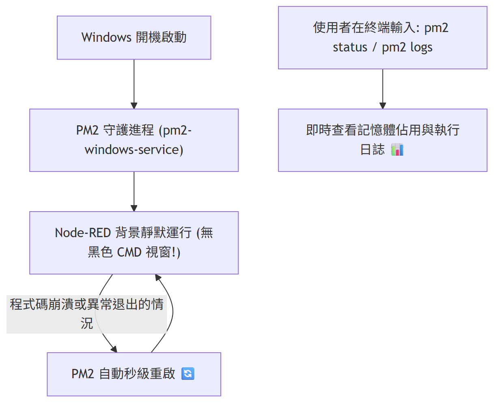

# Day 29：生產上線：Windows 開機啟動與 PM2 程序守護

> 如果每次開機都要手動輸入 `node-red`，會增加日常啟動的負擔；常駐的終端機黑色視窗更不適合當作背景服務。
> 今天我們將使用 Node.js 生態的進程管理 **PM2**，配置 Node-RED 在 Windows 開機時無感啟動、崩潰時自動重啟，並建立生產環境的維運、監控與日誌保留策略。

---

本文同步發布於 GitHub：[2026-18th-it-ironman](https://github.com/BingFengHung/2026-18th-it-ironman/blob/main/Day29_Windows開機無感自啟_PM2進程守護.md)

## 為什麼選擇 PM2 守護 Node-RED？



前面的章節解決了「怎麼做」，Day 29 解決的是「怎麼一直穩定運作」。

在將 Node-RED 交由 PM2 接管前，必須先釐清一個關鍵界線：

> 🔑 **架構責任分離：程序守護 vs 流程韌性**
> **PM2 負責的是「作業系統層級的進程生命週期」**（程序是否存活、是否開機拉起）；而 **Day 28 負責的是「業務邏輯層級的任務自癒」**（重試退避、Fallback 降級）。PM2 不會替 Flow 修復資料契約錯誤，也不會取代業務重試；兩者相輔相成，才是一套完整的生產級防禦體系。

### PM2 的四大生產優勢：

1. **背景靜默運行**：擺脫常駐桌面工作列的黑色 CMD/PowerShell 視窗，讓自動化管家在背景安靜守護。
2. **自動重啟**：當 Node.js 進程因未捕獲的系統級例外退出時，PM2 能在數秒內自動拉起程序。
3. **資源與效能監控**：透過內建指令即時掌握進程的 CPU 負載與記憶體使用量，防止記憶體洩漏。
4. **集中串流日誌管理**：自動收集 Node-RED 的標準輸出與錯誤日誌，便於事後排查問題。

---

## 實戰動手做：3 步驟配置 PM2 開機自啟

### 步驟 1：安裝 PM2 與 Windows 開機自啟工具包

請以「系統管理員身分」開啟 PowerShell，執行全域安裝命令：

```powershell
npm install -g pm2 pm2-windows-startup
```

---

### 步驟 2：配置 Windows 自啟服務

在 PowerShell 中執行初始化配置指令，將 PM2 註冊為 Windows 啟動服務：

```powershell
pm2-startup install
```

---

### 步驟 3：透過 PM2 啟動 Node-RED 並固化進程清單

找到你電腦中 `node-red.cmd` 的安裝路徑（通常位於 `%APPDATA%\npm\node-red.cmd`），使用 PM2 啟動並保存狀態：

```powershell
# 1. 啟動 Node-RED 並命名為 node-red-guardian
pm2 start "$env:APPDATA\npm\node-red.cmd" --name "node-red-guardian"

# 2. 固化當前進程清單 (Windows 開機將自動恢復此清單)
pm2 save
```

---

## PM2 常用維運指令速查

在日常維護時，可透過以下指令進行操作：

```powershell
# 查看所有守護進程的狀態、重啟次數與記憶體佔用
pm2 status

# 開啟即時互動式儀表板 (CPU/記憶體/日誌)
pm2 monit

# 即時串流查看 Node-RED 的運作日誌
pm2 logs node-red-guardian

# 重啟 Node-RED (例如修改 settings.js 或更新相依套件後)
pm2 restart node-red-guardian

# 暫停或停止守護服務
pm2 stop node-red-guardian
```

---

## 生產維運與安全實踐要點

### 1. 建議的漸進式部署順序

為避免把 Node-RED 設定錯誤誤認為是 PM2 守護問題，建議遵守以下順序：

1. **前景手動驗收**：先在終端機手動輸入 `node-red`，確認 Flow 能正常部署、無配置錯誤。
2. **相依環境確認**：確認工作目錄權限、使用者環境變數（如 PATH 中的 `agy.exe`）與 SQLite 路徑均正確無誤。
3. **交由 PM2 接管**：使用 PM2 啟動並執行 `pm2 save` 固化設定。
4. **重開機與崩潰測試**：重新開機測試自啟動，並演練強制終止程序驗證自動復原。

### 2. Windows 環境的啟動陷阱

- **絕對路徑優先**：Windows 開機服務的工作目錄可能與使用者終端不同，所有重要檔案路徑（如 `Downloads`、`SystemLogs`、SQLite DB）應一律使用絕對路徑。
- **環境變數繼承**：若 Node-RED 呼叫了外部 CLI 工具（如 `agy`、`sqlite3`），需確認系統環境變數已正確配置於系統層級或目前服務帳號中。
- **配置變更後必保存**：`pm2 save` 只保存當下的進程清單；若日後修改了啟動參數或名稱，務必再次執行 `pm2 save`。

### 3. 日誌輪替與磁碟保護

長年累月運行的背景進程，最忌諱日誌無限制膨脹塞滿磁碟：

- **程序日誌 vs 業務審計**：PM2 日誌（`pm2 logs`）記錄的是進程崩潰與終端報錯；而 Day 26 的 `SystemLogs/audit_trail.log` 記錄的是具體業務執行歷程，兩者不可偏廢。
- **安裝日誌滾動工具**：可選用 `pm2-logrotate` 模組，限制單一記錄檔上限為 10MB，保留最近 7 天的歷史紀錄。

---

## 生產驗收清單（Checklist）

完成部署後，請對照以下清單進行驗收確認：

- [ ] **開機無感自啟**：重新啟動電腦進入桌面，工作列無黑視窗彈出，打開瀏覽器訪問 `http://127.0.0.1:1880` 能直接連線。
- [ ] **程序自動拉起**：在 Windows「工作管理員」中找到 Node.js 進程並強制結束，執行 `pm2 status` 確認該進程已在數秒內自動重啟且重啟次數計數增加。
- [ ] **E2E 資料流正常**：觸發一次 Day 24～28 的檔案分類事件，確認 `Downloads` 歸檔、`audit_trail.log` 寫入與桌面 Toast 彈窗皆正常運作。
- [ ] **故障排查有序**：若無法連線，能依序透過 `pm2 status` ➜ `pm2 logs node-red-guardian` 快速定位問題原因。

---

## 今日總結與明日預告

今天我們透過 PM2 完成了 Windows 智慧管家的最後一塊維運拼圖，實現了「開機無感自啟、異常自動重啟、背景靜默運行」的生產級標準。

明天就是我們的文章的**最後一天**！我們將回顧 30 天以來的技術架構，提煉 5 大 AI-First 自動化心法，並展望個人 AI Agent 的下一代演進藍圖！
