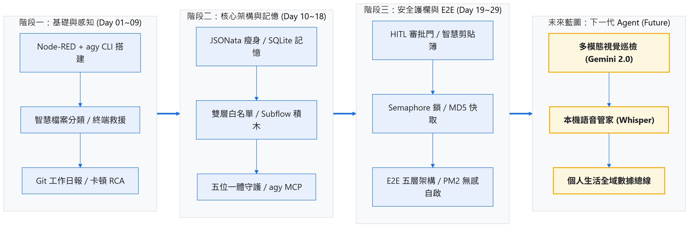

# Day 30：終點也是起點：個人 AI Agent 演進藍圖與全景復盤

> 這是 30 天系列實戰的最終章。前面的篇章我們從 Node-RED 與 `agy CLI` 的本機整合開始，逐步建立起資料採集、結構化契約、狀態記憶、資源護欄、執行落地與自我修復。
> 今天我們不再堆砌新的程式碼，而是站在架構師的角度，對這 30 天的技術棧進行全景復盤、提煉 5 大 AI-First 自動化核心心法，並展望個人 AI Agent 的未來演進藍圖！

---

本文同步發布於 GitHub：[2026-18th-it-ironman](https://github.com/BingFengHung/2026-18th-it-ironman/blob/main/Day30_終點也是起點_個人AIAgent演進藍圖與復盤.md)

## 30 天里程碑全景復盤

回顧這 30 天的旅程，我們並非單純把「AI 聊天」包裝成一條自動化，而是從無到有、逐步組裝出一個具備嚴格邊界與自癒能力的作業系統級智慧助理：

| 階段與篇章                                    | 核心功能與關鍵技術                                                                                                                                                                                                                                                                                   | 解決的核心痛點與架構突破                                                                                                             |
| :-------------------------------------------- | :--------------------------------------------------------------------------------------------------------------------------------------------------------------------------------------------------------------------------------------------------------------------------------------------------- | :----------------------------------------------------------------------------------------------------------------------------------- |
| **階段一：基礎與感知**(Day 01 ~ 09)     | • Node-RED 環境搭建與 Context 狀態機• Downloads 智慧歸檔與 terminal 報錯 AI 一鍵救援• 剪貼簿 Markdown 表格化與 Git 每日工作日報• 電腦卡頓秒級 RCA 根因診斷• `--json-schema` 契約保證與結構化輸出                                                                                              | **掌握本機 AI 串接基礎**解決外部事件格式不穩定、模型輸出純文字難以被程式使用的痛點，實現零延遲感知與結構化決策。               |
| **階段二：架構深化與記憶**(Day 10 ~ 18) | • JSONata 前置瘦身與 Token 資料壓縮• SQLite 長期記憶庫與 Agentic Text-to-SQL 動態檢索• 雙層白名單與 Quarantine 隔離區防誤刪• `agy-ai-core` 專屬 Subflow 樂高模組封裝• 本機 HTTP API 網關與 Windows Event Viewer 崩潰排查• agy MCP 掛載 Windows 本機工具自主行動                              | **建立可維護與模組化架構**加入長期歷史狀態記憶、零信任硬性白名單安全邊界，讓 AI 具備工具調用能力的同時不逾越安全底線。         |
| **階段三：生產護欄與 E2E**(Day 19 ~ 30) | • HITL 人機協作審批門（Windows 原生 Toast）• Semaphore 號誌燈並行鎖（限制 CPU 資源）• MD5 特徵雜湊快取（0ms 秒級短路回應）• E2E 雙軌資料採集、任務路由與雙軌解包大腦• 零信任路徑沙盒安全落地與 Append-only 審計日誌• 指數退避重試與本機 Fallback 降級保底• PM2 Windows 開機無感自啟與進程守護 | **構建工業級生產韌性與自癒管線**兼顧資源競爭保護、重複事件去重、例外退避重試、操作留痕存證與 24/7 常駐背景運行，形成完整閉環。 |

---

## 30 天演進全景技術架構圖



回顧整條自動化演進，可以歸納出一個核心的架構設計判斷標準：**任何新增的 AI 自動化功能，都必須清楚回答這四個問題：**

1. **它的輸入事實是什麼？**（是否有前置清洗與明確的 Envelope 契約？）
2. **它可以改變什麼？**（是否有白名單、路徑沙盒與 HITL 人工確認等防禦護欄？）
3. **失敗時如何收斂？**（是否有明確的錯誤分類、退避重試上限與本機安全降級 Fallback？）
4. **事後如何證明它做過什麼？**（是否有不可竄改的 Append-only 審計日誌與推播反饋？）

---

## 端到端場景演繹：一個完整任務的真實旅程

以最經典的「下載目錄檔案自動整理」為例，我們來看看 30 天所堆疊的各層積木是如何協同作戰的：

1. **現場感知（Day 24 採集層）**：使用者下載了一份安裝檔，採集層透過 Node.js 檔案監聽捕獲事件，確認檔案寫入完畢後封裝成標準的 `Universal Task Envelope`，生成唯一 `task_id`。
2. **效能護欄（Day 27 護欄層）**：任務進入管線，首先計算快取特徵鍵。若同一檔案短時間重複觸發，快取層直接 0ms 原路返回；未命中快取時，透過 Semaphore 號誌鎖獲取唯一的 AI 並行名額，避免 CPU 飆高。
3. **契約決策（Day 25 決策層）**：任務路由器依 `task_type` 裝載專屬 Prompt 與 JSON Schema，呼叫本機 `agy CLI` 推理，並透過雙軌解包容錯防禦（Dual-Track Unwrap）安全取得結構化分類結論。
4. **異常自癒（Day 28 韌性層）**：若 CLI 遭遇短暫逾時或資源鎖定，系統自動啟動指數退避重試（1s ➔ 2s ➔ 4s）；若重試耗盡則觸發 `FALLBACK_LOCAL`，保留原檔絕不盲目猜測。
5. **安全落地與存證（Day 26 執行與審計層）**：執行層秉持零信任原則，對 AI 建議進行路徑沙盒與白名單二度檢驗，搬移完成後同步寫入 `audit_trail.log`，最後非同步彈出 Windows 原生 Toast 通知使用者。
6. **常駐守護（Day 29 運營層）**：整套工作流在 PM2 的背景守護下 24/7 靜默運行，即使電腦重啟也能無感自啟動。

---

## AI-First 自動化核心心法體系

在這 30 天的實踐中，我們提煉出了 5 條最重要的系統工程心法：

### 1. 契約優先（Contract First）

永遠不要直接依賴不可控的純文字輸出。善用 `--json-schema` 在模型推理時進行硬性輸出形狀約束，並在程式端做好結構化輸出與字串解析的雙軌解包容錯。

### 2. 前置瘦身（Garbage In, Garbage Out）

大模型並非垃圾桶。在將日誌或事件送入 AI 前，務必透過純 JavaScript 或 JSONata 進行噪音過濾與前置資料壓縮，用最小的 Token 成本換取最高的推理精度與秒級回應。

### 3. 安全底線（Zero Trust AI）

**AI 的輸出是建議，不是授權！** 涉及檔案搬移、命令執行或狀態變更的關鍵動作，絕不可將權限無條件交給 AI，必須透過程式端的白名單、路徑邊界沙盒、Quarantine 隔離區與 HITL 審批門建立剛性防線。

### 4. 資源護欄（Resource Guardrails）

本地執行的 AI CLI 屬於重度資源消耗者。必須透過 **Semaphore 號誌鎖** 限制最大並行數，搭配 **MD5 特徵雜湊快取** 短路重複請求，確保自動化管家在背景運作時絕不干擾日常工作流暢度。

### 5. 生產自癒（Resilience & Self-Healing）

將「失敗」視為系統的常態。建立全域 Catch 異常捕獲、區分瞬時錯誤與永久錯誤、搭配指數退避重試與本機 Fallback 降級保底；最後交由 PM2 守護進程生命週期，打造兼具業務韌性與進程韌性的穩健系統。

---

## 未來演進藍圖（The Future of Personal AI Agents）

這 30 天的結束，正是個人專屬 AI 生態系統的全新起點！未來可以沿著以下三個前瞻方向持續拓展：

```text
┌─────────────────────────────────────────────────────────────────────────┐
│                    未來下一代個人 AI Agent 演進藍圖                        │
├─────────────────────────────────────────────────────────────────────────┤
│ 1. 多模態視覺巡檢 ──> 螢幕截圖 + Gemini 視覺模型 ──> 桌面異常秒級辨識      │
│ 2. 本機語音管家   ──> Whisper 本機語音識別 ────────────> 聲控全系統工作流     │
│ 3. 全域數據總線   ──> Webhook + IoT / 手機 / 瀏覽器 ───> 跨設備全天候分身     │
└─────────────────────────────────────────────────────────────────────────┘
```

1. **多模態視覺巡檢**：結合 Windows 本機截圖工具與視覺模型，自動辨識桌面卡死畫面、軟體報錯彈窗或藍屏崩潰代碼。
2. **本機語音智慧管家**：整合本機輕量 Whisper 模型，設定全域快捷鍵下達自然語言口令，由 Node-RED 自動排程並執行複雜的工作流。
3. **跨設備全域數據總線**：透過 Day 15 的本機 Webhook 網關，串聯手機 iOS Shortcuts、智慧手錶通知、瀏覽器擴充套件與 IDE 插件，形成真正的個人跨裝置 Agent 中樞。

---

## 從「可以運作」走向「值得長期託付」：工程待辦

若要將這套個人智慧管家進一步推向團隊或企業級應用，以下是後續建議的工程補強方向：

1. **自動化整合測試**：目前多數驗收依賴手動觸發與除錯視窗，未來可引入單元測試框架，針對路由契約與異常退避路徑進行自動化回歸測試。
2. **設定檔集中治理**：將散落在各個 Function 節點中的白名單、目錄路徑、Prompt 模板與重試門檻抽離至獨立的外部配置檔（如 `.env` 或 `config.json`）。
3. **細粒度權限模型**：進一步縮小 Node-RED 與 `agy.exe` 的作業系統權限，針對唯讀、寫入與執行建立嚴格的權限分離機制。
4. **可觀測性指標大盤**：建立專屬的 Monitoring Dashboard，長期統計任務成功率、平均推理延遲、快取命中率與異常重試頻率。
5. **日誌保留與清理策略**：建立自動化歸檔排程，避免 `SystemLogs/audit_trail.log` 與 SQLite 資料庫在長期運作下無限制佔用磁碟。

---

## 給下一個 AI Agent 專案的 7 道架構檢查清單（Checklist）

在展開任何新的 AI 自動化專案前，請務必以此清單自我檢視：

- [ ] **輸入契約明確嗎？**（來源事件是否有標準化資料格式，排除無效輸入？）
- [ ] **模型輸出有 Schema 約束嗎？**（是否強制結構化輸出，並具備雙軌解包容錯？）
- [ ] **高風險動作有程式端驗證嗎？**（是否嚴格實施白名單與路徑沙盒，而非盲信 AI？）
- [ ] **每一個副作用都能追溯嗎？**（是否有獨立於通報系統之外的不可竄改審計存證？）
- [ ] **有區分並行、快取與逾時嗎？**（是否有保護資源臨界區的號誌鎖與快取閘門？）
- [ ] **出錯時能優雅自癒與釋放資源嗎？**（是否有有限重試、安全 Fallback，並在所有出口釋放號誌鎖？）
- [ ] **系統重啟後能安全復原嗎？**（進程是否常駐背景，重啟後不遺失關鍵任務上下文？）

能清晰回答這 7 個問題，通常比盲目調用更龐大的模型，更能決定一個自動化系統的成敗！

---

## 結語

自動化與 AI Agent 的真正價值，在於**以嚴謹的工程思維消滅日常重複的瑣事，並讓系統的每一次決策與執行都可被觀測、可被限制、可被復原**。

希望這套以 Node-RED 與 `agy CLI` 鑄造的架構與 5 大心法，能成為你打造個人專屬 AI Agent 的最堅實基石！
